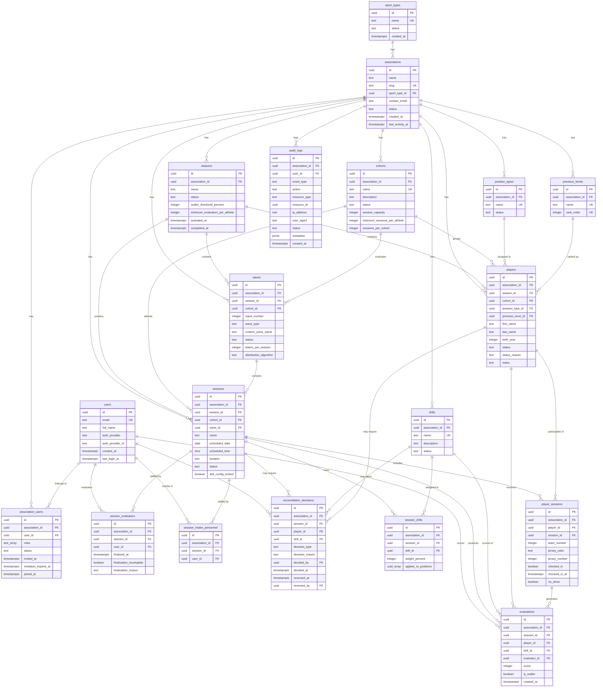

# Technical Architecture: Evalu8

**Project:** Sports Player Evaluation System  
**Date:** November 7, 2025  
**Version:** 1.0

---

## Technology Stack Overview

### Frontend

**Core Framework:**

- **React** - UI library for building component-based interfaces
- **Vite** - Fast build tool and development server
- **TypeScript** - Type-safe JavaScript (recommended for production)

**UI & Styling:**

- **shadcn/ui** - Component library with Violet theme
- **Tailwind CSS** - Utility-first CSS framework (bundled with shadcn/ui)
- **Lucide Icons** - Icon library for consistent visual elements

**State Management:**

- **React Context API** - For global state (auth, user, season context)
- **React Hooks** - For local component state (useState, useEffect, useReducer)

**Routing:**

- **React Router** (v6+) - Client-side routing for multi-page navigation

---

### Backend

**Platform:**

- **Supabase** - Backend-as-a-Service (BaaS) built on PostgreSQL

**Key Services:**

- **Supabase Database (PostgreSQL)** - Relational database with row-level security
- **Supabase Auth** - Authentication with Google OAuth integration
- **Supabase Realtime** - Live updates during evaluation sessions (WebSocket-based)
- **Supabase Storage** - File storage for CSV imports/exports, reports

**API Layer:**

- **Supabase Client SDK** - JavaScript client for database queries, auth, realtime
- **Auto-generated REST API** - Provided by Supabase (PostgREST)
- **Auto-generated GraphQL API** (optional) - Provided by Supabase (pg_graphql)

---

## Architecture Decisions

### Why Supabase?

- **PostgreSQL foundation** - Mature, reliable, ACID-compliant relational database
- **Row-level security (RLS)** - Built-in multi-tenant data isolation at database level
- **Real-time subscriptions** - Essential for live evaluation scoring
- **Integrated authentication** - Google OAuth out-of-the-box
- **Automatic API generation** - No need to write REST endpoints manually
- **Developer experience** - Fast setup, excellent documentation, generous free tier

### Why Vite?

- **Fast HMR (Hot Module Replacement)** - Instant feedback during development
- **Optimized production builds** - Tree-shaking, code-splitting, minification
- **Native ESM support** - Modern JavaScript module system
- **React template** - Pre-configured for React development

### Why shadcn/ui?

- **Customizable components** - Copy-paste components, not npm packages
- **Tailwind-based** - Consistent styling with utility classes
- **Accessible by default** - Built on Radix UI primitives
- **Violet theme** - Professional, modern color scheme for sports applications

### Why React Context API?

- **Native React solution** - No external dependencies
- **Sufficient for MVP** - Simple global state (auth, current season, user role)
- **Easy to migrate** - Can upgrade to Redux/Zustand later if needed

---

## Development Environment

### Required Tools

- **Node.js** (v18+ recommended)
- **npm** or **pnpm** (package manager)
- **Git** (version control)
- **Supabase CLI** (for local development, migrations)
- **VS Code** (recommended IDE)

### VS Code Extensions (Recommended)

- **ESLint** - Code linting
- **Prettier** - Code formatting
- **Tailwind CSS IntelliSense** - Tailwind autocomplete
- **Supabase** - Supabase utilities
- **GitHub Copilot** - AI pair programmer

---

## Project Structure (Recommended)

```
evalu8/
├── src/
│   ├── components/        # Reusable UI components
│   │   ├── ui/           # shadcn/ui components
│   │   ├── layout/       # Layout components (Header, Sidebar, Footer)
│   │   ├── forms/        # Form components (inputs, selects, etc.)
│   │   └── ...
│   ├── pages/            # Route pages
│   │   ├── Dashboard.tsx
│   │   ├── Seasons.tsx
│   │   ├── Players.tsx
│   │   ├── Sessions.tsx
│   │   ├── Evaluation.tsx
│   │   └── ...
│   ├── contexts/         # React Context providers
│   │   ├── AuthContext.tsx
│   │   ├── SeasonContext.tsx
│   │   └── ...
│   ├── hooks/            # Custom React hooks
│   │   ├── useSupabase.ts
│   │   ├── useAuth.ts
│   │   └── ...
│   ├── lib/              # Utility functions
│   │   ├── supabase.ts   # Supabase client initialization
│   │   ├── utils.ts      # Helper functions
│   │   └── ...
│   ├── types/            # TypeScript type definitions
│   │   ├── database.ts   # Supabase generated types
│   │   ├── models.ts     # Business logic types
│   │   └── ...
│   ├── App.tsx           # Root component
│   ├── main.tsx          # Entry point
│   └── index.css         # Global styles
├── supabase/
│   ├── migrations/       # Database migrations
│   ├── seed.sql          # Seed data for development
│   └── config.toml       # Supabase configuration
├── public/               # Static assets
├── package.json
├── vite.config.ts
├── tailwind.config.js
├── tsconfig.json
└── README.md
```

---

## Database Schema Design

### Schema Overview

The database uses **PostgreSQL** with **row-level security (RLS)** for multi-tenant data isolation. All tables (except system-level tables) include an `association_id` foreign key to enforce tenant boundaries.

---

### Core Tables

#### 1. **associations**

Multi-tenant container for each sports organization.

```sql
CREATE TABLE associations (
  id UUID PRIMARY KEY DEFAULT gen_random_uuid(),
  name TEXT NOT NULL,
  slug TEXT UNIQUE NOT NULL, -- URL-friendly identifier (e.g., "la-hockey")
  sport_type_id UUID NOT NULL REFERENCES sport_types(id),
  contact_email TEXT NOT NULL,
  status TEXT NOT NULL DEFAULT 'active' CHECK (status IN ('active', 'inactive')),
  created_at TIMESTAMPTZ NOT NULL DEFAULT NOW(),
  updated_at TIMESTAMPTZ NOT NULL DEFAULT NOW(),
  last_activity_at TIMESTAMPTZ
);

CREATE INDEX idx_associations_slug ON associations(slug);
CREATE INDEX idx_associations_status ON associations(status);
```

#### 2. **sport_types**

System-wide sport definitions (Hockey, Basketball, Soccer, etc.).

```sql
CREATE TABLE sport_types (
  id UUID PRIMARY KEY DEFAULT gen_random_uuid(),
  name TEXT UNIQUE NOT NULL,
  status TEXT NOT NULL DEFAULT 'active' CHECK (status IN ('active', 'inactive')),
  created_at TIMESTAMPTZ NOT NULL DEFAULT NOW()
);
```

#### 3. **users**

Platform users with authentication via Google OAuth.

```sql
CREATE TABLE users (
  id UUID PRIMARY KEY DEFAULT gen_random_uuid(),
  email TEXT UNIQUE NOT NULL,
  full_name TEXT,
  auth_provider TEXT NOT NULL DEFAULT 'google',
  auth_provider_id TEXT, -- Google user ID
  created_at TIMESTAMPTZ NOT NULL DEFAULT NOW(),
  last_login_at TIMESTAMPTZ
);

CREATE INDEX idx_users_email ON users(email);
```

#### 4. **association_users**

Junction table for user-association-role relationships (users can belong to multiple associations).

```sql
CREATE TABLE association_users (
  id UUID PRIMARY KEY DEFAULT gen_random_uuid(),
  association_id UUID NOT NULL REFERENCES associations(id) ON DELETE CASCADE,
  user_id UUID NOT NULL REFERENCES users(id) ON DELETE CASCADE,
  roles TEXT[] NOT NULL, -- e.g., ['Association Administrator', 'Evaluator']
  status TEXT NOT NULL DEFAULT 'active' CHECK (status IN ('active', 'inactive')),
  invited_at TIMESTAMPTZ,
  invited_by UUID REFERENCES users(id),
  invitation_expires_at TIMESTAMPTZ,
  joined_at TIMESTAMPTZ,
  created_at TIMESTAMPTZ NOT NULL DEFAULT NOW(),
  UNIQUE(association_id, user_id)
);

CREATE INDEX idx_association_users_association ON association_users(association_id);
CREATE INDEX idx_association_users_user ON association_users(user_id);
```

#### 5. **seasons**

Season definitions with locked QA parameters.

```sql
CREATE TABLE seasons (
  id UUID PRIMARY KEY DEFAULT gen_random_uuid(),
  association_id UUID NOT NULL REFERENCES associations(id) ON DELETE CASCADE,
  name TEXT NOT NULL,
  status TEXT NOT NULL DEFAULT 'draft' CHECK (status IN ('draft', 'active', 'completed')),
  outlier_threshold_percent INTEGER NOT NULL CHECK (outlier_threshold_percent BETWEEN 10 AND 50),
  minimum_evaluators_per_athlete INTEGER NOT NULL CHECK (minimum_evaluators_per_athlete BETWEEN 1 AND 10),
  activated_at TIMESTAMPTZ,
  completed_at TIMESTAMPTZ,
  created_at TIMESTAMPTZ NOT NULL DEFAULT NOW(),
  updated_at TIMESTAMPTZ NOT NULL DEFAULT NOW(),
  UNIQUE(association_id, name)
);

CREATE INDEX idx_seasons_association ON seasons(association_id);
CREATE INDEX idx_seasons_status ON seasons(status);
```

#### 6. **cohorts**

Age groups/divisions (persist across seasons).

```sql
CREATE TABLE cohorts (
  id UUID PRIMARY KEY DEFAULT gen_random_uuid(),
  association_id UUID NOT NULL REFERENCES associations(id) ON DELETE CASCADE,
  name TEXT NOT NULL,
  description TEXT,
  status TEXT NOT NULL DEFAULT 'active' CHECK (status IN ('active', 'inactive')),
  session_capacity INTEGER NOT NULL DEFAULT 20 CHECK (session_capacity > 0),
  minimum_sessions_per_athlete INTEGER NOT NULL DEFAULT 1 CHECK (minimum_sessions_per_athlete >= 1),
  sessions_per_cohort INTEGER NOT NULL DEFAULT 1 CHECK (sessions_per_cohort >= 1),
  created_at TIMESTAMPTZ NOT NULL DEFAULT NOW(),
  updated_at TIMESTAMPTZ NOT NULL DEFAULT NOW(),
  UNIQUE(association_id, name)
);

CREATE INDEX idx_cohorts_association ON cohorts(association_id);
CREATE INDEX idx_cohorts_status ON cohorts(status);
```

#### 7. **position_types**

Sport-specific positions (Forward, Defense, Goalie, etc.).

```sql
CREATE TABLE position_types (
  id UUID PRIMARY KEY DEFAULT gen_random_uuid(),
  association_id UUID NOT NULL REFERENCES associations(id) ON DELETE CASCADE,
  name TEXT NOT NULL,
  status TEXT NOT NULL DEFAULT 'active' CHECK (status IN ('active', 'inactive')),
  created_at TIMESTAMPTZ NOT NULL DEFAULT NOW(),
  UNIQUE(association_id, name)
);

CREATE INDEX idx_position_types_association ON position_types(association_id);
CREATE INDEX idx_position_types_status ON position_types(status);
```

#### 8. **previous_levels**

Previous ranking levels (A, B, C, D or Gold, Silver, Bronze - persist across seasons).

```sql
CREATE TABLE previous_levels (
  id UUID PRIMARY KEY DEFAULT gen_random_uuid(),
  association_id UUID NOT NULL REFERENCES associations(id) ON DELETE CASCADE,
  name TEXT NOT NULL,
  rank_order INTEGER NOT NULL, -- 1 = highest, 2 = second highest, etc.
  created_at TIMESTAMPTZ NOT NULL DEFAULT NOW(),
  UNIQUE(association_id, name),
  UNIQUE(association_id, rank_order)
);

CREATE INDEX idx_previous_levels_association ON previous_levels(association_id);
CREATE INDEX idx_previous_levels_rank_order ON previous_levels(association_id, rank_order);
```

#### 9. **drills**

Reusable evaluation criteria library.

```sql
CREATE TABLE drills (
  id UUID PRIMARY KEY DEFAULT gen_random_uuid(),
  association_id UUID NOT NULL REFERENCES associations(id) ON DELETE CASCADE,
  name TEXT NOT NULL,
  description TEXT,
  status TEXT NOT NULL DEFAULT 'active' CHECK (status IN ('active', 'inactive')),
  created_at TIMESTAMPTZ NOT NULL DEFAULT NOW(),
  updated_at TIMESTAMPTZ NOT NULL DEFAULT NOW(),
  UNIQUE(association_id, name)
);

CREATE INDEX idx_drills_association ON drills(association_id);
CREATE INDEX idx_drills_status ON drills(status);
```

#### 10. **players**

Registered athletes.

```sql
CREATE TABLE players (
  id UUID PRIMARY KEY DEFAULT gen_random_uuid(),
  association_id UUID NOT NULL REFERENCES associations(id) ON DELETE CASCADE,
  season_id UUID NOT NULL REFERENCES seasons(id) ON DELETE CASCADE,
  cohort_id UUID REFERENCES cohorts(id) ON DELETE SET NULL,
  position_type_id UUID NOT NULL REFERENCES position_types(id),
  previous_level_id UUID REFERENCES previous_levels(id) ON DELETE SET NULL,
  first_name TEXT NOT NULL,
  last_name TEXT NOT NULL,
  birth_year INTEGER NOT NULL,
  status TEXT NOT NULL DEFAULT 'active' CHECK (status IN ('active', 'withdrawn', 'other')),
  status_reason TEXT, -- Required for 'other' status
  notes TEXT,
  created_at TIMESTAMPTZ NOT NULL DEFAULT NOW(),
  updated_at TIMESTAMPTZ NOT NULL DEFAULT NOW()
);

CREATE INDEX idx_players_association ON players(association_id);
CREATE INDEX idx_players_season ON players(season_id);
CREATE INDEX idx_players_cohort ON players(cohort_id);
CREATE INDEX idx_players_status ON players(status);
CREATE INDEX idx_players_name ON players(association_id, last_name, first_name);
```

---

### Session Tables

#### 11. **waves**

Evaluation rounds where each athlete participates once.

```sql
CREATE TABLE waves (
  id UUID PRIMARY KEY DEFAULT gen_random_uuid(),
  association_id UUID NOT NULL REFERENCES associations(id) ON DELETE CASCADE,
  season_id UUID NOT NULL REFERENCES seasons(id) ON DELETE CASCADE,
  cohort_id UUID NOT NULL REFERENCES cohorts(id) ON DELETE CASCADE,
  wave_number INTEGER, -- 1, 2, 3, etc. (NULL for custom waves)
  wave_type TEXT NOT NULL CHECK (wave_type IN ('standard', 'custom')),
  custom_wave_name TEXT, -- Required for custom waves
  status TEXT NOT NULL DEFAULT 'not_started' CHECK (status IN ('not_started', 'ready', 'in_progress', 'completed')),
  teams_per_session INTEGER CHECK (teams_per_session BETWEEN 1 AND 6),
  distribution_algorithm TEXT CHECK (distribution_algorithm IN ('alphabetical', 'random', 'previous_level', 'current_ranking')),
  created_at TIMESTAMPTZ NOT NULL DEFAULT NOW(),
  updated_at TIMESTAMPTZ NOT NULL DEFAULT NOW()
);

CREATE INDEX idx_waves_association ON waves(association_id);
CREATE INDEX idx_waves_season ON waves(season_id);
CREATE INDEX idx_waves_cohort ON waves(cohort_id);
CREATE INDEX idx_waves_type_number ON waves(wave_type, wave_number);
```

#### 12. **sessions**

Individual evaluation sessions.

```sql
CREATE TABLE sessions (
  id UUID PRIMARY KEY DEFAULT gen_random_uuid(),
  association_id UUID NOT NULL REFERENCES associations(id) ON DELETE CASCADE,
  season_id UUID NOT NULL REFERENCES seasons(id) ON DELETE CASCADE,
  cohort_id UUID REFERENCES cohorts(id) ON DELETE SET NULL,
  wave_id UUID REFERENCES waves(id) ON DELETE SET NULL,
  name TEXT NOT NULL,
  scheduled_date DATE NOT NULL,
  scheduled_time TIME NOT NULL,
  location TEXT NOT NULL,
  status TEXT NOT NULL DEFAULT 'draft' CHECK (status IN ('draft', 'ready', 'in_progress', 'completed')),
  drill_config_locked BOOLEAN NOT NULL DEFAULT FALSE,
  created_at TIMESTAMPTZ NOT NULL DEFAULT NOW(),
  updated_at TIMESTAMPTZ NOT NULL DEFAULT NOW()
);

CREATE INDEX idx_sessions_association ON sessions(association_id);
CREATE INDEX idx_sessions_season ON sessions(season_id);
CREATE INDEX idx_sessions_cohort ON sessions(cohort_id);
CREATE INDEX idx_sessions_wave ON sessions(wave_id);
CREATE INDEX idx_sessions_status ON sessions(status);
CREATE INDEX idx_sessions_scheduled ON sessions(scheduled_date, scheduled_time);
```

#### 13. **session_drills**

Many-to-many relationship between sessions and drills with weights.

```sql
CREATE TABLE session_drills (
  id UUID PRIMARY KEY DEFAULT gen_random_uuid(),
  association_id UUID NOT NULL REFERENCES associations(id) ON DELETE CASCADE,
  session_id UUID NOT NULL REFERENCES sessions(id) ON DELETE CASCADE,
  drill_id UUID NOT NULL REFERENCES drills(id) ON DELETE CASCADE,
  weight_percent INTEGER NOT NULL CHECK (weight_percent BETWEEN 1 AND 100),
  applies_to_positions UUID[] NOT NULL, -- Array of position_type_id
  created_at TIMESTAMPTZ NOT NULL DEFAULT NOW(),
  UNIQUE(session_id, drill_id)
);

CREATE INDEX idx_session_drills_session ON session_drills(session_id);
CREATE INDEX idx_session_drills_drill ON session_drills(drill_id);
```

#### 14. **session_evaluators**

Evaluators assigned to sessions.

```sql
CREATE TABLE session_evaluators (
  id UUID PRIMARY KEY DEFAULT gen_random_uuid(),
  association_id UUID NOT NULL REFERENCES associations(id) ON DELETE CASCADE,
  session_id UUID NOT NULL REFERENCES sessions(id) ON DELETE CASCADE,
  user_id UUID NOT NULL REFERENCES users(id) ON DELETE CASCADE,
  finalized_at TIMESTAMPTZ,
  finalization_incomplete BOOLEAN DEFAULT FALSE,
  finalization_reason TEXT, -- Required if finalized incomplete
  created_at TIMESTAMPTZ NOT NULL DEFAULT NOW(),
  UNIQUE(session_id, user_id)
);

CREATE INDEX idx_session_evaluators_session ON session_evaluators(session_id);
CREATE INDEX idx_session_evaluators_user ON session_evaluators(user_id);
```

#### 15. **session_intake_personnel**

Intake personnel assigned to sessions.

```sql
CREATE TABLE session_intake_personnel (
  id UUID PRIMARY KEY DEFAULT gen_random_uuid(),
  association_id UUID NOT NULL REFERENCES associations(id) ON DELETE CASCADE,
  session_id UUID NOT NULL REFERENCES sessions(id) ON DELETE CASCADE,
  user_id UUID NOT NULL REFERENCES users(id) ON DELETE CASCADE,
  created_at TIMESTAMPTZ NOT NULL DEFAULT NOW(),
  UNIQUE(session_id, user_id)
);

CREATE INDEX idx_session_intake_session ON session_intake_personnel(session_id);
CREATE INDEX idx_session_intake_user ON session_intake_personnel(user_id);
```

#### 16. **player_sessions**

Players assigned to sessions with team and jersey information.

```sql
CREATE TABLE player_sessions (
  id UUID PRIMARY KEY DEFAULT gen_random_uuid(),
  association_id UUID NOT NULL REFERENCES associations(id) ON DELETE CASCADE,
  player_id UUID NOT NULL REFERENCES players(id) ON DELETE CASCADE,
  session_id UUID NOT NULL REFERENCES sessions(id) ON DELETE CASCADE,
  team_number INTEGER CHECK (team_number BETWEEN 1 AND 6),
  jersey_color TEXT,
  jersey_number INTEGER CHECK (jersey_number BETWEEN 0 AND 999),
  checked_in BOOLEAN NOT NULL DEFAULT FALSE,
  checked_in_at TIMESTAMPTZ,
  no_show BOOLEAN NOT NULL DEFAULT FALSE,
  created_at TIMESTAMPTZ NOT NULL DEFAULT NOW(),
  updated_at TIMESTAMPTZ NOT NULL DEFAULT NOW(),
  UNIQUE(player_id, session_id),
  UNIQUE(session_id, team_number, jersey_number) -- Unique within team
);

CREATE INDEX idx_player_sessions_player ON player_sessions(player_id);
CREATE INDEX idx_player_sessions_session ON player_sessions(session_id);
CREATE INDEX idx_player_sessions_team ON player_sessions(session_id, team_number);
```

---

### Evaluation Tables

#### 17. **evaluations**

Individual drill scores by evaluators.

```sql
CREATE TABLE evaluations (
  id UUID PRIMARY KEY DEFAULT gen_random_uuid(),
  association_id UUID NOT NULL REFERENCES associations(id) ON DELETE CASCADE,
  session_id UUID NOT NULL REFERENCES sessions(id) ON DELETE CASCADE,
  player_id UUID NOT NULL REFERENCES players(id) ON DELETE CASCADE,
  drill_id UUID NOT NULL REFERENCES drills(id) ON DELETE CASCADE,
  evaluator_id UUID NOT NULL REFERENCES users(id) ON DELETE CASCADE,
  score INTEGER NOT NULL CHECK (score BETWEEN 1 AND 10),
  is_outlier BOOLEAN NOT NULL DEFAULT FALSE,
  created_at TIMESTAMPTZ NOT NULL DEFAULT NOW(),
  updated_at TIMESTAMPTZ NOT NULL DEFAULT NOW(),
  UNIQUE(session_id, player_id, drill_id, evaluator_id) -- One score per drill per athlete per evaluator
);

CREATE INDEX idx_evaluations_session ON evaluations(session_id);
CREATE INDEX idx_evaluations_player ON evaluations(player_id);
CREATE INDEX idx_evaluations_evaluator ON evaluations(evaluator_id);
CREATE INDEX idx_evaluations_drill ON evaluations(drill_id);
CREATE INDEX idx_evaluations_outlier ON evaluations(is_outlier);
```

#### 18. **reconciliation_decisions**

Administrator decisions on incomplete evaluations.

```sql
CREATE TABLE reconciliation_decisions (
  id UUID PRIMARY KEY DEFAULT gen_random_uuid(),
  association_id UUID NOT NULL REFERENCES associations(id) ON DELETE CASCADE,
  session_id UUID NOT NULL REFERENCES sessions(id) ON DELETE CASCADE,
  player_id UUID NOT NULL REFERENCES players(id) ON DELETE CASCADE,
  drill_id UUID REFERENCES drills(id) ON DELETE SET NULL, -- NULL if excluding entire athlete
  decision_type TEXT NOT NULL CHECK (decision_type IN ('partial_averaging', 'mark_drill_invalid', 'exclude_athlete')),
  decision_reason TEXT NOT NULL,
  decided_by UUID NOT NULL REFERENCES users(id),
  decided_at TIMESTAMPTZ NOT NULL DEFAULT NOW(),
  reversed_at TIMESTAMPTZ,
  reversed_by UUID REFERENCES users(id)
);

CREATE INDEX idx_reconciliation_session ON reconciliation_decisions(session_id);
CREATE INDEX idx_reconciliation_player ON reconciliation_decisions(player_id);
CREATE INDEX idx_reconciliation_drill ON reconciliation_decisions(drill_id);
```

---

### Audit & System Tables

#### 19. **audit_logs**

Security and system event tracking.

```sql
CREATE TABLE audit_logs (
  id UUID PRIMARY KEY DEFAULT gen_random_uuid(),
  association_id UUID REFERENCES associations(id) ON DELETE SET NULL,
  user_id UUID REFERENCES users(id) ON DELETE SET NULL,
  event_type TEXT NOT NULL, -- e.g., 'AUTHENTICATION', 'DATA_ACCESS', 'CONFIG_CHANGE', 'DATA_EXPORT'
  action TEXT NOT NULL,
  resource_type TEXT,
  resource_id UUID,
  ip_address INET,
  user_agent TEXT,
  status TEXT NOT NULL CHECK (status IN ('success', 'failed', 'blocked')),
  metadata JSONB, -- Additional context
  created_at TIMESTAMPTZ NOT NULL DEFAULT NOW()
);

CREATE INDEX idx_audit_logs_association ON audit_logs(association_id);
CREATE INDEX idx_audit_logs_user ON audit_logs(user_id);
CREATE INDEX idx_audit_logs_event_type ON audit_logs(event_type);
CREATE INDEX idx_audit_logs_created_at ON audit_logs(created_at);
```

---

### Entity Relationship Diagram (ERD)



**ERD Notes:**

- **Multi-tenancy:** All operational tables reference `association_id` for data isolation
- **Cascading:** Most foreign keys use `ON DELETE CASCADE` to maintain referential integrity
- **Many-to-Many:** Junction tables (`association_users`, `session_drills`, `session_evaluators`, `session_intake_personnel`, `player_sessions`)
- **Soft Deletes:** Status fields (`active`/`inactive`) instead of hard deletes where data preservation is critical
- **Timestamps:** All tables include `created_at`, mutable tables add `updated_at`

---

## Additional Considerations

### Libraries to Add Later

- **React Hook Form** - Form validation and management
- **Zod** - Schema validation (works with React Hook Form)
- **React Query** (TanStack Query) - Data fetching and caching (optional, Supabase client handles most of this)
- **date-fns** or **Day.js** - Date manipulation
- **Recharts** or **Chart.js** - Data visualization for analytics
- **React Table (TanStack Table)** - Advanced table features (sorting, filtering, pagination)

### Deployment Options

- **Vercel** - Recommended for Vite + React (automatic deploys from Git)
- **Netlify** - Alternative hosting with similar features
- **Supabase Hosting** - Static site hosting included with Supabase

### Testing Strategy (Future)

- **Vitest** - Unit testing (Vite-native)
- **React Testing Library** - Component testing
- **Playwright** or **Cypress** - End-to-end testing

---

## Row-Level Security (RLS) Policies

### Overview

**Row-Level Security (RLS)** is PostgreSQL's built-in mechanism for enforcing data access rules at the database level. In Evalu8, RLS policies provide:

1. **Multi-Tenant Isolation** - Each association sees only their own data
2. **Role-Based Access Control** - Different permissions for Administrators, Evaluators, Intake Personnel
3. **Defense in Depth** - Security enforced at database level, not just application code
4. **Automatic Enforcement** - All queries (including direct database access) respect policies

### Authentication Context

Supabase Auth provides the authenticated user's context in every database query via JWT tokens:

```sql
-- Available in all RLS policies:
auth.uid()                    -- Current user's UUID
auth.jwt() ->> 'email'        -- User's email
current_setting('app.current_association_id', true)  -- Association context
```

**Setting Association Context:**
When a user logs in, the application sets their current association in the database session:

```sql
-- Set in application code after login:
SELECT set_config('app.current_association_id', '<association_uuid>', false);
```

### Role-Based Access Model

**Roles stored in `association_users.roles` array:**

- `Administrator` - Full access to all association data
- `Evaluator` - Read sessions/drills/players, write evaluations
- `Intake Personnel` - Read sessions/players, write check-ins

### Policy Pattern Categories

#### 1. **System-Wide Tables** (No RLS)

Tables without `association_id` that all users can read:

- `sport_types` - Available to all during association creation

#### 2. **Association-Scoped Tables** (Standard Multi-Tenant)

Most tables use this pattern - users see only their association's data:

```sql
-- Enable RLS
ALTER TABLE table_name ENABLE ROW LEVEL SECURITY;

-- Policy: Users see only their association's data
CREATE POLICY "Users can view own association data"
  ON table_name FOR SELECT
  USING (
    association_id = current_setting('app.current_association_id', true)::uuid
  );
```

#### 3. **Role-Based Write Access**

Some tables restrict writes to specific roles:

```sql
-- Only Administrators can insert/update/delete
CREATE POLICY "Administrators can manage data"
  ON table_name FOR ALL
  USING (
    association_id = current_setting('app.current_association_id', true)::uuid
    AND EXISTS (
      SELECT 1 FROM association_users
      WHERE user_id = auth.uid()
        AND association_id = current_setting('app.current_association_id', true)::uuid
        AND 'Administrator' = ANY(roles)
    )
  );
```

#### 4. **Cross-Association Tables**

`association_users` - Users can see their own memberships across multiple associations:

```sql
CREATE POLICY "Users can view own association memberships"
  ON association_users FOR SELECT
  USING (user_id = auth.uid());
```

---

### Core Table Policies

#### 1. **sport_types** (System-Wide, No RLS)

```sql
-- No RLS needed - system-wide reference data
-- All authenticated users can read
ALTER TABLE sport_types ENABLE ROW LEVEL SECURITY;

CREATE POLICY "Anyone can view sport types"
  ON sport_types FOR SELECT
  TO authenticated
  USING (true);

-- Only platform admins can manage (future enhancement)
-- For now, managed via Supabase dashboard
```

#### 2. **associations**

```sql
ALTER TABLE associations ENABLE ROW LEVEL SECURITY;

-- Users can view associations they belong to
CREATE POLICY "Users can view own associations"
  ON associations FOR SELECT
  USING (
    id IN (
      SELECT association_id FROM association_users
      WHERE user_id = auth.uid()
    )
  );

-- Only platform admins can create/manage associations (future)
-- For now, managed via Supabase dashboard
```

#### 3. **users**

```sql
ALTER TABLE users ENABLE ROW LEVEL SECURITY;

-- Users can view their own profile
CREATE POLICY "Users can view own profile"
  ON users FOR SELECT
  USING (id = auth.uid());

-- Users can update their own profile
CREATE POLICY "Users can update own profile"
  ON users FOR UPDATE
  USING (id = auth.uid());

-- Users within same association can view each other (for evaluator lists, etc.)
CREATE POLICY "Users can view association members"
  ON users FOR SELECT
  USING (
    id IN (
      SELECT user_id FROM association_users
      WHERE association_id IN (
        SELECT association_id FROM association_users
        WHERE user_id = auth.uid()
      )
    )
  );
```

#### 4. **association_users**

```sql
ALTER TABLE association_users ENABLE ROW LEVEL SECURITY;

-- Users can view their own association memberships
CREATE POLICY "Users can view own memberships"
  ON association_users FOR SELECT
  USING (user_id = auth.uid());

-- Users can view other members in same association
CREATE POLICY "Users can view association members"
  ON association_users FOR SELECT
  USING (
    association_id IN (
      SELECT association_id FROM association_users
      WHERE user_id = auth.uid()
    )
  );

-- Only Administrators can manage association memberships
CREATE POLICY "Administrators can manage memberships"
  ON association_users FOR ALL
  USING (
    association_id IN (
      SELECT association_id FROM association_users
      WHERE user_id = auth.uid()
        AND 'Administrator' = ANY(roles)
    )
  );
```

#### 5. **seasons**

```sql
ALTER TABLE seasons ENABLE ROW LEVEL SECURITY;

-- Users can view their association's seasons
CREATE POLICY "Users can view association seasons"
  ON seasons FOR SELECT
  USING (
    association_id = current_setting('app.current_association_id', true)::uuid
  );

-- Only Administrators can manage seasons
CREATE POLICY "Administrators can manage seasons"
  ON seasons FOR ALL
  USING (
    association_id = current_setting('app.current_association_id', true)::uuid
    AND EXISTS (
      SELECT 1 FROM association_users
      WHERE user_id = auth.uid()
        AND association_id = current_setting('app.current_association_id', true)::uuid
        AND 'Administrator' = ANY(roles)
    )
  );
```

#### 6. **cohorts**

```sql
ALTER TABLE cohorts ENABLE ROW LEVEL SECURITY;

-- Users can view their association's cohorts
CREATE POLICY "Users can view association cohorts"
  ON cohorts FOR SELECT
  USING (
    association_id = current_setting('app.current_association_id', true)::uuid
  );

-- Only Administrators can manage cohorts
CREATE POLICY "Administrators can manage cohorts"
  ON cohorts FOR ALL
  USING (
    association_id = current_setting('app.current_association_id', true)::uuid
    AND EXISTS (
      SELECT 1 FROM association_users
      WHERE user_id = auth.uid()
        AND association_id = current_setting('app.current_association_id', true)::uuid
        AND 'Administrator' = ANY(roles)
    )
  );
```

#### 7. **position_types**

```sql
ALTER TABLE position_types ENABLE ROW LEVEL SECURITY;

-- Users can view their association's positions
CREATE POLICY "Users can view association positions"
  ON position_types FOR SELECT
  USING (
    association_id = current_setting('app.current_association_id', true)::uuid
  );

-- Only Administrators can manage positions
CREATE POLICY "Administrators can manage positions"
  ON position_types FOR ALL
  USING (
    association_id = current_setting('app.current_association_id', true)::uuid
    AND EXISTS (
      SELECT 1 FROM association_users
      WHERE user_id = auth.uid()
        AND association_id = current_setting('app.current_association_id', true)::uuid
        AND 'Administrator' = ANY(roles)
    )
  );
```

#### 8. **previous_levels**

```sql
ALTER TABLE previous_levels ENABLE ROW LEVEL SECURITY;

-- Users can view their association's previous levels
CREATE POLICY "Users can view association previous levels"
  ON previous_levels FOR SELECT
  USING (
    association_id = current_setting('app.current_association_id', true)::uuid
  );

-- Only Administrators can manage previous levels
CREATE POLICY "Administrators can manage previous levels"
  ON previous_levels FOR ALL
  USING (
    association_id = current_setting('app.current_association_id', true)::uuid
    AND EXISTS (
      SELECT 1 FROM association_users
      WHERE user_id = auth.uid()
        AND association_id = current_setting('app.current_association_id', true)::uuid
        AND 'Administrator' = ANY(roles)
    )
  );
```

#### 9. **drills**

```sql
ALTER TABLE drills ENABLE ROW LEVEL SECURITY;

-- Users can view their association's drills
CREATE POLICY "Users can view association drills"
  ON drills FOR SELECT
  USING (
    association_id = current_setting('app.current_association_id', true)::uuid
  );

-- Only Administrators can manage drills
CREATE POLICY "Administrators can manage drills"
  ON drills FOR ALL
  USING (
    association_id = current_setting('app.current_association_id', true)::uuid
    AND EXISTS (
      SELECT 1 FROM association_users
      WHERE user_id = auth.uid()
        AND association_id = current_setting('app.current_association_id', true)::uuid
        AND 'Administrator' = ANY(roles)
    )
  );
```

#### 10. **players**

```sql
ALTER TABLE players ENABLE ROW LEVEL SECURITY;

-- Users can view their association's players
CREATE POLICY "Users can view association players"
  ON players FOR SELECT
  USING (
    association_id = current_setting('app.current_association_id', true)::uuid
  );

-- Only Administrators can manage players
CREATE POLICY "Administrators can manage players"
  ON players FOR ALL
  USING (
    association_id = current_setting('app.current_association_id', true)::uuid
    AND EXISTS (
      SELECT 1 FROM association_users
      WHERE user_id = auth.uid()
        AND association_id = current_setting('app.current_association_id', true)::uuid
        AND 'Administrator' = ANY(roles)
    )
  );
```

---

### Session Table Policies

#### 11. **waves**

```sql
ALTER TABLE waves ENABLE ROW LEVEL SECURITY;

-- Users can view their association's waves
CREATE POLICY "Users can view association waves"
  ON waves FOR SELECT
  USING (
    association_id = current_setting('app.current_association_id', true)::uuid
  );

-- Only Administrators can manage waves
CREATE POLICY "Administrators can manage waves"
  ON waves FOR ALL
  USING (
    association_id = current_setting('app.current_association_id', true)::uuid
    AND EXISTS (
      SELECT 1 FROM association_users
      WHERE user_id = auth.uid()
        AND association_id = current_setting('app.current_association_id', true)::uuid
        AND 'Administrator' = ANY(roles)
    )
  );
```

#### 12. **sessions**

```sql
ALTER TABLE sessions ENABLE ROW LEVEL SECURITY;

-- Users can view their association's sessions
CREATE POLICY "Users can view association sessions"
  ON sessions FOR SELECT
  USING (
    association_id = current_setting('app.current_association_id', true)::uuid
  );

-- Only Administrators can create/update sessions
CREATE POLICY "Administrators can manage sessions"
  ON sessions FOR INSERT, UPDATE
  USING (
    association_id = current_setting('app.current_association_id', true)::uuid
    AND EXISTS (
      SELECT 1 FROM association_users
      WHERE user_id = auth.uid()
        AND association_id = current_setting('app.current_association_id', true)::uuid
        AND 'Administrator' = ANY(roles)
    )
  );

-- Evaluators and Intake Personnel can update session status (finalize, mark ready)
CREATE POLICY "Evaluators can update session status"
  ON sessions FOR UPDATE
  USING (
    association_id = current_setting('app.current_association_id', true)::uuid
    AND (
      -- Evaluator assigned to this session
      id IN (
        SELECT session_id FROM session_evaluators
        WHERE evaluator_id = auth.uid()
      )
      OR
      -- Intake Personnel assigned to this session
      id IN (
        SELECT session_id FROM session_intake_personnel
        WHERE user_id = auth.uid()
      )
    )
  )
  WITH CHECK (
    -- Only allow updating specific columns (status, finalized_at, incomplete_reason)
    -- Note: Column-level RLS would be ideal but not supported - enforce in application
    true
  );
```

#### 13. **session_drills**

```sql
ALTER TABLE session_drills ENABLE ROW LEVEL SECURITY;

-- Users can view session drills for their association's sessions
CREATE POLICY "Users can view session drills"
  ON session_drills FOR SELECT
  USING (
    session_id IN (
      SELECT id FROM sessions
      WHERE association_id = current_setting('app.current_association_id', true)::uuid
    )
  );

-- Only Administrators can manage session drills
CREATE POLICY "Administrators can manage session drills"
  ON session_drills FOR ALL
  USING (
    session_id IN (
      SELECT id FROM sessions
      WHERE association_id = current_setting('app.current_association_id', true)::uuid
        AND EXISTS (
          SELECT 1 FROM association_users
          WHERE user_id = auth.uid()
            AND association_id = sessions.association_id
            AND 'Administrator' = ANY(roles)
        )
    )
  );
```

#### 14. **session_evaluators**

```sql
ALTER TABLE session_evaluators ENABLE ROW LEVEL SECURITY;

-- Users can view session evaluators for their association's sessions
CREATE POLICY "Users can view session evaluators"
  ON session_evaluators FOR SELECT
  USING (
    session_id IN (
      SELECT id FROM sessions
      WHERE association_id = current_setting('app.current_association_id', true)::uuid
    )
  );

-- Only Administrators can assign evaluators
CREATE POLICY "Administrators can manage session evaluators"
  ON session_evaluators FOR INSERT, DELETE
  USING (
    session_id IN (
      SELECT id FROM sessions
      WHERE association_id = current_setting('app.current_association_id', true)::uuid
        AND EXISTS (
          SELECT 1 FROM association_users
          WHERE user_id = auth.uid()
            AND association_id = sessions.association_id
            AND 'Administrator' = ANY(roles)
        )
    )
  );

-- Evaluators can update their own finalization status
CREATE POLICY "Evaluators can finalize own sessions"
  ON session_evaluators FOR UPDATE
  USING (
    evaluator_id = auth.uid()
    AND session_id IN (
      SELECT id FROM sessions
      WHERE association_id = current_setting('app.current_association_id', true)::uuid
    )
  );
```

#### 15. **session_intake_personnel**

```sql
ALTER TABLE session_intake_personnel ENABLE ROW LEVEL SECURITY;

-- Users can view session intake personnel for their association's sessions
CREATE POLICY "Users can view session intake personnel"
  ON session_intake_personnel FOR SELECT
  USING (
    session_id IN (
      SELECT id FROM sessions
      WHERE association_id = current_setting('app.current_association_id', true)::uuid
    )
  );

-- Only Administrators can assign intake personnel
CREATE POLICY "Administrators can manage session intake personnel"
  ON session_intake_personnel FOR ALL
  USING (
    session_id IN (
      SELECT id FROM sessions
      WHERE association_id = current_setting('app.current_association_id', true)::uuid
        AND EXISTS (
          SELECT 1 FROM association_users
          WHERE user_id = auth.uid()
            AND association_id = sessions.association_id
            AND 'Administrator' = ANY(roles)
        )
    )
  );
```

#### 16. **player_sessions**

```sql
ALTER TABLE player_sessions ENABLE ROW LEVEL SECURITY;

-- Users can view player session assignments for their association
CREATE POLICY "Users can view player sessions"
  ON player_sessions FOR SELECT
  USING (
    session_id IN (
      SELECT id FROM sessions
      WHERE association_id = current_setting('app.current_association_id', true)::uuid
    )
  );

-- Administrators can manage player session assignments
CREATE POLICY "Administrators can manage player sessions"
  ON player_sessions FOR INSERT, UPDATE, DELETE
  USING (
    session_id IN (
      SELECT id FROM sessions
      WHERE association_id = current_setting('app.current_association_id', true)::uuid
        AND EXISTS (
          SELECT 1 FROM association_users
          WHERE user_id = auth.uid()
            AND association_id = sessions.association_id
            AND 'Administrator' = ANY(roles)
        )
    )
  );

-- Intake Personnel can update check-in status and jersey info
CREATE POLICY "Intake personnel can update check-ins"
  ON player_sessions FOR UPDATE
  USING (
    session_id IN (
      SELECT session_id FROM session_intake_personnel
      WHERE user_id = auth.uid()
    )
  )
  WITH CHECK (
    -- Only allow updating check-in related columns
    -- (checked_in, no_show, jersey_color, jersey_number)
    true
  );
```

---

### Evaluation Table Policies

#### 17. **evaluations**

```sql
ALTER TABLE evaluations ENABLE ROW LEVEL SECURITY;

-- Users can view evaluations for their association's sessions
CREATE POLICY "Users can view association evaluations"
  ON evaluations FOR SELECT
  USING (
    session_id IN (
      SELECT id FROM sessions
      WHERE association_id = current_setting('app.current_association_id', true)::uuid
    )
  );

-- Evaluators can insert/update their own evaluations
CREATE POLICY "Evaluators can manage own evaluations"
  ON evaluations FOR INSERT, UPDATE
  USING (
    evaluator_id = auth.uid()
    AND session_id IN (
      SELECT session_id FROM session_evaluators
      WHERE evaluator_id = auth.uid()
    )
  );

-- Administrators can manage all evaluations (for corrections)
CREATE POLICY "Administrators can manage all evaluations"
  ON evaluations FOR ALL
  USING (
    session_id IN (
      SELECT id FROM sessions
      WHERE association_id = current_setting('app.current_association_id', true)::uuid
        AND EXISTS (
          SELECT 1 FROM association_users
          WHERE user_id = auth.uid()
            AND association_id = sessions.association_id
            AND 'Administrator' = ANY(roles)
        )
    )
  );
```

#### 18. **reconciliation_decisions**

```sql
ALTER TABLE reconciliation_decisions ENABLE ROW LEVEL SECURITY;

-- Users can view reconciliation decisions for their association
CREATE POLICY "Users can view reconciliation decisions"
  ON reconciliation_decisions FOR SELECT
  USING (
    session_id IN (
      SELECT id FROM sessions
      WHERE association_id = current_setting('app.current_association_id', true)::uuid
    )
  );

-- Only Administrators can manage reconciliation decisions
CREATE POLICY "Administrators can manage reconciliation"
  ON reconciliation_decisions FOR ALL
  USING (
    session_id IN (
      SELECT id FROM sessions
      WHERE association_id = current_setting('app.current_association_id', true)::uuid
        AND EXISTS (
          SELECT 1 FROM association_users
          WHERE user_id = auth.uid()
            AND association_id = sessions.association_id
            AND 'Administrator' = ANY(roles)
        )
    )
  );
```

---

### System Table Policies

#### 19. **audit_logs**

```sql
ALTER TABLE audit_logs ENABLE ROW LEVEL SECURITY;

-- Only Administrators can view audit logs for their association
CREATE POLICY "Administrators can view association audit logs"
  ON audit_logs FOR SELECT
  USING (
    association_id = current_setting('app.current_association_id', true)::uuid
    AND EXISTS (
      SELECT 1 FROM association_users
      WHERE user_id = auth.uid()
        AND association_id = current_setting('app.current_association_id', true)::uuid
        AND 'Administrator' = ANY(roles)
    )
  );

-- System automatically inserts audit logs (via triggers or application code)
-- No direct INSERT policy needed for users
```

---

## Realtime Subscriptions Configuration

### Overview

**Supabase Realtime** uses PostgreSQL's logical replication to broadcast database changes over WebSockets. In Evalu8, realtime subscriptions enable:

1. **Live Evaluation Updates** - Evaluators see scores as they're entered by others
2. **Real-Time Check-Ins** - Intake personnel see player arrivals instantly
3. **Session Status Updates** - All participants see when sessions are finalized
4. **Collaborative Workflows** - Multiple users working simultaneously see each other's changes

### How Supabase Realtime Works

```
Database Change → PostgreSQL WAL → Realtime Server → WebSocket → Client
```

**Key Concepts:**

- **Channel:** A subscription topic (e.g., `session:123`)
- **Event Types:** `INSERT`, `UPDATE`, `DELETE`
- **Filters:** Narrow subscriptions to specific rows (e.g., `session_id=eq.123`)
- **Broadcast:** Custom messages not tied to database changes (optional)

### Enabling Realtime on Tables

```sql
-- Enable realtime replication for specific tables
ALTER PUBLICATION supabase_realtime ADD TABLE evaluations;
ALTER PUBLICATION supabase_realtime ADD TABLE player_sessions;
ALTER PUBLICATION supabase_realtime ADD TABLE session_evaluators;
ALTER PUBLICATION supabase_realtime ADD TABLE sessions;
```

**Selective Replication (Recommended):**
Only enable realtime on tables that need live updates to reduce bandwidth and connection overhead.

---

### Critical Realtime Subscriptions

#### 1. **Evaluations Table** - Live Score Updates

**Use Case:** During an evaluation session, multiple evaluators are scoring different players on different drills. Each evaluator should see scores appear in real-time as other evaluators enter them.

**Subscription Pattern:**

```javascript
// Subscribe to all evaluations for a specific session
const evaluationsChannel = supabase
  .channel(`session:${sessionId}:evaluations`)
  .on(
    "postgres_changes",
    {
      event: "INSERT",
      schema: "public",
      table: "evaluations",
      filter: `session_id=eq.${sessionId}`,
    },
    (payload) => {
      console.log("New evaluation:", payload.new);
      // Update UI with new score
      addEvaluationToUI(payload.new);
    }
  )
  .on(
    "postgres_changes",
    {
      event: "UPDATE",
      schema: "public",
      table: "evaluations",
      filter: `session_id=eq.${sessionId}`,
    },
    (payload) => {
      console.log("Updated evaluation:", payload.new);
      // Update existing score in UI
      updateEvaluationInUI(payload.new);
    }
  )
  .subscribe();

// Cleanup when component unmounts or session ends
// evaluationsChannel.unsubscribe();
```

**React Hook Example:**

```javascript
import { useEffect, useState } from "react";
import { supabase } from "@/lib/supabase";

export function useSessionEvaluations(sessionId) {
  const [evaluations, setEvaluations] = useState([]);

  useEffect(() => {
    // Initial fetch
    const fetchEvaluations = async () => {
      const { data } = await supabase
        .from("evaluations")
        .select("*")
        .eq("session_id", sessionId);
      setEvaluations(data || []);
    };
    fetchEvaluations();

    // Subscribe to realtime updates
    const channel = supabase
      .channel(`session:${sessionId}:evaluations`)
      .on(
        "postgres_changes",
        {
          event: "INSERT",
          schema: "public",
          table: "evaluations",
          filter: `session_id=eq.${sessionId}`,
        },
        (payload) => {
          setEvaluations((prev) => [...prev, payload.new]);
        }
      )
      .on(
        "postgres_changes",
        {
          event: "UPDATE",
          schema: "public",
          table: "evaluations",
          filter: `session_id=eq.${sessionId}`,
        },
        (payload) => {
          setEvaluations((prev) =>
            prev.map((e) => (e.id === payload.new.id ? payload.new : e))
          );
        }
      )
      .subscribe();

    return () => {
      channel.unsubscribe();
    };
  }, [sessionId]);

  return evaluations;
}
```

**Performance Considerations:**

- **Filter by session_id:** Prevents receiving updates for all evaluations across all sessions
- **Unsubscribe on cleanup:** Prevents memory leaks and excessive connections
- **Batch UI updates:** Debounce rapid updates to avoid excessive re-renders

---

#### 2. **Player_Sessions Table** - Live Check-In Status

**Use Case:** Intake personnel check in players at the door. Evaluators need to see which players have arrived and are ready to be evaluated. Team assignments and jersey numbers appear in real-time.

**Subscription Pattern:**

```javascript
// Subscribe to player check-ins for a specific session
const checkInsChannel = supabase
  .channel(`session:${sessionId}:check-ins`)
  .on(
    "postgres_changes",
    {
      event: "UPDATE",
      schema: "public",
      table: "player_sessions",
      filter: `session_id=eq.${sessionId}`,
    },
    (payload) => {
      const { checked_in, no_show, jersey_color, jersey_number, team_number } =
        payload.new;

      if (checked_in) {
        console.log(
          `Player checked in: Team ${team_number}, ${jersey_color} #${jersey_number}`
        );
        updatePlayerStatus(payload.new.player_id, "checked-in", {
          team: team_number,
          jersey: `${jersey_color} #${jersey_number}`,
        });
      } else if (no_show) {
        console.log("Player marked as no-show:", payload.new.player_id);
        updatePlayerStatus(payload.new.player_id, "no-show");
      }
    }
  )
  .subscribe();
```

**React Hook Example:**

```javascript
export function usePlayerCheckIns(sessionId) {
  const [checkInStatus, setCheckInStatus] = useState({});

  useEffect(() => {
    // Initial fetch
    const fetchCheckIns = async () => {
      const { data } = await supabase
        .from("player_sessions")
        .select(
          "player_id, checked_in, no_show, team_number, jersey_color, jersey_number"
        )
        .eq("session_id", sessionId);

      const statusMap = {};
      data?.forEach((ps) => {
        statusMap[ps.player_id] = {
          checkedIn: ps.checked_in,
          noShow: ps.no_show,
          team: ps.team_number,
          jersey:
            ps.jersey_color && ps.jersey_number
              ? `${ps.jersey_color} #${ps.jersey_number}`
              : null,
        };
      });
      setCheckInStatus(statusMap);
    };
    fetchCheckIns();

    // Subscribe to realtime updates
    const channel = supabase
      .channel(`session:${sessionId}:check-ins`)
      .on(
        "postgres_changes",
        {
          event: "UPDATE",
          schema: "public",
          table: "player_sessions",
          filter: `session_id=eq.${sessionId}`,
        },
        (payload) => {
          const {
            player_id,
            checked_in,
            no_show,
            team_number,
            jersey_color,
            jersey_number,
          } = payload.new;
          setCheckInStatus((prev) => ({
            ...prev,
            [player_id]: {
              checkedIn: checked_in,
              noShow: no_show,
              team: team_number,
              jersey:
                jersey_color && jersey_number
                  ? `${jersey_color} #${jersey_number}`
                  : null,
            },
          }));
        }
      )
      .subscribe();

    return () => {
      channel.unsubscribe();
    };
  }, [sessionId]);

  return checkInStatus;
}
```

**UI Integration:**

```javascript
// Example: Player list with live check-in status
function PlayerList({ sessionId, players }) {
  const checkInStatus = usePlayerCheckIns(sessionId);

  return (
    <div>
      {players.map((player) => {
        const status = checkInStatus[player.id];
        return (
          <div
            key={player.id}
            className={status?.checkedIn ? "bg-green-100" : ""}
          >
            <span>{player.name}</span>
            {status?.checkedIn && (
              <span className="ml-2 text-sm text-green-600">
                ✓ Team {status.team} • {status.jersey}
              </span>
            )}
            {status?.noShow && (
              <span className="ml-2 text-sm text-red-600">No Show</span>
            )}
          </div>
        );
      })}
    </div>
  );
}
```

---

#### 3. **Session_Evaluators Table** - Finalization Status

**Use Case:** Administrators need to see which evaluators have finalized their sessions. When an evaluator finalizes (with or without completing all scores), administrators see the status update immediately.

**Subscription Pattern:**

```javascript
// Subscribe to evaluator finalization status
const evaluatorStatusChannel = supabase
  .channel(`session:${sessionId}:evaluators`)
  .on(
    "postgres_changes",
    {
      event: "UPDATE",
      schema: "public",
      table: "session_evaluators",
      filter: `session_id=eq.${sessionId}`,
    },
    (payload) => {
      const { evaluator_id, is_finalized, finalized_at, incomplete_reason } =
        payload.new;

      if (is_finalized) {
        console.log(`Evaluator ${evaluator_id} finalized session`);
        if (incomplete_reason) {
          console.log(`Incomplete finalization: ${incomplete_reason}`);
          flagForReconciliation(sessionId, evaluator_id, incomplete_reason);
        }
        updateEvaluatorStatus(evaluator_id, "finalized", finalized_at);
      }
    }
  )
  .subscribe();
```

**React Hook Example:**

```javascript
export function useEvaluatorStatus(sessionId) {
  const [evaluatorStatus, setEvaluatorStatus] = useState({});

  useEffect(() => {
    // Initial fetch
    const fetchStatus = async () => {
      const { data } = await supabase
        .from("session_evaluators")
        .select("evaluator_id, is_finalized, finalized_at, incomplete_reason")
        .eq("session_id", sessionId);

      const statusMap = {};
      data?.forEach((se) => {
        statusMap[se.evaluator_id] = {
          finalized: se.is_finalized,
          finalizedAt: se.finalized_at,
          incompleteReason: se.incomplete_reason,
        };
      });
      setEvaluatorStatus(statusMap);
    };
    fetchStatus();

    // Subscribe to realtime updates
    const channel = supabase
      .channel(`session:${sessionId}:evaluators`)
      .on(
        "postgres_changes",
        {
          event: "UPDATE",
          schema: "public",
          table: "session_evaluators",
          filter: `session_id=eq.${sessionId}`,
        },
        (payload) => {
          const {
            evaluator_id,
            is_finalized,
            finalized_at,
            incomplete_reason,
          } = payload.new;
          setEvaluatorStatus((prev) => ({
            ...prev,
            [evaluator_id]: {
              finalized: is_finalized,
              finalizedAt: finalized_at,
              incompleteReason: incomplete_reason,
            },
          }));
        }
      )
      .subscribe();

    return () => {
      channel.unsubscribe();
    };
  }, [sessionId]);

  return evaluatorStatus;
}
```

---

#### 4. **Sessions Table** - Session Status Changes

**Use Case:** When a session moves from "draft" → "ready" → "in-progress" → "completed", all users monitoring that session need to see the status change immediately. This triggers UI updates (enable/disable actions, show different views).

**Subscription Pattern:**

```javascript
// Subscribe to session status changes
const sessionStatusChannel = supabase
  .channel(`session:${sessionId}:status`)
  .on(
    "postgres_changes",
    {
      event: "UPDATE",
      schema: "public",
      table: "sessions",
      filter: `id=eq.${sessionId}`,
    },
    (payload) => {
      const { status, started_at, completed_at } = payload.new;
      console.log(`Session status changed to: ${status}`);

      switch (status) {
        case "ready":
          // Session is configured and ready to start
          enableStartSessionButton();
          break;
        case "in-progress":
          // Session has started - enable evaluation interface
          showEvaluationInterface();
          lockDrillConfiguration();
          break;
        case "completed":
          // Session is finished - show reports
          showSessionReport();
          disableEvaluationInterface();
          break;
      }
    }
  )
  .subscribe();
```

**React Hook Example:**

```javascript
export function useSessionStatus(sessionId) {
  const [session, setSession] = useState(null);

  useEffect(() => {
    // Initial fetch
    const fetchSession = async () => {
      const { data } = await supabase
        .from("sessions")
        .select("id, status, started_at, completed_at")
        .eq("id", sessionId)
        .single();
      setSession(data);
    };
    fetchSession();

    // Subscribe to realtime updates
    const channel = supabase
      .channel(`session:${sessionId}:status`)
      .on(
        "postgres_changes",
        {
          event: "UPDATE",
          schema: "public",
          table: "sessions",
          filter: `id=eq.${sessionId}`,
        },
        (payload) => {
          setSession(payload.new);
        }
      )
      .subscribe();

    return () => {
      channel.unsubscribe();
    };
  }, [sessionId]);

  return session;
}
```

**UI Integration:**

```javascript
function SessionInterface({ sessionId }) {
  const session = useSessionStatus(sessionId);

  if (!session) return <div>Loading...</div>;

  return (
    <div>
      <h1>Session Status: {session.status}</h1>

      {session.status === "draft" && (
        <div>Configuring session... Please assign drills and evaluators.</div>
      )}

      {session.status === "ready" && (
        <button onClick={startSession}>Start Session</button>
      )}

      {session.status === "in-progress" && (
        <EvaluationInterface sessionId={sessionId} />
      )}

      {session.status === "completed" && (
        <SessionReport sessionId={sessionId} />
      )}
    </div>
  );
}
```

---

### Subscription Filtering Strategies

#### Filter by Session ID (Most Common)

```javascript
// Only receive updates for specific session
filter: `session_id=eq.${sessionId}`;
```

**Use When:**

- Evaluation scoring interface (only show current session)
- Check-in interface (only show current session players)
- Session management dashboard (individual session view)

#### Filter by Association ID

```javascript
// Receive updates for all sessions in association (use sparingly)
filter: `association_id=eq.${associationId}`;
```

**Use When:**

- Administrator dashboard (monitoring all active sessions)
- System-wide alerts or notifications
- Analytics dashboards

**Warning:** Can generate high volume of updates - use with pagination and debouncing.

#### Filter by User ID

```javascript
// Only receive updates related to current user
filter: `evaluator_id=eq.${userId}`;
```

**Use When:**

- "My Sessions" view for evaluators
- Personal task list
- User-specific notifications

#### Combined Filters

```javascript
// Multiple conditions using AND logic
filter: `session_id=eq.${sessionId},player_id=eq.${playerId}`;
```

**Use When:**

- Individual player scoring view (one player, one session)
- Drill-specific updates
- Highly targeted subscriptions

---

### Connection Management

#### Single Shared Channel Pattern

```javascript
// RECOMMENDED: One channel per view/component, multiple listeners
const sessionChannel = supabase
  .channel(`session:${sessionId}`)
  .on(
    "postgres_changes",
    {
      event: "INSERT",
      schema: "public",
      table: "evaluations",
      filter: `session_id=eq.${sessionId}`,
    },
    handleEvaluationInsert
  )
  .on(
    "postgres_changes",
    {
      event: "UPDATE",
      schema: "public",
      table: "player_sessions",
      filter: `session_id=eq.${sessionId}`,
    },
    handleCheckInUpdate
  )
  .on(
    "postgres_changes",
    {
      event: "UPDATE",
      schema: "public",
      table: "sessions",
      filter: `id=eq.${sessionId}`,
    },
    handleSessionStatusUpdate
  )
  .subscribe();

// One unsubscribe cleans up all listeners
```

**Benefits:**

- Reduced connection overhead (1 WebSocket instead of 3)
- Simpler cleanup
- Better performance

#### Context-Based Connection Management

```javascript
// Create a React Context to manage realtime connections
import { createContext, useContext, useEffect, useState } from "react";
import { supabase } from "@/lib/supabase";

const RealtimeContext = createContext();

export function RealtimeProvider({ sessionId, children }) {
  const [channel, setChannel] = useState(null);

  useEffect(() => {
    const newChannel = supabase.channel(`session:${sessionId}`);
    setChannel(newChannel);
    newChannel.subscribe();

    return () => {
      newChannel.unsubscribe();
    };
  }, [sessionId]);

  return (
    <RealtimeContext.Provider value={channel}>
      {children}
    </RealtimeContext.Provider>
  );
}

export function useRealtimeChannel() {
  return useContext(RealtimeContext);
}

// Usage in components:
function EvaluationScoring() {
  const channel = useRealtimeChannel();

  useEffect(() => {
    if (!channel) return;

    channel.on(
      "postgres_changes",
      {
        event: "INSERT",
        schema: "public",
        table: "evaluations",
      },
      handleNewEvaluation
    );

    // No unsubscribe needed - handled by provider
  }, [channel]);
}
```

---

### Performance Considerations

#### 1. **Limit Subscription Scope**

```javascript
// ❌ BAD: Subscribe to all evaluations across all sessions
const channel = supabase
  .channel("all-evaluations")
  .on(
    "postgres_changes",
    {
      event: "*",
      schema: "public",
      table: "evaluations",
    },
    handleUpdate
  )
  .subscribe();

// ✅ GOOD: Subscribe only to current session
const channel = supabase
  .channel(`session:${sessionId}`)
  .on(
    "postgres_changes",
    {
      event: "*",
      schema: "public",
      table: "evaluations",
      filter: `session_id=eq.${sessionId}`,
    },
    handleUpdate
  )
  .subscribe();
```

#### 2. **Debounce Rapid Updates**

```javascript
import { useEffect, useState, useCallback } from "react";
import { debounce } from "lodash";

export function useSessionEvaluations(sessionId) {
  const [evaluations, setEvaluations] = useState([]);

  // Debounce updates to avoid excessive re-renders
  const debouncedUpdate = useCallback(
    debounce((newEval) => {
      setEvaluations((prev) => [...prev, newEval]);
    }, 100),
    []
  );

  useEffect(() => {
    const channel = supabase
      .channel(`session:${sessionId}:evaluations`)
      .on(
        "postgres_changes",
        {
          event: "INSERT",
          schema: "public",
          table: "evaluations",
          filter: `session_id=eq.${sessionId}`,
        },
        (payload) => {
          debouncedUpdate(payload.new);
        }
      )
      .subscribe();

    return () => {
      channel.unsubscribe();
    };
  }, [sessionId, debouncedUpdate]);

  return evaluations;
}
```

#### 3. **Unsubscribe When Not Needed**

```javascript
// Unsubscribe when user navigates away or component unmounts
useEffect(() => {
  const channel = /* ... */;

  return () => {
    console.log('Cleaning up realtime subscription');
    channel.unsubscribe();
  };
}, [sessionId]);
```

#### 4. **Connection Pooling**

Supabase automatically manages connection pooling, but you can optimize by:

- Reusing channels across components (Context pattern above)
- Avoiding duplicate subscriptions to same table/filter
- Unsubscribing from inactive sessions

---

### Error Handling

#### Connection Errors

```javascript
const channel = supabase
  .channel(`session:${sessionId}`)
  .on(
    "postgres_changes",
    {
      /* ... */
    },
    handleUpdate
  )
  .subscribe((status, error) => {
    if (status === "SUBSCRIBED") {
      console.log("Connected to realtime");
    } else if (status === "CHANNEL_ERROR") {
      console.error("Realtime connection error:", error);
      // Retry connection or show user notification
    } else if (status === "TIMED_OUT") {
      console.error("Realtime connection timed out");
      // Attempt reconnection
    } else if (status === "CLOSED") {
      console.log("Realtime connection closed");
    }
  });
```

#### Reconnection Strategy

```javascript
function useRealtimeWithRetry(sessionId, maxRetries = 3) {
  const [retryCount, setRetryCount] = useState(0);

  useEffect(() => {
    let channel;

    const connect = () => {
      channel = supabase
        .channel(`session:${sessionId}`)
        .on(/* ... */)
        .subscribe((status) => {
          if (status === "CHANNEL_ERROR" && retryCount < maxRetries) {
            console.log(`Retry ${retryCount + 1}/${maxRetries}`);
            setTimeout(() => {
              setRetryCount((prev) => prev + 1);
            }, 1000 * Math.pow(2, retryCount)); // Exponential backoff
          } else if (status === "SUBSCRIBED") {
            setRetryCount(0); // Reset on successful connection
          }
        });
    };

    connect();

    return () => {
      if (channel) channel.unsubscribe();
    };
  }, [sessionId, retryCount, maxRetries]);
}
```

---

### Security Considerations

#### 1. **RLS Policies Apply to Realtime**

Realtime subscriptions **respect Row-Level Security policies**. Users only receive updates for rows they have permission to see.

```javascript
// User subscribed to all evaluations, but RLS filters to their association
const channel = supabase
  .channel("evaluations")
  .on(
    "postgres_changes",
    {
      event: "*",
      schema: "public",
      table: "evaluations",
    },
    handleUpdate
  )
  .subscribe();

// User only receives updates for evaluations in their association
// RLS policy automatically filters based on auth.uid() and association_id
```

#### 2. **Validate Incoming Data**

Even though RLS filters data, always validate realtime updates in your application:

```javascript
const handleEvaluationUpdate = (payload) => {
  const evaluation = payload.new;

  // Validate data structure
  if (!evaluation.session_id || !evaluation.score) {
    console.error("Invalid evaluation data received:", evaluation);
    return;
  }

  // Validate business rules
  if (evaluation.score < 1 || evaluation.score > 10) {
    console.error("Invalid score:", evaluation.score);
    return;
  }

  // Update UI
  updateEvaluationInUI(evaluation);
};
```

#### 3. **Avoid Exposing Sensitive Data**

If a table contains sensitive data, use **column-level RLS** or create views:

```sql
-- Example: Create view that excludes sensitive columns
CREATE VIEW evaluations_public AS
SELECT id, session_id, player_id, drill_id, score, created_at
FROM evaluations;
-- Excludes: evaluator_id, is_outlier, notes

-- Subscribe to view instead of table
ALTER PUBLICATION supabase_realtime ADD TABLE evaluations_public;
```

---

### Testing Realtime Subscriptions

#### 1. **Manual Testing**

```javascript
// Open two browser windows with different users
// Window 1: Evaluator A enters score
await supabase.from("evaluations").insert({
  session_id: "abc-123",
  player_id: "player-1",
  drill_id: "drill-1",
  evaluator_id: "evaluator-a",
  score: 8,
});

// Window 2: Evaluator B should see score appear instantly
// Check: Does UI update without refresh?
```

#### 2. **Automated Testing with Vitest**

```javascript
import { describe, it, expect, beforeEach, afterEach } from "vitest";
import { supabase } from "@/lib/supabase";

describe("Realtime Evaluations", () => {
  let channel;
  let receivedUpdates = [];

  beforeEach(() => {
    receivedUpdates = [];
    channel = supabase
      .channel("test-evaluations")
      .on(
        "postgres_changes",
        {
          event: "INSERT",
          schema: "public",
          table: "evaluations",
          filter: "session_id=eq.test-session",
        },
        (payload) => {
          receivedUpdates.push(payload.new);
        }
      )
      .subscribe();
  });

  afterEach(() => {
    channel.unsubscribe();
  });

  it("should receive new evaluation in realtime", async () => {
    // Insert evaluation
    await supabase.from("evaluations").insert({
      session_id: "test-session",
      player_id: "test-player",
      drill_id: "test-drill",
      evaluator_id: "test-evaluator",
      score: 7,
    });

    // Wait for realtime event
    await new Promise((resolve) => setTimeout(resolve, 1000));

    // Verify update received
    expect(receivedUpdates).toHaveLength(1);
    expect(receivedUpdates[0].score).toBe(7);
  });
});
```

---

### Best Practices Summary

1. **Always filter subscriptions** - Use `session_id`, `association_id`, or `user_id` filters
2. **Unsubscribe on cleanup** - Prevent memory leaks with proper cleanup in useEffect
3. **Reuse channels** - One channel per view with multiple listeners
4. **Debounce rapid updates** - Avoid excessive re-renders
5. **Handle connection errors** - Implement retry logic with exponential backoff
6. **Validate incoming data** - Don't trust realtime data blindly
7. **Test with multiple users** - Ensure subscriptions work across different browser sessions
8. **Monitor performance** - Watch for excessive updates or slow UI responses
9. **Use Context for shared channels** - Simplify connection management across components
10. **Respect RLS policies** - Realtime automatically filters based on user permissions

---

## Next Steps

#### 1. **Test Multi-Tenant Isolation**

```sql
-- Create test scenario:
-- User A belongs to Association 1
-- User B belongs to Association 2
-- Verify User A cannot see Association 2's data

-- Set User A's context
SELECT set_config('app.current_association_id', '<association_1_uuid>', false);
SET LOCAL ROLE authenticated;
SET LOCAL "request.jwt.claims" = '{"sub": "<user_a_uuid>"}';

-- Query should return only Association 1's players
SELECT * FROM players;

-- Switch to User B's context
SELECT set_config('app.current_association_id', '<association_2_uuid>', false);
SET LOCAL "request.jwt.claims" = '{"sub": "<user_b_uuid>"}';

-- Query should return only Association 2's players (different results)
SELECT * FROM players;
```

#### 2. **Test Role-Based Access**

```sql
-- Verify Evaluator cannot modify seasons
SET LOCAL ROLE authenticated;
SET LOCAL "request.jwt.claims" = '{"sub": "<evaluator_uuid>"}';

-- Should fail with permission denied
UPDATE seasons SET name = 'Modified' WHERE id = '<season_uuid>';

-- Verify Evaluator CAN create evaluations
INSERT INTO evaluations (session_id, player_id, drill_id, evaluator_id, score)
VALUES ('<session_uuid>', '<player_uuid>', '<drill_uuid>', '<evaluator_uuid>', 8);
-- Should succeed
```

#### 3. **Test Cross-Table Joins**

```sql
-- Verify policies work correctly with JOINs
-- User should only see their association's data even in complex queries

SELECT
  s.name AS session_name,
  p.first_name || ' ' || p.last_name AS player_name,
  e.score
FROM evaluations e
JOIN sessions s ON e.session_id = s.id
JOIN players p ON e.player_id = p.id
WHERE s.association_id = current_setting('app.current_association_id', true)::uuid;
-- Should only return current association's data
```

### Common RLS Patterns

#### Pattern 1: Helper Function for Role Check

```sql
-- Create reusable function to check if user has specific role
CREATE OR REPLACE FUNCTION has_role(required_role TEXT)
RETURNS BOOLEAN AS $$
BEGIN
  RETURN EXISTS (
    SELECT 1 FROM association_users
    WHERE user_id = auth.uid()
      AND association_id = current_setting('app.current_association_id', true)::uuid
      AND required_role = ANY(roles)
  );
END;
$$ LANGUAGE plpgsql SECURITY DEFINER;

-- Use in policies:
CREATE POLICY "Administrators can manage data"
  ON table_name FOR ALL
  USING (
    association_id = current_setting('app.current_association_id', true)::uuid
    AND has_role('Administrator')
  );
```

#### Pattern 2: Session-Scoped Access

```sql
-- Pattern for tables that need session-level access control
CREATE POLICY "Evaluators can access assigned sessions"
  ON table_name FOR SELECT
  USING (
    session_id IN (
      SELECT session_id FROM session_evaluators
      WHERE evaluator_id = auth.uid()
    )
  );
```

### Security Considerations

1. **Always Set Association Context:** Application MUST set `app.current_association_id` after login
2. **Validate Association Membership:** Before setting context, verify user belongs to association
3. **Use SECURITY DEFINER Sparingly:** Only for helper functions, not direct data access
4. **Test Policy Changes:** Always test policies with multiple user contexts before deploying
5. **Monitor Policy Performance:** Complex policies with subqueries can impact performance - use indexes
6. **Audit Policy Changes:** Track who modifies RLS policies (database-level audit)
7. **Handle Multi-Association Users:** Users with multiple associations must explicitly switch context

### Troubleshooting Common Issues

#### Issue: "Row-level security policy violation"

**Cause:** User doesn't have permission via RLS policies  
**Solution:** Check `app.current_association_id` is set, verify user has correct role

#### Issue: Policies not enforcing on some queries

**Cause:** RLS not enabled on table  
**Solution:** `ALTER TABLE table_name ENABLE ROW LEVEL SECURITY;`

#### Issue: Performance degradation after adding policies

**Cause:** Policy subqueries not using indexes  
**Solution:** Add indexes on `association_id`, foreign keys used in policies

#### Issue: User sees no data after login

**Cause:** `app.current_association_id` not set or set incorrectly  
**Solution:** Verify application sets config after authentication

---

## API Structure & Operations

### Overview

Evalu8 uses **Supabase Client** for all database operations, which provides:

1. **Auto-Generated REST API** - PostgREST creates endpoints for all tables
2. **Type-Safe Queries** - TypeScript support with generated types
3. **Built-In Authentication** - JWT tokens automatically included in requests
4. **RLS Enforcement** - All queries respect Row-Level Security policies
5. **Real-Time Subscriptions** - WebSocket support for live updates

### Supabase Client Initialization

```typescript
// src/lib/supabase.ts
import { createClient } from "@supabase/supabase-js";
import { Database } from "@/types/database";

const supabaseUrl = import.meta.env.VITE_SUPABASE_URL;
const supabaseAnonKey = import.meta.env.VITE_SUPABASE_ANON_KEY;

export const supabase = createClient<Database>(supabaseUrl, supabaseAnonKey, {
  auth: {
    persistSession: true,
    autoRefreshToken: true,
    detectSessionInUrl: true,
  },
});

// Set association context after login
export async function setAssociationContext(associationId: string) {
  const { error } = await supabase.rpc("set_association_context", {
    association_id: associationId,
  });

  if (error) {
    console.error("Failed to set association context:", error);
    throw error;
  }
}
```

**Database Function for Context:**

```sql
-- Create function to set association context
CREATE OR REPLACE FUNCTION set_association_context(association_id UUID)
RETURNS VOID AS $$
BEGIN
  PERFORM set_config('app.current_association_id', association_id::TEXT, false);
END;
$$ LANGUAGE plpgsql SECURITY DEFINER;
```

### Generated TypeScript Types

```typescript
// src/types/database.ts (auto-generated from Supabase)
export type Database = {
  public: {
    Tables: {
      players: {
        Row: {
          id: string;
          association_id: string;
          season_id: string;
          cohort_id: string;
          position_id: string;
          previous_level_id: string | null;
          first_name: string;
          last_name: string;
          date_of_birth: string;
          status: "active" | "withdrawn" | "other";
          status_reason: string | null;
          created_at: string;
          updated_at: string;
        };
        Insert: Omit<
          Database["public"]["Tables"]["players"]["Row"],
          "id" | "created_at" | "updated_at"
        >;
        Update: Partial<Database["public"]["Tables"]["players"]["Insert"]>;
      };
      // ... other tables
    };
  };
};
```

---

### Core Table Operations

#### **Seasons**

```typescript
// Create new season
export async function createSeason(data: {
  name: string;
  year: number;
  outlier_threshold_percent: number;
  minimum_evaluators_per_athlete: number;
  minimum_sessions_per_athlete: number;
  session_capacity: number;
}) {
  const { data: session } = await supabase.auth.getSession();
  const associationId = session?.session?.user?.user_metadata?.association_id;

  const { data: season, error } = await supabase
    .from("seasons")
    .insert({
      ...data,
      association_id: associationId,
      status: "draft",
    })
    .select()
    .single();

  if (error) throw error;
  return season;
}

// Get active season
export async function getActiveSeason() {
  const { data, error } = await supabase
    .from("seasons")
    .select("*")
    .eq("status", "active")
    .single();

  if (error && error.code !== "PGRST116") throw error; // PGRST116 = no rows
  return data;
}

// Activate season (locks QA parameters)
export async function activateSeason(seasonId: string) {
  const { data, error } = await supabase
    .from("seasons")
    .update({
      status: "active",
      activated_at: new Date().toISOString(),
    })
    .eq("id", seasonId)
    .select()
    .single();

  if (error) throw error;
  return data;
}

// Get all seasons for association
export async function getSeasons() {
  const { data, error } = await supabase
    .from("seasons")
    .select("*")
    .order("year", { ascending: false });

  if (error) throw error;
  return data;
}
```

#### **Cohorts**

```typescript
// Create cohort
export async function createCohort(data: {
  name: string;
  birth_year_start: number;
  birth_year_end: number;
  description?: string;
}) {
  const { data: session } = await supabase.auth.getSession();
  const associationId = session?.session?.user?.user_metadata?.association_id;

  const { data: cohort, error } = await supabase
    .from("cohorts")
    .insert({
      ...data,
      association_id: associationId,
      status: "active",
    })
    .select()
    .single();

  if (error) throw error;
  return cohort;
}

// Get all cohorts
export async function getCohorts() {
  const { data, error } = await supabase
    .from("cohorts")
    .select("*")
    .eq("status", "active")
    .order("birth_year_start", { ascending: false });

  if (error) throw error;
  return data;
}
```

#### **Position Types**

```typescript
// Create position type
export async function createPositionType(data: {
  name: string;
  abbreviation?: string;
  description?: string;
}) {
  const { data: session } = await supabase.auth.getSession();
  const associationId = session?.session?.user?.user_metadata?.association_id;

  const { data: position, error } = await supabase
    .from("position_types")
    .insert({
      ...data,
      association_id: associationId,
      status: "active",
    })
    .select()
    .single();

  if (error) throw error;
  return position;
}

// Get all positions
export async function getPositionTypes() {
  const { data, error } = await supabase
    .from("position_types")
    .select("*")
    .eq("status", "active")
    .order("name");

  if (error) throw error;
  return data;
}
```

#### **Drills**

```typescript
// Create drill
export async function createDrill(data: {
  name: string;
  description?: string;
  criteria?: string;
}) {
  const { data: session } = await supabase.auth.getSession();
  const associationId = session?.session?.user?.user_metadata?.association_id;

  const { data: drill, error } = await supabase
    .from("drills")
    .insert({
      ...data,
      association_id: associationId,
      status: "active",
    })
    .select()
    .single();

  if (error) throw error;
  return drill;
}

// Get all drills
export async function getDrills() {
  const { data, error } = await supabase
    .from("drills")
    .select("*")
    .eq("status", "active")
    .order("name");

  if (error) throw error;
  return data;
}
```

#### **Players**

```typescript
// Create player
export async function createPlayer(data: {
  season_id: string;
  cohort_id: string;
  position_id: string;
  previous_level_id?: string;
  first_name: string;
  last_name: string;
  date_of_birth: string;
  guardian_name?: string;
  guardian_email?: string;
  guardian_phone?: string;
}) {
  const { data: session } = await supabase.auth.getSession();
  const associationId = session?.session?.user?.user_metadata?.association_id;

  const { data: player, error } = await supabase
    .from("players")
    .insert({
      ...data,
      association_id: associationId,
      status: "active",
    })
    .select()
    .single();

  if (error) throw error;
  return player;
}

// Get players for cohort
export async function getPlayersByCohort(cohortId: string) {
  const { data, error } = await supabase
    .from("players")
    .select(
      `
      *,
      cohort:cohorts(name),
      position:position_types(name),
      previous_level:previous_levels(name)
    `
    )
    .eq("cohort_id", cohortId)
    .eq("status", "active")
    .order("last_name");

  if (error) throw error;
  return data;
}

// Update player status
export async function updatePlayerStatus(
  playerId: string,
  status: "active" | "withdrawn" | "other",
  reason?: string
) {
  const { data, error } = await supabase
    .from("players")
    .update({
      status,
      status_reason: reason || null,
      updated_at: new Date().toISOString(),
    })
    .eq("id", playerId)
    .select()
    .single();

  if (error) throw error;
  return data;
}

// Bulk import players
export async function bulkImportPlayers(
  players: Array<{
    season_id: string;
    cohort_id: string;
    position_id: string;
    previous_level_id?: string;
    first_name: string;
    last_name: string;
    date_of_birth: string;
    guardian_name?: string;
    guardian_email?: string;
    guardian_phone?: string;
  }>
) {
  const { data: session } = await supabase.auth.getSession();
  const associationId = session?.session?.user?.user_metadata?.association_id;

  const playersWithAssociation = players.map((p) => ({
    ...p,
    association_id: associationId,
    status: "active" as const,
  }));

  const { data, error } = await supabase
    .from("players")
    .insert(playersWithAssociation)
    .select();

  if (error) throw error;
  return data;
}
```

---

### Session Table Operations

#### **Waves**

```typescript
// Create standard wave
export async function createStandardWave(data: {
  cohort_id: string;
  wave_number: number;
  session_count: number;
}) {
  const { data: session } = await supabase.auth.getSession();
  const associationId = session?.session?.user?.user_metadata?.association_id;

  const { data: wave, error } = await supabase
    .from("waves")
    .insert({
      ...data,
      association_id: associationId,
      wave_type: "standard",
      status: "not-started",
    })
    .select()
    .single();

  if (error) throw error;
  return wave;
}

// Create custom wave
export async function createCustomWave(data: {
  cohort_id: string;
  wave_name: string;
  description?: string;
  session_count: number;
}) {
  const { data: session } = await supabase.auth.getSession();
  const associationId = session?.session?.user?.user_metadata?.association_id;

  const { data: wave, error } = await supabase
    .from("waves")
    .insert({
      ...data,
      association_id: associationId,
      wave_type: "custom",
      status: "not-started",
    })
    .select()
    .single();

  if (error) throw error;
  return wave;
}

// Get waves for cohort
export async function getWavesByCohort(cohortId: string) {
  const { data, error } = await supabase
    .from("waves")
    .select(
      `
      *,
      cohort:cohorts(name),
      sessions:sessions(count)
    `
    )
    .eq("cohort_id", cohortId)
    .order("wave_number", { ascending: true });

  if (error) throw error;
  return data;
}

// Update wave status
export async function updateWaveStatus(
  waveId: string,
  status: "not-started" | "ready" | "in-progress" | "completed"
) {
  const { data, error } = await supabase
    .from("waves")
    .update({ status })
    .eq("id", waveId)
    .select()
    .single();

  if (error) throw error;
  return data;
}
```

#### **Sessions**

```typescript
// Create session
export async function createSession(data: {
  wave_id: string;
  cohort_id: string;
  session_date: string;
  session_time: string;
  location?: string;
}) {
  const { data: session } = await supabase.auth.getSession();
  const associationId = session?.session?.user?.user_metadata?.association_id;

  const { data: newSession, error } = await supabase
    .from("sessions")
    .insert({
      ...data,
      association_id: associationId,
      status: "draft",
    })
    .select()
    .single();

  if (error) throw error;
  return newSession;
}

// Get session with full details
export async function getSessionDetails(sessionId: string) {
  const { data, error } = await supabase
    .from("sessions")
    .select(
      `
      *,
      wave:waves(wave_number, wave_type, wave_name),
      cohort:cohorts(name),
      session_drills(
        drill_id,
        weight_percent,
        applies_to_positions,
        drill:drills(name, description)
      ),
      session_evaluators(
        evaluator:users(id, first_name, last_name, email),
        is_finalized,
        finalized_at,
        incomplete_reason
      ),
      session_intake_personnel(
        user:users(id, first_name, last_name, email)
      ),
      player_sessions(
        player:players(id, first_name, last_name),
        team_number,
        jersey_color,
        jersey_number,
        checked_in,
        no_show
      )
    `
    )
    .eq("id", sessionId)
    .single();

  if (error) throw error;
  return data;
}

// Update session status
export async function updateSessionStatus(
  sessionId: string,
  status: "draft" | "ready" | "in-progress" | "completed"
) {
  const updates: any = { status };

  if (status === "in-progress") {
    updates.started_at = new Date().toISOString();
  } else if (status === "completed") {
    updates.completed_at = new Date().toISOString();
  }

  const { data, error } = await supabase
    .from("sessions")
    .update(updates)
    .eq("id", sessionId)
    .select()
    .single();

  if (error) throw error;
  return data;
}

// Bulk import sessions
export async function bulkImportSessions(
  sessions: Array<{
    wave_id: string;
    cohort_id: string;
    session_date: string;
    session_time: string;
    location?: string;
  }>
) {
  const { data: session } = await supabase.auth.getSession();
  const associationId = session?.session?.user?.user_metadata?.association_id;

  const sessionsWithAssociation = sessions.map((s) => ({
    ...s,
    association_id: associationId,
    status: "draft" as const,
  }));

  const { data, error } = await supabase
    .from("sessions")
    .insert(sessionsWithAssociation)
    .select();

  if (error) throw error;
  return data;
}
```

#### **Session Drills**

```typescript
// Assign drill to session
export async function assignDrillToSession(data: {
  session_id: string;
  drill_id: string;
  weight_percent: number;
  applies_to_positions: string[];
}) {
  const { data: sessionDrill, error } = await supabase
    .from("session_drills")
    .insert(data)
    .select(
      `
      *,
      drill:drills(name, description)
    `
    )
    .single();

  if (error) throw error;
  return sessionDrill;
}

// Update drill weight
export async function updateDrillWeight(
  sessionDrillId: string,
  weightPercent: number
) {
  const { data, error } = await supabase
    .from("session_drills")
    .update({ weight_percent: weightPercent })
    .eq("id", sessionDrillId)
    .select()
    .single();

  if (error) throw error;
  return data;
}

// Clone drill configuration to other sessions
export async function cloneDrillConfiguration(
  sourceSessionId: string,
  targetSessionIds: string[]
) {
  // Get source session drills
  const { data: sourceDrills, error: fetchError } = await supabase
    .from("session_drills")
    .select("drill_id, weight_percent, applies_to_positions")
    .eq("session_id", sourceSessionId);

  if (fetchError) throw fetchError;

  // Clone to each target session
  const clonePromises = targetSessionIds.map(async (targetSessionId) => {
    // Delete existing drills for target session
    await supabase
      .from("session_drills")
      .delete()
      .eq("session_id", targetSessionId);

    // Insert cloned drills
    const drillsToInsert = sourceDrills.map((drill) => ({
      session_id: targetSessionId,
      drill_id: drill.drill_id,
      weight_percent: drill.weight_percent,
      applies_to_positions: drill.applies_to_positions,
    }));

    return supabase.from("session_drills").insert(drillsToInsert);
  });

  const results = await Promise.all(clonePromises);
  const errors = results.filter((r) => r.error);

  if (errors.length > 0) throw errors[0].error;
  return results;
}

// Validate drill configuration totals 100% per position
export async function validateDrillConfiguration(sessionId: string) {
  const { data: sessionDrills, error } = await supabase
    .from("session_drills")
    .select("drill_id, weight_percent, applies_to_positions")
    .eq("session_id", sessionId);

  if (error) throw error;

  // Get all positions for session's cohort
  const { data: session } = await supabase
    .from("sessions")
    .select("cohort:cohorts(id)")
    .eq("id", sessionId)
    .single();

  const { data: positions } = await supabase
    .from("position_types")
    .select("id, name")
    .eq("status", "active");

  // Check each position totals 100%
  const validation: Record<
    string,
    { total: number; drills: number; valid: boolean }
  > = {};

  positions?.forEach((position) => {
    const positionDrills =
      sessionDrills?.filter((sd) =>
        sd.applies_to_positions.includes(position.id)
      ) || [];

    const total = positionDrills.reduce(
      (sum, sd) => sum + sd.weight_percent,
      0
    );

    validation[position.name] = {
      total,
      drills: positionDrills.length,
      valid: total === 100 && positionDrills.length <= 4,
    };
  });

  return validation;
}
```

#### **Session Evaluators**

```typescript
// Assign evaluator to session
export async function assignEvaluatorToSession(
  sessionId: string,
  evaluatorId: string
) {
  const { data, error } = await supabase
    .from("session_evaluators")
    .insert({
      session_id: sessionId,
      evaluator_id: evaluatorId,
    })
    .select(
      `
      *,
      evaluator:users(first_name, last_name, email)
    `
    )
    .single();

  if (error) throw error;
  return data;
}

// Finalize session for evaluator
export async function finalizeEvaluatorSession(
  sessionId: string,
  incompleteReason?: string
) {
  const { data: session } = await supabase.auth.getSession();
  const evaluatorId = session?.session?.user?.id;

  const { data, error } = await supabase
    .from("session_evaluators")
    .update({
      is_finalized: true,
      finalized_at: new Date().toISOString(),
      incomplete_reason: incompleteReason || null,
    })
    .eq("session_id", sessionId)
    .eq("evaluator_id", evaluatorId)
    .select()
    .single();

  if (error) throw error;
  return data;
}

// Get evaluators for session
export async function getSessionEvaluators(sessionId: string) {
  const { data, error } = await supabase
    .from("session_evaluators")
    .select(
      `
      *,
      evaluator:users(id, first_name, last_name, email)
    `
    )
    .eq("session_id", sessionId);

  if (error) throw error;
  return data;
}
```

#### **Player Sessions**

```typescript
// Assign players to session (distribution)
export async function assignPlayersToSession(
  assignments: Array<{
    session_id: string;
    player_id: string;
    team_number: number;
  }>
) {
  const { data, error } = await supabase
    .from("player_sessions")
    .insert(assignments)
    .select();

  if (error) throw error;
  return data;
}

// Check in player
export async function checkInPlayer(
  sessionId: string,
  playerId: string,
  jerseyColor: string,
  jerseyNumber: number
) {
  const { data, error } = await supabase
    .from("player_sessions")
    .update({
      checked_in: true,
      jersey_color: jerseyColor,
      jersey_number: jerseyNumber,
    })
    .eq("session_id", sessionId)
    .eq("player_id", playerId)
    .select()
    .single();

  if (error) throw error;
  return data;
}

// Mark player as no-show
export async function markPlayerNoShow(sessionId: string, playerId: string) {
  const { data, error } = await supabase
    .from("player_sessions")
    .update({ no_show: true })
    .eq("session_id", sessionId)
    .eq("player_id", playerId)
    .select()
    .single();

  if (error) throw error;
  return data;
}

// Get player assignments for session
export async function getSessionPlayers(sessionId: string) {
  const { data, error } = await supabase
    .from("player_sessions")
    .select(
      `
      *,
      player:players(
        id,
        first_name,
        last_name,
        position:position_types(name),
        previous_level:previous_levels(name)
      )
    `
    )
    .eq("session_id", sessionId)
    .order("team_number")
    .order("player.last_name");

  if (error) throw error;
  return data;
}
```

---

### Evaluation Table Operations

#### **Evaluations**

```typescript
// Create evaluation score
export async function createEvaluation(data: {
  session_id: string;
  player_id: string;
  drill_id: string;
  score: number;
}) {
  const { data: session } = await supabase.auth.getSession();
  const evaluatorId = session?.session?.user?.id;

  const { data: evaluation, error } = await supabase
    .from("evaluations")
    .insert({
      ...data,
      evaluator_id: evaluatorId,
    })
    .select()
    .single();

  if (error) throw error;
  return evaluation;
}

// Update evaluation score
export async function updateEvaluation(evaluationId: string, score: number) {
  const { data, error } = await supabase
    .from("evaluations")
    .update({ score })
    .eq("id", evaluationId)
    .select()
    .single();

  if (error) throw error;
  return data;
}

// Get evaluations for player in session
export async function getPlayerEvaluations(
  sessionId: string,
  playerId: string
) {
  const { data, error } = await supabase
    .from("evaluations")
    .select(
      `
      *,
      drill:drills(name),
      evaluator:users(first_name, last_name)
    `
    )
    .eq("session_id", sessionId)
    .eq("player_id", playerId);

  if (error) throw error;
  return data;
}

// Get all evaluations for session
export async function getSessionEvaluations(sessionId: string) {
  const { data, error } = await supabase
    .from("evaluations")
    .select(
      `
      *,
      player:players(first_name, last_name),
      drill:drills(name),
      evaluator:users(first_name, last_name)
    `
    )
    .eq("session_id", sessionId);

  if (error) throw error;
  return data;
}

// Bulk create evaluations
export async function bulkCreateEvaluations(
  evaluations: Array<{
    session_id: string;
    player_id: string;
    drill_id: string;
    score: number;
  }>
) {
  const { data: session } = await supabase.auth.getSession();
  const evaluatorId = session?.session?.user?.id;

  const evaluationsWithEvaluator = evaluations.map((e) => ({
    ...e,
    evaluator_id: evaluatorId,
  }));

  const { data, error } = await supabase
    .from("evaluations")
    .insert(evaluationsWithEvaluator)
    .select();

  if (error) throw error;
  return data;
}
```

#### **Reconciliation Decisions**

```typescript
// Create reconciliation decision
export async function createReconciliationDecision(data: {
  session_id: string;
  player_id: string;
  drill_id: string;
  decision_type: "partial_averaging" | "mark_drill_invalid" | "exclude_athlete";
  reason: string;
  notes?: string;
}) {
  const { data: session } = await supabase.auth.getSession();
  const administratorId = session?.session?.user?.id;

  const { data: decision, error } = await supabase
    .from("reconciliation_decisions")
    .insert({
      ...data,
      decided_by: administratorId,
    })
    .select()
    .single();

  if (error) throw error;
  return decision;
}

// Get reconciliation decisions for session
export async function getReconciliationDecisions(sessionId: string) {
  const { data, error } = await supabase
    .from("reconciliation_decisions")
    .select(
      `
      *,
      player:players(first_name, last_name),
      drill:drills(name),
      administrator:users(first_name, last_name)
    `
    )
    .eq("session_id", sessionId);

  if (error) throw error;
  return data;
}
```

---

### Complex Query Patterns

#### **Session with Nested Data**

```typescript
export async function getCompleteSession(sessionId: string) {
  // Fetch session with all related data
  const { data: session, error: sessionError } = await supabase
    .from("sessions")
    .select(
      `
      *,
      wave:waves(
        wave_number,
        wave_type,
        wave_name,
        status
      ),
      cohort:cohorts(
        name,
        birth_year_start,
        birth_year_end
      ),
      drills:session_drills(
        id,
        weight_percent,
        applies_to_positions,
        drill:drills(
          id,
          name,
          description,
          criteria
        )
      ),
      evaluators:session_evaluators(
        id,
        is_finalized,
        finalized_at,
        incomplete_reason,
        user:users(
          id,
          first_name,
          last_name,
          email
        )
      ),
      intake:session_intake_personnel(
        id,
        user:users(
          id,
          first_name,
          last_name,
          email
        )
      ),
      players:player_sessions(
        id,
        team_number,
        jersey_color,
        jersey_number,
        checked_in,
        no_show,
        player:players(
          id,
          first_name,
          last_name,
          date_of_birth,
          position:position_types(name),
          previous_level:previous_levels(name)
        )
      )
    `
    )
    .eq("id", sessionId)
    .single();

  if (sessionError) throw sessionError;

  // Fetch evaluation counts per player
  const { data: evaluationCounts } = await supabase
    .from("evaluations")
    .select("player_id, drill_id, count")
    .eq("session_id", sessionId);

  return {
    ...session,
    evaluation_counts: evaluationCounts,
  };
}
```

#### **Player Rankings with Scores**

```typescript
export async function getPlayerRankings(cohortId: string) {
  // Call database function that calculates rankings
  const { data, error } = await supabase.rpc("calculate_player_rankings", {
    p_cohort_id: cohortId,
  });

  if (error) throw error;
  return data;
}

// Database function (PostgreSQL)
/*
CREATE OR REPLACE FUNCTION calculate_player_rankings(p_cohort_id UUID)
RETURNS TABLE (
  player_id UUID,
  player_name TEXT,
  position_name TEXT,
  average_score NUMERIC,
  evaluation_count INTEGER,
  rank INTEGER
) AS $$
BEGIN
  RETURN QUERY
  WITH player_scores AS (
    SELECT 
      p.id AS player_id,
      p.first_name || ' ' || p.last_name AS player_name,
      pt.name AS position_name,
      AVG(e.score * sd.weight_percent / 100.0) AS average_score,
      COUNT(DISTINCT e.evaluator_id) AS evaluation_count
    FROM players p
    JOIN position_types pt ON p.position_id = pt.id
    JOIN player_sessions ps ON p.id = ps.player_id
    JOIN sessions s ON ps.session_id = s.id
    JOIN evaluations e ON p.id = e.player_id AND s.id = e.session_id
    JOIN session_drills sd ON e.drill_id = sd.drill_id AND s.id = sd.session_id
    WHERE p.cohort_id = p_cohort_id
      AND p.status = 'active'
      AND s.status = 'completed'
    GROUP BY p.id, p.first_name, p.last_name, pt.name
  )
  SELECT 
    player_id,
    player_name,
    position_name,
    ROUND(average_score * 10, 2) AS average_score, -- Convert to 0-100 scale
    evaluation_count,
    RANK() OVER (PARTITION BY position_name ORDER BY average_score DESC) AS rank
  FROM player_scores
  ORDER BY position_name, rank;
END;
$$ LANGUAGE plpgsql;
*/
```

#### **Outlier Detection**

```typescript
export async function detectOutliers(sessionId: string) {
  // Call database function that applies outlier threshold
  const { data, error } = await supabase.rpc("detect_outliers", {
    p_session_id: sessionId,
  });

  if (error) throw error;
  return data;
}

// Database function (PostgreSQL)
/*
CREATE OR REPLACE FUNCTION detect_outliers(p_session_id UUID)
RETURNS TABLE (
  evaluation_id UUID,
  player_id UUID,
  drill_id UUID,
  evaluator_id UUID,
  score INTEGER,
  avg_score NUMERIC,
  deviation_percent NUMERIC,
  is_outlier BOOLEAN
) AS $$
DECLARE
  v_outlier_threshold INTEGER;
BEGIN
  -- Get outlier threshold for season
  SELECT se.outlier_threshold_percent INTO v_outlier_threshold
  FROM sessions s
  JOIN seasons se ON s.association_id = se.association_id AND se.status = 'active'
  WHERE s.id = p_session_id;

  RETURN QUERY
  WITH drill_averages AS (
    SELECT 
      e.player_id,
      e.drill_id,
      AVG(e.score) AS avg_score
    FROM evaluations e
    WHERE e.session_id = p_session_id
    GROUP BY e.player_id, e.drill_id
  )
  SELECT 
    e.id AS evaluation_id,
    e.player_id,
    e.drill_id,
    e.evaluator_id,
    e.score,
    da.avg_score,
    ABS((e.score - da.avg_score) / da.avg_score * 100) AS deviation_percent,
    ABS((e.score - da.avg_score) / da.avg_score * 100) > v_outlier_threshold AS is_outlier
  FROM evaluations e
  JOIN drill_averages da ON e.player_id = da.player_id AND e.drill_id = da.drill_id
  WHERE e.session_id = p_session_id
  ORDER BY deviation_percent DESC;
END;
$$ LANGUAGE plpgsql;
*/

// Update outlier flags
export async function updateOutlierFlags(sessionId: string) {
  const outliers = await detectOutliers(sessionId);

  const updates = outliers?.map((outlier) =>
    supabase
      .from("evaluations")
      .update({ is_outlier: outlier.is_outlier })
      .eq("id", outlier.evaluation_id)
  );

  await Promise.all(updates || []);
}
```

#### **Session Progress Report**

```typescript
export async function getSessionProgress(sessionId: string) {
  // Get session details
  const { data: session } = await supabase
    .from("sessions")
    .select(
      `
      *,
      cohort:cohorts(name),
      wave:waves(wave_number)
    `
    )
    .eq("id", sessionId)
    .single();

  // Get total players
  const { count: totalPlayers } = await supabase
    .from("player_sessions")
    .select("*", { count: "exact", head: true })
    .eq("session_id", sessionId);

  // Get checked-in players
  const { count: checkedInPlayers } = await supabase
    .from("player_sessions")
    .select("*", { count: "exact", head: true })
    .eq("session_id", sessionId)
    .eq("checked_in", true);

  // Get total evaluations expected
  const { data: drills } = await supabase
    .from("session_drills")
    .select("drill_id")
    .eq("session_id", sessionId);

  const { data: evaluators } = await supabase
    .from("session_evaluators")
    .select("evaluator_id")
    .eq("session_id", sessionId);

  const expectedEvaluations =
    (totalPlayers || 0) * (drills?.length || 0) * (evaluators?.length || 0);

  // Get actual evaluations
  const { count: actualEvaluations } = await supabase
    .from("evaluations")
    .select("*", { count: "exact", head: true })
    .eq("session_id", sessionId);

  // Get finalized evaluators
  const { count: finalizedEvaluators } = await supabase
    .from("session_evaluators")
    .select("*", { count: "exact", head: true })
    .eq("session_id", sessionId)
    .eq("is_finalized", true);

  return {
    session,
    totalPlayers: totalPlayers || 0,
    checkedInPlayers: checkedInPlayers || 0,
    totalEvaluators: evaluators?.length || 0,
    finalizedEvaluators: finalizedEvaluators || 0,
    expectedEvaluations,
    actualEvaluations: actualEvaluations || 0,
    completionPercent:
      expectedEvaluations > 0
        ? Math.round(((actualEvaluations || 0) / expectedEvaluations) * 100)
        : 0,
  };
}
```

---

### Database Functions for Business Logic

#### **Player Distribution Algorithm**

```sql
-- Alphabetical distribution
CREATE OR REPLACE FUNCTION distribute_players_alphabetical(
  p_wave_id UUID,
  p_session_ids UUID[],
  p_teams_per_session INTEGER DEFAULT 2
)
RETURNS TABLE (
  session_id UUID,
  player_id UUID,
  team_number INTEGER
) AS $$
DECLARE
  v_cohort_id UUID;
  v_session_capacity INTEGER;
  v_current_session_idx INTEGER := 1;
  v_current_team INTEGER := 1;
  v_players_in_session INTEGER := 0;
BEGIN
  -- Get cohort and capacity
  SELECT w.cohort_id INTO v_cohort_id
  FROM waves w WHERE w.id = p_wave_id;

  SELECT s.session_capacity INTO v_session_capacity
  FROM waves w
  JOIN seasons se ON w.association_id = se.association_id
  WHERE w.id = p_wave_id;

  -- Distribute players alphabetically
  FOR player_record IN
    SELECT p.id
    FROM players p
    WHERE p.cohort_id = v_cohort_id
      AND p.status = 'active'
    ORDER BY p.last_name, p.first_name
  LOOP
    -- Assign to current session and team
    session_id := p_session_ids[v_current_session_idx];
    player_id := player_record.id;
    team_number := v_current_team;

    RETURN NEXT;

    -- Increment counters
    v_players_in_session := v_players_in_session + 1;
    v_current_team := v_current_team + 1;

    -- Move to next session if capacity reached
    IF v_players_in_session >= v_session_capacity THEN
      v_current_session_idx := v_current_session_idx + 1;
      v_players_in_session := 0;
      v_current_team := 1;
    -- Cycle teams within session
    ELSIF v_current_team > p_teams_per_session THEN
      v_current_team := 1;
    END IF;
  END LOOP;
END;
$$ LANGUAGE plpgsql;
```

#### **Previous Level Distribution**

```sql
-- Previous level balanced distribution
CREATE OR REPLACE FUNCTION distribute_players_by_level(
  p_wave_id UUID,
  p_session_ids UUID[],
  p_teams_per_session INTEGER DEFAULT 2
)
RETURNS TABLE (
  session_id UUID,
  player_id UUID,
  team_number INTEGER
) AS $$
DECLARE
  v_cohort_id UUID;
  v_session_count INTEGER;
  v_level_record RECORD;
  v_session_idx INTEGER;
  v_team_num INTEGER;
BEGIN
  -- Get cohort
  SELECT w.cohort_id INTO v_cohort_id
  FROM waves w WHERE w.id = p_wave_id;

  v_session_count := array_length(p_session_ids, 1);

  -- For each previous level, distribute evenly across sessions
  FOR v_level_record IN
    SELECT DISTINCT pl.id AS level_id, pl.rank_order
    FROM previous_levels pl
    ORDER BY pl.rank_order
  LOOP
    v_session_idx := 1;
    v_team_num := 1;

    -- Distribute players of this level
    FOR player_record IN
      SELECT p.id
      FROM players p
      WHERE p.cohort_id = v_cohort_id
        AND p.previous_level_id = v_level_record.level_id
        AND p.status = 'active'
      ORDER BY p.last_name, p.first_name
    LOOP
      session_id := p_session_ids[v_session_idx];
      player_id := player_record.id;
      team_number := v_team_num;

      RETURN NEXT;

      -- Snake draft pattern across sessions
      v_session_idx := v_session_idx + 1;
      IF v_session_idx > v_session_count THEN
        v_session_idx := 1;
        v_team_num := v_team_num + 1;
        IF v_team_num > p_teams_per_session THEN
          v_team_num := 1;
        END IF;
      END IF;
    END LOOP;
  END LOOP;
END;
$$ LANGUAGE plpgsql;
```

---

### File Operations

#### **CSV Import**

```typescript
import { parse } from "papaparse";

// Import players from CSV
export async function importPlayersFromCSV(
  file: File,
  seasonId: string,
  cohortId: string
) {
  return new Promise((resolve, reject) => {
    parse(file, {
      header: true,
      complete: async (results) => {
        try {
          // Map CSV rows to player objects
          const players = results.data.map((row: any) => ({
            season_id: seasonId,
            cohort_id: cohortId,
            position_id: row.position_id,
            previous_level_id: row.previous_level_id || null,
            first_name: row.first_name,
            last_name: row.last_name,
            date_of_birth: row.date_of_birth,
            guardian_name: row.guardian_name || null,
            guardian_email: row.guardian_email || null,
            guardian_phone: row.guardian_phone || null,
          }));

          // Bulk import
          const imported = await bulkImportPlayers(players);
          resolve(imported);
        } catch (error) {
          reject(error);
        }
      },
      error: (error) => {
        reject(error);
      },
    });
  });
}

// Import sessions from CSV
export async function importSessionsFromCSV(
  file: File,
  waveId: string,
  cohortId: string
) {
  return new Promise((resolve, reject) => {
    parse(file, {
      header: true,
      complete: async (results) => {
        try {
          const sessions = results.data.map((row: any) => ({
            wave_id: waveId,
            cohort_id: cohortId,
            session_date: row.session_date,
            session_time: row.session_time,
            location: row.location || null,
          }));

          const imported = await bulkImportSessions(sessions);
          resolve(imported);
        } catch (error) {
          reject(error);
        }
      },
      error: (error) => {
        reject(error);
      },
    });
  });
}
```

#### **CSV Export**

```typescript
import { unparse } from "papaparse";

// Export players to CSV
export async function exportPlayersToCSV(cohortId: string) {
  const players = await getPlayersByCohort(cohortId);

  const csv = unparse(
    players.map((p) => ({
      first_name: p.first_name,
      last_name: p.last_name,
      date_of_birth: p.date_of_birth,
      position: p.position.name,
      previous_level: p.previous_level?.name || "",
      guardian_name: p.guardian_name || "",
      guardian_email: p.guardian_email || "",
      guardian_phone: p.guardian_phone || "",
      status: p.status,
    }))
  );

  // Download file
  const blob = new Blob([csv], { type: "text/csv" });
  const url = window.URL.createObjectURL(blob);
  const link = document.createElement("a");
  link.href = url;
  link.download = `players-cohort-${cohortId}.csv`;
  link.click();
  window.URL.revokeObjectURL(url);
}

// Export rankings to CSV
export async function exportRankingsToCSV(cohortId: string) {
  const rankings = await getPlayerRankings(cohortId);

  const csv = unparse(
    rankings.map((r: any) => ({
      rank: r.rank,
      player_name: r.player_name,
      position: r.position_name,
      average_score: r.average_score,
      evaluation_count: r.evaluation_count,
    }))
  );

  const blob = new Blob([csv], { type: "text/csv" });
  const url = window.URL.createObjectURL(blob);
  const link = document.createElement("a");
  link.href = url;
  link.download = `rankings-cohort-${cohortId}.csv`;
  link.click();
  window.URL.revokeObjectURL(url);
}
```

#### **Report Generation (PDF)**

```typescript
import jsPDF from "jspdf";
import autoTable from "jspdf-autotable";

// Generate session report PDF
export async function generateSessionReportPDF(sessionId: string) {
  const progress = await getSessionProgress(sessionId);
  const evaluations = await getSessionEvaluations(sessionId);

  const doc = new jsPDF();

  // Title
  doc.setFontSize(18);
  doc.text(`Session Report: ${progress.session.cohort.name}`, 14, 20);

  // Session details
  doc.setFontSize(12);
  doc.text(`Wave ${progress.session.wave.wave_number}`, 14, 30);
  doc.text(
    `Date: ${progress.session.session_date} ${progress.session.session_time}`,
    14,
    37
  );
  doc.text(`Location: ${progress.session.location || "N/A"}`, 14, 44);

  // Progress summary
  doc.text("Progress Summary:", 14, 55);
  doc.setFontSize(10);
  doc.text(
    `Players: ${progress.checkedInPlayers}/${progress.totalPlayers} checked in`,
    20,
    62
  );
  doc.text(
    `Evaluators: ${progress.finalizedEvaluators}/${progress.totalEvaluators} finalized`,
    20,
    69
  );
  doc.text(
    `Evaluations: ${progress.actualEvaluations}/${progress.expectedEvaluations} (${progress.completionPercent}%)`,
    20,
    76
  );

  // Evaluations table
  const tableData = evaluations?.map((e) => [
    `${e.player.first_name} ${e.player.last_name}`,
    e.drill.name,
    `${e.evaluator.first_name} ${e.evaluator.last_name}`,
    e.score.toString(),
    e.is_outlier ? "Yes" : "No",
  ]);

  autoTable(doc, {
    startY: 85,
    head: [["Player", "Drill", "Evaluator", "Score", "Outlier"]],
    body: tableData || [],
  });

  // Save PDF
  doc.save(`session-report-${sessionId}.pdf`);
}
```

---

### Error Handling Patterns

```typescript
// Wrapper for consistent error handling
export async function safeQuery<T>(
  queryFn: () => Promise<{ data: T | null; error: any }>
): Promise<T> {
  const { data, error } = await queryFn();

  if (error) {
    // Log error
    console.error("Database error:", error);

    // Check for specific error types
    if (error.code === "PGRST116") {
      throw new Error("No data found");
    } else if (error.code === "23505") {
      throw new Error("Duplicate entry - this record already exists");
    } else if (error.code === "23503") {
      throw new Error("Invalid reference - related record not found");
    } else if (error.message.includes("row-level security")) {
      throw new Error(
        "Permission denied - you do not have access to this data"
      );
    } else {
      throw new Error(error.message || "An unexpected error occurred");
    }
  }

  if (!data) {
    throw new Error("No data returned from query");
  }

  return data;
}

// Usage
export async function getSeasonSafe(seasonId: string) {
  return safeQuery(() =>
    supabase.from("seasons").select("*").eq("id", seasonId).single()
  );
}
```

---

### API Best Practices

1. **Use TypeScript types** - Generate from Supabase schema for type safety
2. **Handle errors consistently** - Use wrapper functions for common error patterns
3. **Filter queries** - Always filter by `association_id` or `session_id` to reduce data transfer
4. **Use select() for nested data** - Fetch related data in single query with joins
5. **Batch operations** - Use bulk insert/update for multiple records
6. **Cache frequently accessed data** - Active season, cohorts, positions, drills
7. **Validate before insert** - Check business rules in application before database call
8. **Use database functions** - Complex calculations belong in PostgreSQL for performance
9. **Limit result sets** - Use pagination for large data sets
10. **Monitor query performance** - Use Supabase dashboard to identify slow queries

---

## Authentication Flow

### Overview

Evalu8 uses **Supabase Auth with Google OAuth** for user authentication. This provides:

1. **Secure Authentication** - Industry-standard OAuth 2.0 flow
2. **Zero Password Management** - No password storage or reset flows needed
3. **Automatic User Creation** - Users created on first login via Google
4. **JWT Token Management** - Automatic token refresh and session persistence
5. **Multi-Association Support** - Users can belong to multiple associations with different roles

### Google OAuth Configuration

#### 1. **Set Up Google OAuth Credentials**

In Google Cloud Console:

1. Create OAuth 2.0 credentials
2. Add authorized redirect URI: `https://<your-project>.supabase.co/auth/v1/callback`
3. Note Client ID and Client Secret

In Supabase Dashboard:

1. Navigate to Authentication → Providers
2. Enable Google provider
3. Enter Client ID and Client Secret
4. Save configuration

#### 2. **Configure Supabase Auth Settings**

```typescript
// supabase/config.toml
[auth]
site_url = "http://localhost:5173" # Development
# site_url = "https://yourdomain.com" # Production

[auth.external.google]
enabled = true
client_id = "env(GOOGLE_CLIENT_ID)"
client_secret = "env(GOOGLE_CLIENT_SECRET)"
redirect_uri = "https://<your-project>.supabase.co/auth/v1/callback"

[auth.email]
enable_signup = false # Disable email/password signup
```

---

### Authentication Sequence

#### **First-Time User Login**

```
┌─────────┐                 ┌──────────┐                 ┌────────────┐                 ┌─────────────┐
│ User    │                 │ Evalu8   │                 │ Supabase   │                 │ Google      │
│ Browser │                 │ App      │                 │ Auth       │                 │ OAuth       │
└────┬────┘                 └────┬─────┘                 └─────┬──────┘                 └──────┬──────┘
     │                           │                             │                               │
     │ 1. Click "Sign in with Google"                         │                               │
     │──────────────────────────>│                             │                               │
     │                           │                             │                               │
     │                           │ 2. Initiate OAuth flow      │                               │
     │                           │────────────────────────────>│                               │
     │                           │                             │                               │
     │                           │                             │ 3. Redirect to Google         │
     │                           │                             │──────────────────────────────>│
     │                           │                             │                               │
     │ 4. Google login screen    │                             │                               │
     │<───────────────────────────────────────────────────────────────────────────────────────│
     │                           │                             │                               │
     │ 5. User authenticates     │                             │                               │
     │──────────────────────────────────────────────────────────────────────────────────────>│
     │                           │                             │                               │
     │                           │                             │ 6. Authorization code         │
     │                           │                             │<──────────────────────────────│
     │                           │                             │                               │
     │                           │ 7. Exchange for tokens      │                               │
     │                           │<────────────────────────────│                               │
     │                           │                             │                               │
     │                           │ 8. Create user record       │                               │
     │                           │    (users table)            │                               │
     │                           │                             │                               │
     │ 9. Redirect to app        │                             │                               │
     │<──────────────────────────│                             │                               │
     │    with session token     │                             │                               │
     │                           │                             │                               │
     │ 10. Show association      │                             │                               │
     │     selection / invitation│                             │                               │
     │     screen                │                             │                               │
```

#### **Returning User Login**

```
1. User clicks "Sign in with Google"
2. Google recognizes existing session (may skip login screen)
3. Supabase validates OAuth response
4. User record exists → load association memberships
5. If user has ONE association → auto-select and redirect to dashboard
6. If user has MULTIPLE associations → show association selector
7. Set association context → redirect to dashboard
```

---

### Code Implementation

#### **1. Login Component**

```typescript
// src/pages/Login.tsx
import { useEffect } from "react";
import { useNavigate } from "react-router-dom";
import { supabase } from "@/lib/supabase";
import { Button } from "@/components/ui/button";
import { Chrome } from "lucide-react";

export function Login() {
  const navigate = useNavigate();

  useEffect(() => {
    // Check if user is already logged in
    const checkSession = async () => {
      const {
        data: { session },
      } = await supabase.auth.getSession();
      if (session) {
        navigate("/select-association");
      }
    };
    checkSession();
  }, [navigate]);

  const handleGoogleLogin = async () => {
    const { error } = await supabase.auth.signInWithOAuth({
      provider: "google",
      options: {
        redirectTo: `${window.location.origin}/auth/callback`,
        queryParams: {
          access_type: "offline",
          prompt: "consent",
        },
      },
    });

    if (error) {
      console.error("Login error:", error);
      alert("Failed to sign in with Google");
    }
  };

  return (
    <div className="flex min-h-screen items-center justify-center bg-gradient-to-br from-violet-50 to-violet-100">
      <div className="w-full max-w-md space-y-8 rounded-lg bg-white p-8 shadow-lg">
        <div className="text-center">
          <h1 className="text-3xl font-bold text-violet-900">Evalu8</h1>
          <p className="mt-2 text-sm text-gray-600">
            Sports Player Evaluation System
          </p>
        </div>

        <Button onClick={handleGoogleLogin} className="w-full" size="lg">
          <Chrome className="mr-2 h-5 w-5" />
          Sign in with Google
        </Button>

        <p className="text-center text-xs text-gray-500">
          By signing in, you agree to our Terms of Service and Privacy Policy
        </p>
      </div>
    </div>
  );
}
```

#### **2. OAuth Callback Handler**

```typescript
// src/pages/AuthCallback.tsx
import { useEffect } from "react";
import { useNavigate } from "react-router-dom";
import { supabase } from "@/lib/supabase";

export function AuthCallback() {
  const navigate = useNavigate();

  useEffect(() => {
    const handleCallback = async () => {
      // Supabase automatically handles the OAuth callback
      // Check if session exists
      const {
        data: { session },
        error,
      } = await supabase.auth.getSession();

      if (error) {
        console.error("Auth callback error:", error);
        navigate("/login?error=auth_failed");
        return;
      }

      if (!session) {
        navigate("/login?error=no_session");
        return;
      }

      // Check if user has association memberships
      const { data: memberships, error: membershipError } = await supabase
        .from("association_users")
        .select("association_id, roles")
        .eq("user_id", session.user.id);

      if (membershipError) {
        console.error("Failed to fetch memberships:", membershipError);
        navigate("/login?error=membership_check_failed");
        return;
      }

      if (!memberships || memberships.length === 0) {
        // New user - show onboarding/invitation screen
        navigate("/onboarding");
      } else if (memberships.length === 1) {
        // Single association - auto-select and redirect
        const associationId = memberships[0].association_id;
        await supabase.rpc("set_association_context", {
          association_id: associationId,
        });
        navigate("/dashboard");
      } else {
        // Multiple associations - show selector
        navigate("/select-association");
      }
    };

    handleCallback();
  }, [navigate]);

  return (
    <div className="flex min-h-screen items-center justify-center">
      <div className="text-center">
        <div className="mb-4 h-12 w-12 animate-spin rounded-full border-4 border-violet-200 border-t-violet-600 mx-auto"></div>
        <p className="text-gray-600">Completing sign in...</p>
      </div>
    </div>
  );
}
```

#### **3. Association Selector**

```typescript
// src/pages/SelectAssociation.tsx
import { useEffect, useState } from "react";
import { useNavigate } from "react-router-dom";
import { supabase } from "@/lib/supabase";
import { Button } from "@/components/ui/button";
import { Card } from "@/components/ui/card";

interface Association {
  id: string;
  name: string;
  sport_type: { name: string };
  roles: string[];
}

export function SelectAssociation() {
  const navigate = useNavigate();
  const [associations, setAssociations] = useState<Association[]>([]);
  const [loading, setLoading] = useState(true);

  useEffect(() => {
    const fetchAssociations = async () => {
      const {
        data: { session },
      } = await supabase.auth.getSession();
      if (!session) {
        navigate("/login");
        return;
      }

      const { data, error } = await supabase
        .from("association_users")
        .select(
          `
          association_id,
          roles,
          association:associations(
            id,
            name,
            sport_type:sport_types(name)
          )
        `
        )
        .eq("user_id", session.user.id);

      if (error) {
        console.error("Failed to fetch associations:", error);
        setLoading(false);
        return;
      }

      const mapped = data.map((item: any) => ({
        id: item.association.id,
        name: item.association.name,
        sport_type: item.association.sport_type,
        roles: item.roles,
      }));

      setAssociations(mapped);
      setLoading(false);
    };

    fetchAssociations();
  }, [navigate]);

  const selectAssociation = async (associationId: string) => {
    // Set association context
    const { error } = await supabase.rpc("set_association_context", {
      association_id: associationId,
    });

    if (error) {
      console.error("Failed to set association context:", error);
      alert("Failed to switch association");
      return;
    }

    // Store selected association in localStorage for persistence
    localStorage.setItem("selected_association_id", associationId);

    // Redirect to dashboard
    navigate("/dashboard");
  };

  if (loading) {
    return (
      <div className="flex min-h-screen items-center justify-center">
        <div className="text-center">
          <div className="mb-4 h-12 w-12 animate-spin rounded-full border-4 border-violet-200 border-t-violet-600 mx-auto"></div>
          <p className="text-gray-600">Loading associations...</p>
        </div>
      </div>
    );
  }

  return (
    <div className="flex min-h-screen items-center justify-center bg-gradient-to-br from-violet-50 to-violet-100">
      <div className="w-full max-w-2xl space-y-8 p-8">
        <div className="text-center">
          <h1 className="text-3xl font-bold text-violet-900">
            Select Association
          </h1>
          <p className="mt-2 text-sm text-gray-600">
            Choose which association you'd like to access
          </p>
        </div>

        <div className="grid gap-4">
          {associations.map((assoc) => (
            <Card
              key={assoc.id}
              className="p-6 hover:shadow-lg transition-shadow cursor-pointer"
              onClick={() => selectAssociation(assoc.id)}
            >
              <h3 className="text-xl font-semibold text-gray-900">
                {assoc.name}
              </h3>
              <p className="text-sm text-gray-600 mt-1">
                {assoc.sport_type.name}
              </p>
              <div className="mt-3 flex gap-2">
                {assoc.roles.map((role) => (
                  <span
                    key={role}
                    className="inline-flex items-center rounded-full bg-violet-100 px-3 py-1 text-xs font-medium text-violet-700"
                  >
                    {role}
                  </span>
                ))}
              </div>
            </Card>
          ))}
        </div>
      </div>
    </div>
  );
}
```

#### **4. Auth Context Provider**

```typescript
// src/contexts/AuthContext.tsx
import { createContext, useContext, useEffect, useState } from "react";
import { useNavigate } from "react-router-dom";
import { supabase } from "@/lib/supabase";
import type { User, Session } from "@supabase/supabase-js";

interface AuthContextType {
  user: User | null;
  session: Session | null;
  loading: boolean;
  currentAssociationId: string | null;
  roles: string[];
  signOut: () => Promise<void>;
  switchAssociation: (associationId: string) => Promise<void>;
  hasRole: (role: string) => boolean;
}

const AuthContext = createContext<AuthContextType | undefined>(undefined);

export function AuthProvider({ children }: { children: React.ReactNode }) {
  const [user, setUser] = useState<User | null>(null);
  const [session, setSession] = useState<Session | null>(null);
  const [loading, setLoading] = useState(true);
  const [currentAssociationId, setCurrentAssociationId] = useState<
    string | null
  >(null);
  const [roles, setRoles] = useState<string[]>([]);
  const navigate = useNavigate();

  useEffect(() => {
    // Get initial session
    const initSession = async () => {
      const {
        data: { session },
      } = await supabase.auth.getSession();
      setSession(session);
      setUser(session?.user ?? null);

      // Restore association context from localStorage
      if (session) {
        const savedAssociationId = localStorage.getItem(
          "selected_association_id"
        );
        if (savedAssociationId) {
          await loadAssociationContext(savedAssociationId);
        }
      }

      setLoading(false);
    };

    initSession();

    // Listen for auth state changes
    const {
      data: { subscription },
    } = supabase.auth.onAuthStateChange(async (event, session) => {
      console.log("Auth state changed:", event);
      setSession(session);
      setUser(session?.user ?? null);

      if (event === "SIGNED_OUT") {
        setCurrentAssociationId(null);
        setRoles([]);
        localStorage.removeItem("selected_association_id");
        navigate("/login");
      } else if (event === "TOKEN_REFRESHED") {
        console.log("Token refreshed successfully");
      }
    });

    return () => {
      subscription.unsubscribe();
    };
  }, [navigate]);

  const loadAssociationContext = async (associationId: string) => {
    // Set association context in database
    await supabase.rpc("set_association_context", {
      association_id: associationId,
    });

    // Load user's roles for this association
    const { data } = await supabase
      .from("association_users")
      .select("roles")
      .eq("user_id", user?.id)
      .eq("association_id", associationId)
      .single();

    setCurrentAssociationId(associationId);
    setRoles(data?.roles || []);
    localStorage.setItem("selected_association_id", associationId);
  };

  const signOut = async () => {
    await supabase.auth.signOut();
    setCurrentAssociationId(null);
    setRoles([]);
    localStorage.removeItem("selected_association_id");
  };

  const switchAssociation = async (associationId: string) => {
    await loadAssociationContext(associationId);
    navigate("/dashboard");
  };

  const hasRole = (role: string) => {
    return roles.includes(role);
  };

  return (
    <AuthContext.Provider
      value={{
        user,
        session,
        loading,
        currentAssociationId,
        roles,
        signOut,
        switchAssociation,
        hasRole,
      }}
    >
      {children}
    </AuthContext.Provider>
  );
}

export function useAuth() {
  const context = useContext(AuthContext);
  if (context === undefined) {
    throw new Error("useAuth must be used within an AuthProvider");
  }
  return context;
}
```

#### **5. Protected Route Component**

```typescript
// src/components/ProtectedRoute.tsx
import { Navigate } from "react-router-dom";
import { useAuth } from "@/contexts/AuthContext";

interface ProtectedRouteProps {
  children: React.ReactNode;
  requireRole?: string;
}

export function ProtectedRoute({ children, requireRole }: ProtectedRouteProps) {
  const { user, loading, currentAssociationId, hasRole } = useAuth();

  if (loading) {
    return (
      <div className="flex min-h-screen items-center justify-center">
        <div className="text-center">
          <div className="mb-4 h-12 w-12 animate-spin rounded-full border-4 border-violet-200 border-t-violet-600 mx-auto"></div>
          <p className="text-gray-600">Loading...</p>
        </div>
      </div>
    );
  }

  if (!user) {
    return <Navigate to="/login" replace />;
  }

  if (!currentAssociationId) {
    return <Navigate to="/select-association" replace />;
  }

  if (requireRole && !hasRole(requireRole)) {
    return (
      <div className="flex min-h-screen items-center justify-center">
        <div className="text-center">
          <h1 className="text-2xl font-bold text-gray-900">Access Denied</h1>
          <p className="mt-2 text-gray-600">
            You don't have permission to access this page.
          </p>
          <p className="mt-1 text-sm text-gray-500">
            Required role: {requireRole}
          </p>
        </div>
      </div>
    );
  }

  return <>{children}</>;
}
```

#### **6. App Router Configuration**

```typescript
// src/App.tsx
import { BrowserRouter, Routes, Route } from "react-router-dom";
import { AuthProvider } from "@/contexts/AuthContext";
import { ProtectedRoute } from "@/components/ProtectedRoute";
import { Login } from "@/pages/Login";
import { AuthCallback } from "@/pages/AuthCallback";
import { SelectAssociation } from "@/pages/SelectAssociation";
import { Dashboard } from "@/pages/Dashboard";
import { Players } from "@/pages/Players";
import { Sessions } from "@/pages/Sessions";
import { EvaluationInterface } from "@/pages/EvaluationInterface";

export function App() {
  return (
    <BrowserRouter>
      <AuthProvider>
        <Routes>
          {/* Public routes */}
          <Route path="/login" element={<Login />} />
          <Route path="/auth/callback" element={<AuthCallback />} />

          {/* Association selection (authenticated but no association context) */}
          <Route path="/select-association" element={<SelectAssociation />} />

          {/* Protected routes - require authentication + association context */}
          <Route
            path="/dashboard"
            element={
              <ProtectedRoute>
                <Dashboard />
              </ProtectedRoute>
            }
          />

          <Route
            path="/players"
            element={
              <ProtectedRoute requireRole="Administrator">
                <Players />
              </ProtectedRoute>
            }
          />

          <Route
            path="/sessions"
            element={
              <ProtectedRoute requireRole="Administrator">
                <Sessions />
              </ProtectedRoute>
            }
          />

          <Route
            path="/evaluate/:sessionId"
            element={
              <ProtectedRoute requireRole="Evaluator">
                <EvaluationInterface />
              </ProtectedRoute>
            }
          />

          {/* Default redirect */}
          <Route path="*" element={<Navigate to="/dashboard" replace />} />
        </Routes>
      </AuthProvider>
    </BrowserRouter>
  );
}
```

---

### JWT Token Structure

**Supabase Auth JWT contains:**

```json
{
  "sub": "user-uuid",
  "email": "user@example.com",
  "aud": "authenticated",
  "role": "authenticated",
  "iat": 1699372800,
  "exp": 1699376400,
  "app_metadata": {
    "provider": "google",
    "providers": ["google"]
  },
  "user_metadata": {
    "avatar_url": "https://...",
    "email": "user@example.com",
    "email_verified": true,
    "full_name": "John Doe",
    "iss": "https://accounts.google.com",
    "name": "John Doe",
    "picture": "https://...",
    "provider_id": "google-user-id",
    "sub": "google-user-id"
  }
}
```

**Custom Claims (set via database function):**

```sql
-- Add custom claims to JWT
CREATE OR REPLACE FUNCTION add_custom_claims()
RETURNS TRIGGER AS $$
BEGIN
  -- Add association_id to JWT claims when user selects association
  -- This would require Supabase Edge Function or custom API endpoint
  -- For MVP, use session-level config instead (set_association_context)
  RETURN NEW;
END;
$$ LANGUAGE plpgsql;
```

---

### Session Management

#### **Token Refresh**

Supabase automatically refreshes tokens before expiration:

```typescript
// Automatic refresh configured in supabase client
export const supabase = createClient<Database>(supabaseUrl, supabaseAnonKey, {
  auth: {
    persistSession: true, // Store session in localStorage
    autoRefreshToken: true, // Auto-refresh before expiration
    detectSessionInUrl: true, // Handle OAuth callback
  },
});
```

#### **Manual Session Check**

```typescript
// Check if session is valid
async function checkSession() {
  const {
    data: { session },
    error,
  } = await supabase.auth.getSession();

  if (error || !session) {
    // Session expired or invalid - redirect to login
    navigate("/login");
    return false;
  }

  return true;
}
```

#### **Session Expiry Handling**

```typescript
// Listen for session expiry
supabase.auth.onAuthStateChange((event, session) => {
  if (event === "SIGNED_OUT") {
    // Clear local state
    localStorage.removeItem("selected_association_id");
    // Redirect to login
    navigate("/login");
  } else if (event === "TOKEN_REFRESHED") {
    console.log("Session refreshed successfully");
  }
});
```

---

### Permission Checking Patterns

#### **1. Role-Based UI Components**

```typescript
// src/components/RoleGate.tsx
import { useAuth } from "@/contexts/AuthContext";

interface RoleGateProps {
  children: React.ReactNode;
  requireRole: string;
  fallback?: React.ReactNode;
}

export function RoleGate({
  children,
  requireRole,
  fallback = null,
}: RoleGateProps) {
  const { hasRole } = useAuth();

  if (!hasRole(requireRole)) {
    return <>{fallback}</>;
  }

  return <>{children}</>;
}

// Usage in components
function PlayerManagement() {
  return (
    <div>
      <h1>Players</h1>

      {/* Only Administrators see Add Player button */}
      <RoleGate requireRole="Administrator">
        <Button onClick={handleAddPlayer}>Add Player</Button>
      </RoleGate>

      {/* Everyone sees player list */}
      <PlayerList />
    </div>
  );
}
```

#### **2. Multi-Role Checks**

```typescript
// src/hooks/usePermissions.ts
import { useAuth } from "@/contexts/AuthContext";

export function usePermissions() {
  const { hasRole } = useAuth();

  return {
    canManagePlayers: hasRole("Administrator"),
    canEvaluate: hasRole("Evaluator") || hasRole("Administrator"),
    canCheckIn: hasRole("Intake Personnel") || hasRole("Administrator"),
    canViewReports: hasRole("Administrator"),
    canManageSessions: hasRole("Administrator"),
    isAdmin: hasRole("Administrator"),
  };
}

// Usage
function EvaluationInterface() {
  const { canEvaluate, isAdmin } = usePermissions();

  if (!canEvaluate) {
    return <AccessDenied />;
  }

  return (
    <div>
      <EvaluationForm />

      {isAdmin && <AdminControls />}
    </div>
  );
}
```

#### **3. API-Level Permission Checks**

```typescript
// API calls automatically enforce RLS policies
// No additional permission checks needed in application code
// Database rejects unauthorized queries

// Example: Non-admin trying to update season
const { error } = await supabase
  .from("seasons")
  .update({ name: "Modified" })
  .eq("id", seasonId);

// Error will be returned if user is not Administrator
// RLS policy: "Administrators can manage seasons"
if (error) {
  if (error.message.includes("row-level security")) {
    alert("You do not have permission to modify seasons");
  }
}
```

---

### Logout Flow

```typescript
// src/components/layout/Header.tsx
import { useAuth } from "@/contexts/AuthContext";
import { Button } from "@/components/ui/button";
import { LogOut } from "lucide-react";

export function Header() {
  const { user, signOut } = useAuth();

  const handleSignOut = async () => {
    const confirmed = window.confirm("Are you sure you want to sign out?");
    if (!confirmed) return;

    await signOut();
  };

  return (
    <header className="border-b bg-white">
      <div className="container mx-auto flex items-center justify-between px-4 py-4">
        <h1 className="text-2xl font-bold text-violet-900">Evalu8</h1>

        <div className="flex items-center gap-4">
          <span className="text-sm text-gray-600">
            {user?.user_metadata?.full_name || user?.email}
          </span>

          <Button variant="outline" size="sm" onClick={handleSignOut}>
            <LogOut className="mr-2 h-4 w-4" />
            Sign Out
          </Button>
        </div>
      </div>
    </header>
  );
}
```

---

### Multi-Association Context Switching

```typescript
// src/components/layout/AssociationSwitcher.tsx
import { useAuth } from "@/contexts/AuthContext";
import { Button } from "@/components/ui/button";
import {
  DropdownMenu,
  DropdownMenuContent,
  DropdownMenuItem,
  DropdownMenuTrigger,
} from "@/components/ui/dropdown-menu";
import { ChevronDown } from "lucide-react";
import { useEffect, useState } from "react";
import { supabase } from "@/lib/supabase";

interface Association {
  id: string;
  name: string;
}

export function AssociationSwitcher() {
  const { currentAssociationId, switchAssociation } = useAuth();
  const [associations, setAssociations] = useState<Association[]>([]);
  const [currentAssociation, setCurrentAssociation] =
    useState<Association | null>(null);

  useEffect(() => {
    const fetchAssociations = async () => {
      const {
        data: { session },
      } = await supabase.auth.getSession();
      if (!session) return;

      const { data } = await supabase
        .from("association_users")
        .select("association:associations(id, name)")
        .eq("user_id", session.user.id);

      const mapped = data?.map((item: any) => item.association) || [];
      setAssociations(mapped);

      const current = mapped.find(
        (a: Association) => a.id === currentAssociationId
      );
      setCurrentAssociation(current || null);
    };

    fetchAssociations();
  }, [currentAssociationId]);

  if (associations.length <= 1) {
    // Don't show switcher if user only has one association
    return null;
  }

  return (
    <DropdownMenu>
      <DropdownMenuTrigger asChild>
        <Button variant="outline">
          {currentAssociation?.name || "Select Association"}
          <ChevronDown className="ml-2 h-4 w-4" />
        </Button>
      </DropdownMenuTrigger>
      <DropdownMenuContent>
        {associations.map((assoc) => (
          <DropdownMenuItem
            key={assoc.id}
            onClick={() => switchAssociation(assoc.id)}
            className={currentAssociationId === assoc.id ? "bg-violet-50" : ""}
          >
            {assoc.name}
          </DropdownMenuItem>
        ))}
      </DropdownMenuContent>
    </DropdownMenu>
  );
}
```

---

### Security Best Practices

1. **Never store sensitive data in JWT claims** - Use database queries for sensitive data
2. **Always validate tokens server-side** - RLS policies enforce this automatically
3. **Use HTTPS in production** - Prevent token interception
4. **Set secure redirect URIs** - Only whitelist known domains
5. **Implement token refresh** - Automatic via Supabase client
6. **Clear session on logout** - Remove localStorage items
7. **Validate association membership** - Check user belongs to selected association
8. **Rate limit authentication endpoints** - Use Supabase built-in rate limiting
9. **Monitor failed login attempts** - Track in audit_logs
10. **Use secure cookie settings** - Configured in Supabase Auth

---

### Testing Authentication

#### **Manual Testing Checklist**

- [ ] Login with Google OAuth succeeds
- [ ] First-time user redirected to onboarding
- [ ] Returning user with one association auto-redirects to dashboard
- [ ] Returning user with multiple associations sees selector
- [ ] Association context persists across page refresh
- [ ] Token auto-refreshes before expiration
- [ ] Logout clears session and redirects to login
- [ ] Protected routes redirect to login when not authenticated
- [ ] Role-based routes show access denied for unauthorized users
- [ ] Association switcher works for multi-association users

#### **Automated Testing with Playwright**

```typescript
// tests/auth.spec.ts
import { test, expect } from "@playwright/test";

test.describe("Authentication", () => {
  test("should login with Google OAuth", async ({ page }) => {
    await page.goto("/login");

    // Click "Sign in with Google" button
    await page.click('button:has-text("Sign in with Google")');

    // Google OAuth flow (mocked in test environment)
    await page.waitForURL("/auth/callback");

    // Should redirect to dashboard or association selector
    await page.waitForURL(/\/(dashboard|select-association)/);
  });

  test("should protect routes requiring authentication", async ({ page }) => {
    await page.goto("/dashboard");

    // Should redirect to login
    await page.waitForURL("/login");
  });

  test("should handle logout", async ({ page, context }) => {
    // Assume user is logged in
    await page.goto("/dashboard");

    // Click logout button
    await page.click('button:has-text("Sign Out")');

    // Confirm logout
    await page.click('button:has-text("OK")');

    // Should redirect to login
    await page.waitForURL("/login");

    // Session should be cleared
    const cookies = await context.cookies();
    expect(cookies.find((c) => c.name.includes("supabase"))).toBeUndefined();
  });
});
```

---

## Component Architecture

### Overview

This section documents the critical UI components for the Evalu8 MVP. Components follow these principles:

1. **Single Responsibility** - Each component has one clear purpose
2. **Composition** - Build complex UIs from simple, reusable components
3. **Type Safety** - Full TypeScript coverage with strict mode
4. **Accessibility** - WCAG 2.1 AA compliance with ARIA labels
5. **Responsive Design** - Mobile-first approach with Tailwind breakpoints
6. **Real-Time Updates** - Supabase Realtime integration where needed
7. **Performance** - Optimized rendering with React.memo and useMemo

### Component Structure

```
src/
├── components/
│   ├── ui/                    # shadcn/ui primitives (Button, Card, Input, etc.)
│   ├── layout/                # Header, Sidebar, Footer
│   ├── features/
│   │   ├── evaluation/        # Evaluation-related components
│   │   │   ├── EvaluationInterface.tsx
│   │   │   ├── PlayerScoreCard.tsx
│   │   │   ├── DrillSelector.tsx
│   │   │   └── ScoreEntry.tsx
│   │   ├── session/           # Session management
│   │   │   ├── SessionConfiguration.tsx
│   │   │   ├── DrillAssignment.tsx
│   │   │   ├── WeightConfiguration.tsx
│   │   │   └── SessionProgress.tsx
│   │   ├── distribution/      # Player distribution
│   │   │   ├── WaveManagement.tsx
│   │   │   ├── AlgorithmSelector.tsx
│   │   │   ├── TeamConfiguration.tsx
│   │   │   └── PlayerAssignment.tsx
│   │   ├── intake/            # Check-in
│   │   │   ├── CheckInInterface.tsx
│   │   │   ├── PlayerSearch.tsx
│   │   │   ├── JerseyAssignment.tsx
│   │   │   └── CheckInList.tsx
│   │   └── reports/           # Reporting
│   │       ├── RankingsDashboard.tsx
│   │       ├── OutlierVisualization.tsx
│   │       ├── SessionReport.tsx
│   │       └── ExportControls.tsx
│   └── shared/                # Shared utilities
│       ├── DataTable.tsx
│       ├── LoadingSpinner.tsx
│       └── ErrorBoundary.tsx
```

---

## 1. Evaluation Scoring Interface

### Overview

The **Evaluation Scoring Interface** is where evaluators enter scores for players during a session. Key requirements:

- Select drill and player
- Enter score (1-10 scale)
- See real-time scores from other evaluators
- Bulk scoring for efficiency
- Visual feedback for incomplete evaluations
- Finalize session (with incomplete reason if needed)

### Component Hierarchy

```
EvaluationInterface
├── SessionHeader (session info, timer)
├── FilterControls (drill filter, player filter)
├── EvaluationGrid
│   └── PlayerScoreCard (for each player)
│       ├── PlayerInfo (name, position, team, jersey)
│       ├── DrillScores
│       │   └── ScoreEntry (for each drill)
│       └── CompletionIndicator
└── FinalizeButton (with incomplete reason modal)
```

### Implementation

```typescript
// src/components/features/evaluation/EvaluationInterface.tsx
import { useState, useEffect } from "react";
import { useParams } from "react-router-dom";
import { supabase } from "@/lib/supabase";
import { useAuth } from "@/contexts/AuthContext";
import { useSessionEvaluations } from "@/hooks/useSessionEvaluations";
import { usePlayerCheckIns } from "@/hooks/usePlayerCheckIns";
import { Button } from "@/components/ui/button";
import { Card } from "@/components/ui/card";
import { Input } from "@/components/ui/input";
import { Badge } from "@/components/ui/badge";
import { PlayerScoreCard } from "./PlayerScoreCard";
import { FinalizeModal } from "./FinalizeModal";

interface Player {
  id: string;
  first_name: string;
  last_name: string;
  position: { name: string };
  team_number: number;
  jersey_color: string;
  jersey_number: number;
  checked_in: boolean;
}

interface Drill {
  id: string;
  name: string;
  weight_percent: number;
  applies_to_positions: string[];
}

interface Evaluation {
  id: string;
  player_id: string;
  drill_id: string;
  evaluator_id: string;
  score: number;
}

export function EvaluationInterface() {
  const { sessionId } = useParams<{ sessionId: string }>();
  const { user } = useAuth();

  const [session, setSession] = useState<any>(null);
  const [players, setPlayers] = useState<Player[]>([]);
  const [drills, setDrills] = useState<Drill[]>([]);
  const [loading, setLoading] = useState(true);
  const [selectedDrill, setSelectedDrill] = useState<string | null>(null);
  const [searchQuery, setSearchQuery] = useState("");
  const [showFinalizeModal, setShowFinalizeModal] = useState(false);

  // Real-time hooks
  const evaluations = useSessionEvaluations(sessionId!);
  const checkInStatus = usePlayerCheckIns(sessionId!);

  useEffect(() => {
    fetchSessionData();
  }, [sessionId]);

  const fetchSessionData = async () => {
    if (!sessionId) return;

    // Fetch session with players and drills
    const { data: sessionData, error: sessionError } = await supabase
      .from("sessions")
      .select(
        `
        *,
        cohort:cohorts(name),
        session_drills(
          drill_id,
          weight_percent,
          applies_to_positions,
          drill:drills(id, name, description)
        ),
        player_sessions(
          player:players(
            id,
            first_name,
            last_name,
            position:position_types(id, name)
          ),
          team_number,
          jersey_color,
          jersey_number,
          checked_in
        )
      `
      )
      .eq("id", sessionId)
      .single();

    if (sessionError) {
      console.error("Failed to fetch session:", sessionError);
      return;
    }

    setSession(sessionData);

    // Map drills
    const drillsData = sessionData.session_drills.map((sd: any) => ({
      id: sd.drill.id,
      name: sd.drill.name,
      weight_percent: sd.weight_percent,
      applies_to_positions: sd.applies_to_positions,
    }));
    setDrills(drillsData);

    // Map players
    const playersData = sessionData.player_sessions.map((ps: any) => ({
      id: ps.player.id,
      first_name: ps.player.first_name,
      last_name: ps.player.last_name,
      position: ps.player.position,
      team_number: ps.team_number,
      jersey_color: ps.jersey_color,
      jersey_number: ps.jersey_number,
      checked_in: ps.checked_in,
    }));
    setPlayers(playersData);

    setLoading(false);
  };

  const handleScoreEntry = async (
    playerId: string,
    drillId: string,
    score: number
  ) => {
    // Check if evaluation exists
    const existing = evaluations.find(
      (e) =>
        e.player_id === playerId &&
        e.drill_id === drillId &&
        e.evaluator_id === user?.id
    );

    if (existing) {
      // Update existing evaluation
      const { error } = await supabase
        .from("evaluations")
        .update({ score })
        .eq("id", existing.id);

      if (error) {
        console.error("Failed to update evaluation:", error);
        alert("Failed to update score");
      }
    } else {
      // Create new evaluation
      const { error } = await supabase.from("evaluations").insert({
        session_id: sessionId,
        player_id: playerId,
        drill_id: drillId,
        evaluator_id: user?.id,
        score,
      });

      if (error) {
        console.error("Failed to create evaluation:", error);
        alert("Failed to save score");
      }
    }
  };

  const handleFinalize = async (incompleteReason?: string) => {
    const { error } = await supabase
      .from("session_evaluators")
      .update({
        is_finalized: true,
        finalized_at: new Date().toISOString(),
        incomplete_reason: incompleteReason || null,
      })
      .eq("session_id", sessionId)
      .eq("evaluator_id", user?.id);

    if (error) {
      console.error("Failed to finalize session:", error);
      alert("Failed to finalize session");
      return;
    }

    alert("Session finalized successfully!");
    setShowFinalizeModal(false);
  };

  // Filter players
  const filteredPlayers = players.filter((player) => {
    const matchesSearch =
      player.first_name.toLowerCase().includes(searchQuery.toLowerCase()) ||
      player.last_name.toLowerCase().includes(searchQuery.toLowerCase()) ||
      player.jersey_number.toString().includes(searchQuery);

    // Only show checked-in players
    return matchesSearch && checkInStatus[player.id]?.checkedIn;
  });

  // Calculate completion stats
  const totalEvaluations = filteredPlayers.length * drills.length;
  const completedEvaluations = evaluations.filter(
    (e) => e.evaluator_id === user?.id
  ).length;
  const completionPercent =
    totalEvaluations > 0
      ? Math.round((completedEvaluations / totalEvaluations) * 100)
      : 0;

  if (loading) {
    return (
      <div className="flex min-h-screen items-center justify-center">
        <div className="text-center">
          <div className="mb-4 h-12 w-12 animate-spin rounded-full border-4 border-violet-200 border-t-violet-600 mx-auto"></div>
          <p className="text-gray-600">Loading session...</p>
        </div>
      </div>
    );
  }

  return (
    <div className="min-h-screen bg-gray-50">
      {/* Header */}
      <div className="bg-white border-b">
        <div className="container mx-auto px-4 py-4">
          <div className="flex items-center justify-between">
            <div>
              <h1 className="text-2xl font-bold text-gray-900">
                Evaluation Session
              </h1>
              <p className="text-sm text-gray-600">
                {session?.cohort?.name} • {session?.session_date}{" "}
                {session?.session_time}
              </p>
            </div>

            <div className="flex items-center gap-4">
              {/* Completion indicator */}
              <div className="text-right">
                <div className="text-2xl font-bold text-violet-600">
                  {completionPercent}%
                </div>
                <div className="text-xs text-gray-600">
                  {completedEvaluations}/{totalEvaluations} completed
                </div>
              </div>

              {/* Finalize button */}
              <Button
                onClick={() => setShowFinalizeModal(true)}
                variant={completionPercent === 100 ? "default" : "outline"}
              >
                Finalize Session
              </Button>
            </div>
          </div>
        </div>
      </div>

      {/* Filter controls */}
      <div className="bg-white border-b">
        <div className="container mx-auto px-4 py-4">
          <div className="flex gap-4">
            {/* Search */}
            <Input
              type="text"
              placeholder="Search players (name or jersey #)..."
              value={searchQuery}
              onChange={(e) => setSearchQuery(e.target.value)}
              className="max-w-sm"
            />

            {/* Drill filter */}
            <div className="flex gap-2">
              <Button
                variant={selectedDrill === null ? "default" : "outline"}
                size="sm"
                onClick={() => setSelectedDrill(null)}
              >
                All Drills
              </Button>
              {drills.map((drill) => (
                <Button
                  key={drill.id}
                  variant={selectedDrill === drill.id ? "default" : "outline"}
                  size="sm"
                  onClick={() => setSelectedDrill(drill.id)}
                >
                  {drill.name}
                </Button>
              ))}
            </div>
          </div>
        </div>
      </div>

      {/* Player grid */}
      <div className="container mx-auto px-4 py-6">
        {filteredPlayers.length === 0 ? (
          <Card className="p-8 text-center">
            <p className="text-gray-600">
              No players found. Make sure players are checked in.
            </p>
          </Card>
        ) : (
          <div className="grid gap-4 md:grid-cols-2 lg:grid-cols-3">
            {filteredPlayers.map((player) => (
              <PlayerScoreCard
                key={player.id}
                player={player}
                drills={drills.filter(
                  (d) => !selectedDrill || d.id === selectedDrill
                )}
                evaluations={evaluations.filter(
                  (e) =>
                    e.player_id === player.id && e.evaluator_id === user?.id
                )}
                onScoreEntry={handleScoreEntry}
              />
            ))}
          </div>
        )}
      </div>

      {/* Finalize modal */}
      {showFinalizeModal && (
        <FinalizeModal
          completionPercent={completionPercent}
          onFinalize={handleFinalize}
          onCancel={() => setShowFinalizeModal(false)}
        />
      )}
    </div>
  );
}
```

### PlayerScoreCard Sub-Component

```typescript
// src/components/features/evaluation/PlayerScoreCard.tsx
import { useState } from "react";
import { Card } from "@/components/ui/card";
import { Badge } from "@/components/ui/badge";
import { Input } from "@/components/ui/input";
import { Button } from "@/components/ui/button";
import { CheckCircle, Circle } from "lucide-react";

interface PlayerScoreCardProps {
  player: {
    id: string;
    first_name: string;
    last_name: string;
    position: { name: string };
    team_number: number;
    jersey_color: string;
    jersey_number: number;
  };
  drills: Array<{
    id: string;
    name: string;
    weight_percent: number;
  }>;
  evaluations: Array<{
    drill_id: string;
    score: number;
  }>;
  onScoreEntry: (playerId: string, drillId: string, score: number) => void;
}

export function PlayerScoreCard({
  player,
  drills,
  evaluations,
  onScoreEntry,
}: PlayerScoreCardProps) {
  const [scores, setScores] = useState<Record<string, string>>(() => {
    const initial: Record<string, string> = {};
    evaluations.forEach((e) => {
      initial[e.drill_id] = e.score.toString();
    });
    return initial;
  });

  const handleScoreChange = (drillId: string, value: string) => {
    setScores((prev) => ({ ...prev, [drillId]: value }));
  };

  const handleScoreSubmit = (drillId: string) => {
    const score = parseInt(scores[drillId], 10);

    if (isNaN(score) || score < 1 || score > 10) {
      alert("Score must be between 1 and 10");
      return;
    }

    onScoreEntry(player.id, drillId, score);
  };

  const completedDrills = drills.filter((d) =>
    evaluations.some((e) => e.drill_id === d.id)
  ).length;

  const isComplete = completedDrills === drills.length;

  return (
    <Card className={`p-4 ${isComplete ? "border-green-500 border-2" : ""}`}>
      {/* Player header */}
      <div className="mb-4 border-b pb-3">
        <div className="flex items-start justify-between">
          <div>
            <h3 className="text-lg font-semibold text-gray-900">
              {player.first_name} {player.last_name}
            </h3>
            <p className="text-sm text-gray-600">{player.position.name}</p>
          </div>

          {isComplete && <CheckCircle className="h-6 w-6 text-green-600" />}
        </div>

        {/* Team and jersey */}
        <div className="mt-2 flex gap-2">
          <Badge variant="outline">Team {player.team_number}</Badge>
          <Badge
            variant="outline"
            className={`bg-${player.jersey_color.toLowerCase()}-100`}
          >
            {player.jersey_color} #{player.jersey_number}
          </Badge>
        </div>

        {/* Progress */}
        <div className="mt-2 text-xs text-gray-600">
          {completedDrills}/{drills.length} drills completed
        </div>
      </div>

      {/* Drill scores */}
      <div className="space-y-3">
        {drills.map((drill) => {
          const hasScore = evaluations.some((e) => e.drill_id === drill.id);
          const currentScore = scores[drill.id] || "";

          return (
            <div key={drill.id} className="flex items-center gap-2">
              <div className="flex-shrink-0">
                {hasScore ? (
                  <CheckCircle className="h-5 w-5 text-green-600" />
                ) : (
                  <Circle className="h-5 w-5 text-gray-300" />
                )}
              </div>

              <div className="flex-1">
                <div className="text-sm font-medium text-gray-900">
                  {drill.name}
                </div>
                <div className="text-xs text-gray-500">
                  {drill.weight_percent}% weight
                </div>
              </div>

              <div className="flex items-center gap-2">
                <Input
                  type="number"
                  min="1"
                  max="10"
                  value={currentScore}
                  onChange={(e) => handleScoreChange(drill.id, e.target.value)}
                  placeholder="1-10"
                  className="w-16 text-center"
                  onKeyDown={(e) => {
                    if (e.key === "Enter") {
                      handleScoreSubmit(drill.id);
                    }
                  }}
                />
                <Button
                  size="sm"
                  onClick={() => handleScoreSubmit(drill.id)}
                  disabled={!currentScore}
                >
                  Save
                </Button>
              </div>
            </div>
          );
        })}
      </div>
    </Card>
  );
}
```

### FinalizeModal Sub-Component

```typescript
// src/components/features/evaluation/FinalizeModal.tsx
import { useState } from "react";
import {
  Dialog,
  DialogContent,
  DialogHeader,
  DialogTitle,
  DialogDescription,
  DialogFooter,
} from "@/components/ui/dialog";
import { Button } from "@/components/ui/button";
import { Textarea } from "@/components/ui/textarea";
import { Alert, AlertDescription } from "@/components/ui/alert";
import { AlertCircle } from "lucide-react";

interface FinalizeModalProps {
  completionPercent: number;
  onFinalize: (incompleteReason?: string) => void;
  onCancel: () => void;
}

export function FinalizeModal({
  completionPercent,
  onFinalize,
  onCancel,
}: FinalizeModalProps) {
  const [incompleteReason, setIncompleteReason] = useState("");
  const isComplete = completionPercent === 100;

  const handleFinalize = () => {
    if (!isComplete && !incompleteReason.trim()) {
      alert("Please provide a reason for incomplete session");
      return;
    }

    onFinalize(isComplete ? undefined : incompleteReason);
  };

  return (
    <Dialog open onOpenChange={onCancel}>
      <DialogContent>
        <DialogHeader>
          <DialogTitle>Finalize Session</DialogTitle>
          <DialogDescription>
            {isComplete
              ? "You have completed all evaluations for this session."
              : `You have completed ${completionPercent}% of evaluations.`}
          </DialogDescription>
        </DialogHeader>

        {!isComplete && (
          <div className="space-y-4">
            <Alert variant="destructive">
              <AlertCircle className="h-4 w-4" />
              <AlertDescription>
                Some evaluations are incomplete. Please provide a reason before
                finalizing.
              </AlertDescription>
            </Alert>

            <Textarea
              placeholder="Reason for incomplete session (e.g., 'Had to leave early due to emergency')"
              value={incompleteReason}
              onChange={(e) => setIncompleteReason(e.target.value)}
              rows={3}
            />
          </div>
        )}

        <DialogFooter>
          <Button variant="outline" onClick={onCancel}>
            Cancel
          </Button>
          <Button onClick={handleFinalize}>
            {isComplete ? "Finalize" : "Finalize with Reason"}
          </Button>
        </DialogFooter>
      </DialogContent>
    </Dialog>
  );
}
```

---

## 2. Session Distribution Component

### Overview

The **Session Distribution Component** handles assigning players to sessions and teams within waves. Key requirements:

- Select distribution algorithm (alphabetical, random, previous level, current ranking)
- Configure teams per session (1-6)
- Preview distribution before applying
- Apply distribution to wave
- View assigned players with team numbers

### Component Hierarchy

```
DistributionInterface
├── WaveSelector (select wave to distribute)
├── AlgorithmConfiguration
│   ├── AlgorithmSelector (dropdown)
│   └── TeamConfiguration (number input)
├── DistributionPreview (table showing assignments)
├── ApplyButton
└── AssignedPlayersList (after distribution)
```

### Implementation

```typescript
// src/components/features/distribution/DistributionInterface.tsx
import { useState, useEffect } from "react";
import { useParams } from "react-router-dom";
import { supabase } from "@/lib/supabase";
import { Button } from "@/components/ui/button";
import { Card } from "@/components/ui/card";
import {
  Select,
  SelectContent,
  SelectItem,
  SelectTrigger,
  SelectValue,
} from "@/components/ui/select";
import { Input } from "@/components/ui/input";
import { Badge } from "@/components/ui/badge";
import {
  Table,
  TableBody,
  TableCell,
  TableHead,
  TableHeader,
  TableRow,
} from "@/components/ui/table";

type Algorithm =
  | "alphabetical"
  | "random"
  | "previous_level"
  | "current_ranking";

interface Wave {
  id: string;
  wave_number: number;
  wave_type: "standard" | "custom";
  wave_name?: string;
  status: string;
  sessions: Array<{ id: string }>;
}

interface Player {
  id: string;
  first_name: string;
  last_name: string;
  position: string;
  previous_level?: string;
}

interface Distribution {
  session_id: string;
  session_index: number;
  player_id: string;
  player_name: string;
  team_number: number;
}

export function DistributionInterface() {
  const { cohortId } = useParams<{ cohortId: string }>();

  const [waves, setWaves] = useState<Wave[]>([]);
  const [selectedWave, setSelectedWave] = useState<Wave | null>(null);
  const [algorithm, setAlgorithm] = useState<Algorithm>("alphabetical");
  const [teamsPerSession, setTeamsPerSession] = useState(2);
  const [preview, setPreview] = useState<Distribution[]>([]);
  const [loading, setLoading] = useState(false);

  useEffect(() => {
    fetchWaves();
  }, [cohortId]);

  const fetchWaves = async () => {
    const { data, error } = await supabase
      .from("waves")
      .select(
        `
        *,
        sessions:sessions(id)
      `
      )
      .eq("cohort_id", cohortId)
      .eq("status", "not-started")
      .order("wave_number");

    if (error) {
      console.error("Failed to fetch waves:", error);
      return;
    }

    setWaves(data || []);
  };

  const generatePreview = async () => {
    if (!selectedWave) return;

    setLoading(true);

    // Call database function to generate distribution
    const { data, error } = await supabase.rpc("preview_distribution", {
      p_wave_id: selectedWave.id,
      p_algorithm: algorithm,
      p_teams_per_session: teamsPerSession,
    });

    if (error) {
      console.error("Failed to generate preview:", error);
      alert("Failed to generate distribution preview");
      setLoading(false);
      return;
    }

    setPreview(data || []);
    setLoading(false);
  };

  const applyDistribution = async () => {
    if (!selectedWave || preview.length === 0) return;

    const confirmed = window.confirm(
      `Apply distribution to Wave ${selectedWave.wave_number}? This will assign ${preview.length} players to ${selectedWave.sessions.length} sessions.`
    );

    if (!confirmed) return;

    setLoading(true);

    // Create player_sessions records
    const assignments = preview.map((p) => ({
      session_id: p.session_id,
      player_id: p.player_id,
      team_number: p.team_number,
    }));

    const { error: insertError } = await supabase
      .from("player_sessions")
      .insert(assignments);

    if (insertError) {
      console.error("Failed to apply distribution:", insertError);
      alert("Failed to apply distribution");
      setLoading(false);
      return;
    }

    // Update wave status to 'ready'
    const { error: updateError } = await supabase
      .from("waves")
      .update({ status: "ready" })
      .eq("id", selectedWave.id);

    if (updateError) {
      console.error("Failed to update wave status:", updateError);
    }

    alert("Distribution applied successfully!");
    setPreview([]);
    fetchWaves();
    setLoading(false);
  };

  return (
    <div className="space-y-6">
      {/* Wave selector */}
      <Card className="p-6">
        <h2 className="text-lg font-semibold mb-4">
          Select Wave to Distribute
        </h2>

        <div className="grid gap-4">
          {waves.map((wave) => (
            <div
              key={wave.id}
              className={`p-4 border rounded-lg cursor-pointer transition-colors ${
                selectedWave?.id === wave.id
                  ? "border-violet-500 bg-violet-50"
                  : "border-gray-200 hover:border-gray-300"
              }`}
              onClick={() => setSelectedWave(wave)}
            >
              <div className="flex items-center justify-between">
                <div>
                  <h3 className="font-medium">
                    {wave.wave_type === "standard"
                      ? `Wave ${wave.wave_number}`
                      : wave.wave_name}
                  </h3>
                  <p className="text-sm text-gray-600">
                    {wave.sessions.length} sessions
                  </p>
                </div>
                <Badge>{wave.status}</Badge>
              </div>
            </div>
          ))}

          {waves.length === 0 && (
            <p className="text-gray-600 text-center py-4">
              No waves available for distribution
            </p>
          )}
        </div>
      </Card>

      {/* Algorithm configuration */}
      {selectedWave && (
        <Card className="p-6">
          <h2 className="text-lg font-semibold mb-4">
            Distribution Configuration
          </h2>

          <div className="grid gap-4 md:grid-cols-2">
            {/* Algorithm selector */}
            <div>
              <label className="block text-sm font-medium mb-2">
                Distribution Algorithm
              </label>
              <Select
                value={algorithm}
                onValueChange={(value) => setAlgorithm(value as Algorithm)}
              >
                <SelectTrigger>
                  <SelectValue />
                </SelectTrigger>
                <SelectContent>
                  <SelectItem value="alphabetical">
                    Alphabetical (Last Name)
                  </SelectItem>
                  <SelectItem value="random">Random</SelectItem>
                  <SelectItem value="previous_level">
                    Previous Level (Balanced)
                  </SelectItem>
                  <SelectItem value="current_ranking">
                    Current Ranking (Snake Draft)
                  </SelectItem>
                </SelectContent>
              </Select>
              <p className="text-xs text-gray-500 mt-1">
                {algorithm === "alphabetical" &&
                  "Players sorted by last name, distributed evenly"}
                {algorithm === "random" &&
                  "Players randomly assigned to sessions"}
                {algorithm === "previous_level" &&
                  "Balances A/B/C/D levels across sessions and teams"}
                {algorithm === "current_ranking" &&
                  "Uses in-progress scores for balanced distribution"}
              </p>
            </div>

            {/* Teams per session */}
            <div>
              <label className="block text-sm font-medium mb-2">
                Teams Per Session
              </label>
              <Input
                type="number"
                min="1"
                max="6"
                value={teamsPerSession}
                onChange={(e) =>
                  setTeamsPerSession(parseInt(e.target.value, 10))
                }
              />
              <p className="text-xs text-gray-500 mt-1">
                Players will be distributed across {teamsPerSession} team(s)
                within each session
              </p>
            </div>
          </div>

          <div className="mt-4 flex gap-2">
            <Button onClick={generatePreview} disabled={loading}>
              {loading ? "Generating..." : "Generate Preview"}
            </Button>

            {preview.length > 0 && (
              <Button onClick={applyDistribution} disabled={loading}>
                Apply Distribution
              </Button>
            )}
          </div>
        </Card>
      )}

      {/* Distribution preview */}
      {preview.length > 0 && (
        <Card className="p-6">
          <h2 className="text-lg font-semibold mb-4">Distribution Preview</h2>

          <div className="border rounded-lg overflow-hidden">
            <Table>
              <TableHeader>
                <TableRow>
                  <TableHead>Player</TableHead>
                  <TableHead>Session</TableHead>
                  <TableHead>Team</TableHead>
                </TableRow>
              </TableHeader>
              <TableBody>
                {preview.map((dist, index) => (
                  <TableRow key={index}>
                    <TableCell>{dist.player_name}</TableCell>
                    <TableCell>Session {dist.session_index + 1}</TableCell>
                    <TableCell>
                      <Badge>Team {dist.team_number}</Badge>
                    </TableCell>
                  </TableRow>
                ))}
              </TableBody>
            </Table>
          </div>

          <p className="text-sm text-gray-600 mt-4">
            {preview.length} players will be distributed across{" "}
            {selectedWave?.sessions.length} sessions
          </p>
        </Card>
      )}
    </div>
  );
}
```

---

## 3. Wave Management Component

### Overview

The **Wave Management Component** displays all waves for a cohort and allows creation of standard/custom waves. Key requirements:

- Display standard waves (numbered)
- Display custom waves (named)
- Show wave status (not-started, ready, in-progress, completed)
- Show session count per wave
- Create new custom wave
- View wave details (sessions, player count)

### Implementation

```typescript
// src/components/features/distribution/WaveManagement.tsx
import { useState, useEffect } from "react";
import { useParams } from "react-router-dom";
import { supabase } from "@/lib/supabase";
import { Button } from "@/components/ui/button";
import { Card } from "@/components/ui/card";
import { Badge } from "@/components/ui/badge";
import {
  Dialog,
  DialogContent,
  DialogHeader,
  DialogTitle,
  DialogTrigger,
} from "@/components/ui/dialog";
import { Input } from "@/components/ui/input";
import { Textarea } from "@/components/ui/textarea";
import { Plus, Calendar, Users } from "lucide-react";

interface Wave {
  id: string;
  wave_number: number | null;
  wave_type: "standard" | "custom";
  wave_name?: string;
  description?: string;
  status: string;
  session_count: number;
  player_count: number;
}

export function WaveManagement() {
  const { cohortId } = useParams<{ cohortId: string }>();

  const [waves, setWaves] = useState<Wave[]>([]);
  const [showCreateModal, setShowCreateModal] = useState(false);
  const [newWaveName, setNewWaveName] = useState("");
  const [newWaveDescription, setNewWaveDescription] = useState("");
  const [newWaveSessionCount, setNewWaveSessionCount] = useState(1);

  useEffect(() => {
    fetchWaves();
  }, [cohortId]);

  const fetchWaves = async () => {
    const { data, error } = await supabase
      .from("waves")
      .select(
        `
        *,
        sessions:sessions(count),
        player_sessions:player_sessions(count)
      `
      )
      .eq("cohort_id", cohortId)
      .order("wave_number");

    if (error) {
      console.error("Failed to fetch waves:", error);
      return;
    }

    const mapped = data.map((wave: any) => ({
      id: wave.id,
      wave_number: wave.wave_number,
      wave_type: wave.wave_type,
      wave_name: wave.wave_name,
      description: wave.description,
      status: wave.status,
      session_count: wave.sessions[0]?.count || 0,
      player_count: wave.player_sessions[0]?.count || 0,
    }));

    setWaves(mapped);
  };

  const handleCreateCustomWave = async () => {
    if (!newWaveName.trim()) {
      alert("Wave name is required");
      return;
    }

    const { error } = await supabase.from("waves").insert({
      cohort_id: cohortId,
      wave_type: "custom",
      wave_name: newWaveName,
      description: newWaveDescription || null,
      session_count: newWaveSessionCount,
      status: "not-started",
    });

    if (error) {
      console.error("Failed to create custom wave:", error);
      alert("Failed to create wave");
      return;
    }

    alert("Custom wave created successfully!");
    setShowCreateModal(false);
    setNewWaveName("");
    setNewWaveDescription("");
    setNewWaveSessionCount(1);
    fetchWaves();
  };

  const getStatusColor = (status: string) => {
    switch (status) {
      case "not-started":
        return "bg-gray-100 text-gray-800";
      case "ready":
        return "bg-blue-100 text-blue-800";
      case "in-progress":
        return "bg-yellow-100 text-yellow-800";
      case "completed":
        return "bg-green-100 text-green-800";
      default:
        return "bg-gray-100 text-gray-800";
    }
  };

  return (
    <div className="space-y-6">
      {/* Header */}
      <div className="flex items-center justify-between">
        <div>
          <h1 className="text-2xl font-bold text-gray-900">Wave Management</h1>
          <p className="text-sm text-gray-600">
            Manage evaluation waves for this cohort
          </p>
        </div>

        <Dialog open={showCreateModal} onOpenChange={setShowCreateModal}>
          <DialogTrigger asChild>
            <Button>
              <Plus className="mr-2 h-4 w-4" />
              Create Custom Wave
            </Button>
          </DialogTrigger>
          <DialogContent>
            <DialogHeader>
              <DialogTitle>Create Custom Wave</DialogTitle>
            </DialogHeader>

            <div className="space-y-4">
              <div>
                <label className="block text-sm font-medium mb-2">
                  Wave Name *
                </label>
                <Input
                  type="text"
                  placeholder="e.g., Catcher Evaluation Wave"
                  value={newWaveName}
                  onChange={(e) => setNewWaveName(e.target.value)}
                />
              </div>

              <div>
                <label className="block text-sm font-medium mb-2">
                  Description
                </label>
                <Textarea
                  placeholder="Purpose of this custom wave"
                  value={newWaveDescription}
                  onChange={(e) => setNewWaveDescription(e.target.value)}
                  rows={3}
                />
              </div>

              <div>
                <label className="block text-sm font-medium mb-2">
                  Number of Sessions
                </label>
                <Input
                  type="number"
                  min="1"
                  value={newWaveSessionCount}
                  onChange={(e) =>
                    setNewWaveSessionCount(parseInt(e.target.value, 10))
                  }
                />
              </div>

              <Button onClick={handleCreateCustomWave} className="w-full">
                Create Wave
              </Button>
            </div>
          </DialogContent>
        </Dialog>
      </div>

      {/* Waves list */}
      <div className="grid gap-4 md:grid-cols-2 lg:grid-cols-3">
        {waves.map((wave) => (
          <Card key={wave.id} className="p-6">
            <div className="flex items-start justify-between mb-4">
              <div>
                <h3 className="text-lg font-semibold">
                  {wave.wave_type === "standard"
                    ? `Wave ${wave.wave_number}`
                    : wave.wave_name}
                </h3>
                {wave.description && (
                  <p className="text-sm text-gray-600 mt-1">
                    {wave.description}
                  </p>
                )}
              </div>

              <Badge className={getStatusColor(wave.status)}>
                {wave.status.replace("-", " ")}
              </Badge>
            </div>

            <div className="space-y-2">
              <div className="flex items-center text-sm text-gray-600">
                <Calendar className="mr-2 h-4 w-4" />
                {wave.session_count} session{wave.session_count !== 1 ? "s" : ""}
              </div>

              <div className="flex items-center text-sm text-gray-600">
                <Users className="mr-2 h-4 w-4" />
                {wave.player_count} player{wave.player_count !== 1 ? "s" : ""} assigned
              </div>
            </div>

            <Button
              variant="outline"
              size="sm"
              className="w-full mt-4"
              onClick={() => {
                /* Navigate to wave detail */
              }}
            >
              View Details
            </Button>
          </Card>
        ))}
      </div>

      {waves.length === 0 && (
        <Card className="p-8 text-center">
          <p className="text-gray-600">
            No waves found. Waves are created automatically during session
            import, or you can create custom waves manually.
          </p>
        </Card>
      )}
    </div>
  );
}
```

---

## 4. Player Check-In Interface

### Overview

The **Player Check-In Interface** allows intake personnel to check in players as they arrive, assign jersey colors and numbers, and track no-shows. Key requirements:

- Search players by name or existing jersey number
- Check in player with jersey assignment
- Validate jersey color uniqueness per team
- Validate jersey number uniqueness within team
- Mark player as no-show
- Display team assignments
- Real-time updates as other intake personnel check in players

### Implementation

```typescript
// src/components/features/intake/CheckInInterface.tsx
import { useState, useEffect } from "react";
import { useParams } from "react-router-dom";
import { supabase } from "@/lib/supabase";
import { usePlayerCheckIns } from "@/hooks/usePlayerCheckIns";
import { Button } from "@/components/ui/button";
import { Card } from "@/components/ui/card";
import { Input } from "@/components/ui/input";
import { Badge } from "@/components/ui/badge";
import {
  Select,
  SelectContent,
  SelectItem,
  SelectTrigger,
  SelectValue,
} from "@/components/ui/select";
import { CheckCircle, XCircle, Search } from "lucide-react";

interface Player {
  id: string;
  first_name: string;
  last_name: string;
  position: string;
  team_number: number;
  checked_in: boolean;
  no_show: boolean;
  jersey_color?: string;
  jersey_number?: number;
}

const JERSEY_COLORS = [
  "Red",
  "Blue",
  "Green",
  "Yellow",
  "Orange",
  "Purple",
  "Black",
  "White",
  "Pink",
  "Gray",
];

export function CheckInInterface() {
  const { sessionId } = useParams<{ sessionId: string }>();

  const [players, setPlayers] = useState<Player[]>([]);
  const [filteredPlayers, setFilteredPlayers] = useState<Player[]>([]);
  const [searchQuery, setSearchQuery] = useState("");
  const [selectedPlayer, setSelectedPlayer] = useState<Player | null>(null);
  const [jerseyColor, setJerseyColor] = useState("");
  const [jerseyNumber, setJerseyNumber] = useState("");
  const [loading, setLoading] = useState(true);

  // Real-time check-in updates
  const checkInStatus = usePlayerCheckIns(sessionId!);

  useEffect(() => {
    fetchPlayers();
  }, [sessionId]);

  useEffect(() => {
    // Update players with real-time check-in status
    setPlayers((prev) =>
      prev.map((p) => ({
        ...p,
        checked_in: checkInStatus[p.id]?.checkedIn || false,
        no_show: checkInStatus[p.id]?.noShow || false,
        jersey_color: checkInStatus[p.id]?.jersey?.split(" #")[0],
        jersey_number: parseInt(
          checkInStatus[p.id]?.jersey?.split("#")[1] || "0",
          10
        ),
      }))
    );
  }, [checkInStatus]);

  useEffect(() => {
    // Filter players based on search
    const filtered = players.filter(
      (p) =>
        p.first_name.toLowerCase().includes(searchQuery.toLowerCase()) ||
        p.last_name.toLowerCase().includes(searchQuery.toLowerCase()) ||
        (p.jersey_number && p.jersey_number.toString().includes(searchQuery))
    );
    setFilteredPlayers(filtered);
  }, [searchQuery, players]);

  const fetchPlayers = async () => {
    const { data, error } = await supabase
      .from("player_sessions")
      .select(
        `
        player:players(
          id,
          first_name,
          last_name,
          position:position_types(name)
        ),
        team_number,
        checked_in,
        no_show,
        jersey_color,
        jersey_number
      `
      )
      .eq("session_id", sessionId);

    if (error) {
      console.error("Failed to fetch players:", error);
      setLoading(false);
      return;
    }

    const mapped = data.map((ps: any) => ({
      id: ps.player.id,
      first_name: ps.player.first_name,
      last_name: ps.player.last_name,
      position: ps.player.position.name,
      team_number: ps.team_number,
      checked_in: ps.checked_in,
      no_show: ps.no_show,
      jersey_color: ps.jersey_color,
      jersey_number: ps.jersey_number,
    }));

    setPlayers(mapped);
    setFilteredPlayers(mapped);
    setLoading(false);
  };

  const handleCheckIn = async () => {
    if (!selectedPlayer) return;

    // Validate jersey color and number
    if (!jerseyColor) {
      alert("Please select a jersey color");
      return;
    }

    const jerseyNum = parseInt(jerseyNumber, 10);
    if (isNaN(jerseyNum) || jerseyNum < 0 || jerseyNum > 999) {
      alert("Jersey number must be between 0 and 999");
      return;
    }

    // Check if jersey color is already used by another team
    const colorUsedByTeam = players.find(
      (p) =>
        p.team_number !== selectedPlayer.team_number &&
        p.jersey_color === jerseyColor &&
        p.checked_in
    );

    if (colorUsedByTeam) {
      const proceed = window.confirm(
        `Jersey color ${jerseyColor} is already used by Team ${colorUsedByTeam.team_number}. ` +
          `This is allowed, but teams typically use one primary color. Continue?`
      );
      if (!proceed) return;
    }

    // Check if jersey number is already used within same team
    const numberUsedInTeam = players.find(
      (p) =>
        p.team_number === selectedPlayer.team_number &&
        p.jersey_number === jerseyNum &&
        p.id !== selectedPlayer.id &&
        p.checked_in
    );

    if (numberUsedInTeam) {
      alert(
        `Jersey number ${jerseyNum} is already used by ${numberUsedInTeam.first_name} ${numberUsedInTeam.last_name} on Team ${selectedPlayer.team_number}`
      );
      return;
    }

    // Check in player
    const { error } = await supabase
      .from("player_sessions")
      .update({
        checked_in: true,
        jersey_color: jerseyColor,
        jersey_number: jerseyNum,
      })
      .eq("session_id", sessionId)
      .eq("player_id", selectedPlayer.id);

    if (error) {
      console.error("Failed to check in player:", error);
      alert("Failed to check in player");
      return;
    }

    // Clear selection
    setSelectedPlayer(null);
    setJerseyColor("");
    setJerseyNumber("");
    setSearchQuery("");
  };

  const handleNoShow = async (player: Player) => {
    const confirmed = window.confirm(
      `Mark ${player.first_name} ${player.last_name} as no-show?`
    );

    if (!confirmed) return;

    const { error } = await supabase
      .from("player_sessions")
      .update({ no_show: true })
      .eq("session_id", sessionId)
      .eq("player_id", player.id);

    if (error) {
      console.error("Failed to mark no-show:", error);
      alert("Failed to mark player as no-show");
    }
  };

  const stats = {
    total: players.length,
    checkedIn: players.filter((p) => p.checked_in).length,
    noShows: players.filter((p) => p.no_show).length,
    pending: players.filter((p) => !p.checked_in && !p.no_show).length,
  };

  if (loading) {
    return (
      <div className="flex min-h-screen items-center justify-center">
        <div className="text-center">
          <div className="mb-4 h-12 w-12 animate-spin rounded-full border-4 border-violet-200 border-t-violet-600 mx-auto"></div>
          <p className="text-gray-600">Loading players...</p>
        </div>
      </div>
    );
  }

  return (
    <div className="min-h-screen bg-gray-50">
      {/* Header with stats */}
      <div className="bg-white border-b">
        <div className="container mx-auto px-4 py-4">
          <h1 className="text-2xl font-bold text-gray-900 mb-4">
            Player Check-In
          </h1>

          <div className="grid grid-cols-4 gap-4">
            <Card className="p-4">
              <div className="text-2xl font-bold text-gray-900">
                {stats.total}
              </div>
              <div className="text-sm text-gray-600">Total Players</div>
            </Card>

            <Card className="p-4 border-green-500">
              <div className="text-2xl font-bold text-green-600">
                {stats.checkedIn}
              </div>
              <div className="text-sm text-gray-600">Checked In</div>
            </Card>

            <Card className="p-4 border-yellow-500">
              <div className="text-2xl font-bold text-yellow-600">
                {stats.pending}
              </div>
              <div className="text-sm text-gray-600">Pending</div>
            </Card>

            <Card className="p-4 border-red-500">
              <div className="text-2xl font-bold text-red-600">
                {stats.noShows}
              </div>
              <div className="text-sm text-gray-600">No Shows</div>
            </Card>
          </div>
        </div>
      </div>

      <div className="container mx-auto px-4 py-6">
        <div className="grid gap-6 lg:grid-cols-2">
          {/* Player search and selection */}
          <Card className="p-6">
            <h2 className="text-lg font-semibold mb-4">Search Player</h2>

            <div className="relative mb-4">
              <Search className="absolute left-3 top-1/2 -translate-y-1/2 h-4 w-4 text-gray-400" />
              <Input
                type="text"
                placeholder="Search by name or jersey number..."
                value={searchQuery}
                onChange={(e) => setSearchQuery(e.target.value)}
                className="pl-10"
              />
            </div>

            <div className="space-y-2 max-h-96 overflow-y-auto">
              {filteredPlayers
                .filter((p) => !p.checked_in && !p.no_show)
                .map((player) => (
                  <div
                    key={player.id}
                    className={`p-3 border rounded-lg cursor-pointer transition-colors ${
                      selectedPlayer?.id === player.id
                        ? "border-violet-500 bg-violet-50"
                        : "border-gray-200 hover:border-gray-300"
                    }`}
                    onClick={() => setSelectedPlayer(player)}
                  >
                    <div className="flex items-center justify-between">
                      <div>
                        <div className="font-medium">
                          {player.first_name} {player.last_name}
                        </div>
                        <div className="text-sm text-gray-600">
                          {player.position} • Team {player.team_number}
                        </div>
                      </div>
                    </div>
                  </div>
                ))}

              {filteredPlayers.filter((p) => !p.checked_in && !p.no_show)
                .length === 0 && (
                <p className="text-gray-600 text-center py-4">
                  {searchQuery ? "No players found" : "All players checked in"}
                </p>
              )}
            </div>
          </Card>

          {/* Jersey assignment */}
          <Card className="p-6">
            <h2 className="text-lg font-semibold mb-4">Jersey Assignment</h2>

            {selectedPlayer ? (
              <div className="space-y-4">
                <div className="p-4 bg-violet-50 rounded-lg border border-violet-200">
                  <div className="font-semibold text-lg">
                    {selectedPlayer.first_name} {selectedPlayer.last_name}
                  </div>
                  <div className="text-sm text-gray-600">
                    {selectedPlayer.position} • Team{" "}
                    {selectedPlayer.team_number}
                  </div>
                </div>

                <div>
                  <label className="block text-sm font-medium mb-2">
                    Jersey Color
                  </label>
                  <Select value={jerseyColor} onValueChange={setJerseyColor}>
                    <SelectTrigger>
                      <SelectValue placeholder="Select color" />
                    </SelectTrigger>
                    <SelectContent>
                      {JERSEY_COLORS.map((color) => (
                        <SelectItem key={color} value={color}>
                          {color}
                        </SelectItem>
                      ))}
                    </SelectContent>
                  </Select>
                </div>

                <div>
                  <label className="block text-sm font-medium mb-2">
                    Jersey Number (0-999)
                  </label>
                  <Input
                    type="number"
                    min="0"
                    max="999"
                    placeholder="Enter jersey number"
                    value={jerseyNumber}
                    onChange={(e) => setJerseyNumber(e.target.value)}
                  />
                </div>

                <div className="flex gap-2">
                  <Button onClick={handleCheckIn} className="flex-1">
                    <CheckCircle className="mr-2 h-4 w-4" />
                    Check In
                  </Button>

                  <Button
                    variant="outline"
                    onClick={() => {
                      setSelectedPlayer(null);
                      setJerseyColor("");
                      setJerseyNumber("");
                    }}
                  >
                    Cancel
                  </Button>
                </div>
              </div>
            ) : (
              <p className="text-gray-600 text-center py-8">
                Select a player from the list to assign jersey
              </p>
            )}
          </Card>
        </div>

        {/* Checked-in players list */}
        <Card className="p-6 mt-6">
          <h2 className="text-lg font-semibold mb-4">Checked-In Players</h2>

          <div className="space-y-2">
            {players
              .filter((p) => p.checked_in)
              .map((player) => (
                <div
                  key={player.id}
                  className="flex items-center justify-between p-3 border rounded-lg"
                >
                  <div className="flex items-center gap-3">
                    <CheckCircle className="h-5 w-5 text-green-600" />
                    <div>
                      <div className="font-medium">
                        {player.first_name} {player.last_name}
                      </div>
                      <div className="text-sm text-gray-600">
                        {player.position}
                      </div>
                    </div>
                  </div>

                  <div className="flex items-center gap-2">
                    <Badge>Team {player.team_number}</Badge>
                    <Badge variant="outline">
                      {player.jersey_color} #{player.jersey_number}
                    </Badge>
                  </div>
                </div>
              ))}

            {players.filter((p) => p.checked_in).length === 0 && (
              <p className="text-gray-600 text-center py-4">
                No players checked in yet
              </p>
            )}
          </div>
        </Card>

        {/* No-show players list */}
        {players.filter((p) => p.no_show).length > 0 && (
          <Card className="p-6 mt-6 border-red-500">
            <h2 className="text-lg font-semibold mb-4 text-red-600">
              No-Show Players
            </h2>

            <div className="space-y-2">
              {players
                .filter((p) => p.no_show)
                .map((player) => (
                  <div
                    key={player.id}
                    className="flex items-center justify-between p-3 border rounded-lg bg-red-50"
                  >
                    <div className="flex items-center gap-3">
                      <XCircle className="h-5 w-5 text-red-600" />
                      <div>
                        <div className="font-medium">
                          {player.first_name} {player.last_name}
                        </div>
                        <div className="text-sm text-gray-600">
                          {player.position} • Team {player.team_number}
                        </div>
                      </div>
                    </div>
                  </div>
                ))}
            </div>
          </Card>
        )}
      </div>
    </div>
  );
}
```

---

## Component Best Practices

### 1. Performance Optimization

```typescript
// Use React.memo for expensive components
import { memo } from "react";

export const PlayerScoreCard = memo(
  function PlayerScoreCard(props) {
    // Component implementation
  },
  (prevProps, nextProps) => {
    // Custom comparison
    return (
      prevProps.player.id === nextProps.player.id &&
      prevProps.evaluations.length === nextProps.evaluations.length
    );
  }
);

// Use useMemo for expensive calculations
const sortedPlayers = useMemo(() => {
  return players.sort((a, b) => a.last_name.localeCompare(b.last_name));
}, [players]);

// Use useCallback for event handlers passed to children
const handleScoreEntry = useCallback((playerId, drillId, score) => {
  // Implementation
}, []);
```

### 2. Error Boundaries

```typescript
// src/components/shared/ErrorBoundary.tsx
import React from "react";
import { Card } from "@/components/ui/card";
import { Button } from "@/components/ui/button";
import { AlertCircle } from "lucide-react";

interface Props {
  children: React.ReactNode;
}

interface State {
  hasError: boolean;
  error?: Error;
}

export class ErrorBoundary extends React.Component<Props, State> {
  constructor(props: Props) {
    super(props);
    this.state = { hasError: false };
  }

  static getDerivedStateFromError(error: Error): State {
    return { hasError: true, error };
  }

  componentDidCatch(error: Error, errorInfo: React.ErrorInfo) {
    console.error("ErrorBoundary caught error:", error, errorInfo);
  }

  render() {
    if (this.state.hasError) {
      return (
        <div className="flex min-h-screen items-center justify-center p-4">
          <Card className="max-w-md p-6">
            <div className="flex items-center gap-3 mb-4">
              <AlertCircle className="h-8 w-8 text-red-600" />
              <h1 className="text-xl font-bold text-gray-900">
                Something went wrong
              </h1>
            </div>

            <p className="text-gray-600 mb-4">
              An unexpected error occurred. Please try refreshing the page.
            </p>

            {this.state.error && (
              <pre className="text-xs bg-gray-100 p-3 rounded overflow-auto mb-4">
                {this.state.error.message}
              </pre>
            )}

            <Button onClick={() => window.location.reload()}>
              Refresh Page
            </Button>
          </Card>
        </div>
      );
    }

    return this.props.children;
  }
}
```

### 3. Loading States

```typescript
// src/components/shared/LoadingSpinner.tsx
import { Loader2 } from "lucide-react";

interface LoadingSpinnerProps {
  message?: string;
  fullScreen?: boolean;
}

export function LoadingSpinner({
  message = "Loading...",
  fullScreen = false,
}: LoadingSpinnerProps) {
  const content = (
    <div className="text-center">
      <Loader2 className="h-12 w-12 animate-spin text-violet-600 mx-auto mb-4" />
      <p className="text-gray-600">{message}</p>
    </div>
  );

  if (fullScreen) {
    return (
      <div className="flex min-h-screen items-center justify-center">
        {content}
      </div>
    );
  }

  return content;
}
```

### 4. Data Table Pattern

```typescript
// src/components/shared/DataTable.tsx
import {
  Table,
  TableBody,
  TableCell,
  TableHead,
  TableHeader,
  TableRow,
} from "@/components/ui/table";
import { Button } from "@/components/ui/button";
import { ChevronUp, ChevronDown } from "lucide-react";

interface Column<T> {
  key: string;
  label: string;
  sortable?: boolean;
  render?: (item: T) => React.ReactNode;
}

interface DataTableProps<T> {
  data: T[];
  columns: Column<T>[];
  keyExtractor: (item: T) => string;
}

export function DataTable<T>({
  data,
  columns,
  keyExtractor,
}: DataTableProps<T>) {
  const [sortKey, setSortKey] = useState<string | null>(null);
  const [sortDirection, setSortDirection] = useState<"asc" | "desc">("asc");

  const handleSort = (key: string) => {
    if (sortKey === key) {
      setSortDirection(sortDirection === "asc" ? "desc" : "asc");
    } else {
      setSortKey(key);
      setSortDirection("asc");
    }
  };

  const sortedData = useMemo(() => {
    if (!sortKey) return data;

    return [...data].sort((a, b) => {
      const aVal = (a as any)[sortKey];
      const bVal = (b as any)[sortKey];

      if (aVal < bVal) return sortDirection === "asc" ? -1 : 1;
      if (aVal > bVal) return sortDirection === "asc" ? 1 : -1;
      return 0;
    });
  }, [data, sortKey, sortDirection]);

  return (
    <div className="border rounded-lg overflow-hidden">
      <Table>
        <TableHeader>
          <TableRow>
            {columns.map((column) => (
              <TableHead key={column.key}>
                {column.sortable ? (
                  <Button
                    variant="ghost"
                    size="sm"
                    onClick={() => handleSort(column.key)}
                    className="font-semibold"
                  >
                    {column.label}
                    {sortKey === column.key &&
                      (sortDirection === "asc" ? (
                        <ChevronUp className="ml-2 h-4 w-4" />
                      ) : (
                        <ChevronDown className="ml-2 h-4 w-4" />
                      ))}
                  </Button>
                ) : (
                  <span className="font-semibold">{column.label}</span>
                )}
              </TableHead>
            ))}
          </TableRow>
        </TableHeader>
        <TableBody>
          {sortedData.map((item) => (
            <TableRow key={keyExtractor(item)}>
              {columns.map((column) => (
                <TableCell key={column.key}>
                  {column.render
                    ? column.render(item)
                    : (item as any)[column.key]}
                </TableCell>
              ))}
            </TableRow>
          ))}
        </TableBody>
      </Table>
    </div>
  );
}
```

### 5. Form Validation Pattern

```typescript
// Using React Hook Form + Zod (recommended for production)
import { useForm } from "react-hook-form";
import { zodResolver } from "@hookform/resolvers/zod";
import * as z from "zod";

const playerSchema = z.object({
  first_name: z.string().min(1, "First name is required"),
  last_name: z.string().min(1, "Last name is required"),
  date_of_birth: z.string().regex(/^\d{4}-\d{2}-\d{2}$/, "Invalid date format"),
  position_id: z.string().uuid("Select a position"),
  cohort_id: z.string().uuid("Select a cohort"),
});

type PlayerFormData = z.infer<typeof playerSchema>;

export function PlayerForm() {
  const {
    register,
    handleSubmit,
    formState: { errors },
  } = useForm<PlayerFormData>({
    resolver: zodResolver(playerSchema),
  });

  const onSubmit = (data: PlayerFormData) => {
    // Handle form submission
  };

  return (
    <form onSubmit={handleSubmit(onSubmit)}>
      <Input {...register("first_name")} />
      {errors.first_name && (
        <p className="text-red-600 text-sm">{errors.first_name.message}</p>
      )}
      {/* Other fields */}
    </form>
  );
}
```

---

## Accessibility Guidelines

### 1. ARIA Labels

```typescript
// Always provide ARIA labels for interactive elements
<Button aria-label="Delete player">
  <Trash2 className="h-4 w-4" />
</Button>

// Use aria-describedby for additional context
<Input
  id="score-input"
  aria-describedby="score-help"
/>
<p id="score-help" className="text-sm text-gray-500">
  Enter a score between 1 and 10
</p>
```

### 2. Keyboard Navigation

```typescript
// Support keyboard navigation
<div
  role="button"
  tabIndex={0}
  onClick={handleClick}
  onKeyDown={(e) => {
    if (e.key === "Enter" || e.key === " ") {
      handleClick();
    }
  }}
>
  Clickable div
</div>
```

### 3. Focus Management

```typescript
// Manage focus for modals and dialogs
import { useEffect, useRef } from "react";

export function Modal({ isOpen, onClose, children }) {
  const closeButtonRef = useRef<HTMLButtonElement>(null);

  useEffect(() => {
    if (isOpen) {
      // Focus close button when modal opens
      closeButtonRef.current?.focus();
    }
  }, [isOpen]);

  return (
    <Dialog open={isOpen} onOpenChange={onClose}>
      <DialogContent>
        {children}
        <Button ref={closeButtonRef} onClick={onClose}>
          Close
        </Button>
      </DialogContent>
    </Dialog>
  );
}
```

### 4. Screen Reader Support

```typescript
// Use live regions for dynamic content
<div aria-live="polite" aria-atomic="true">
  {evaluations.length} evaluations completed
</div>

// Hide decorative images from screen readers

```

---

## Testing Components

### Unit Testing with Vitest + React Testing Library

```typescript
// src/components/features/evaluation/PlayerScoreCard.test.tsx
import { describe, it, expect, vi } from "vitest";
import { render, screen, fireEvent } from "@testing-library/react";
import { PlayerScoreCard } from "./PlayerScoreCard";

describe("PlayerScoreCard", () => {
  const mockPlayer = {
    id: "123",
    first_name: "John",
    last_name: "Doe",
    position: { name: "Forward" },
    team_number: 1,
    jersey_color: "Red",
    jersey_number: 7,
  };

  const mockDrills = [
    { id: "d1", name: "Skating", weight_percent: 40 },
    { id: "d2", name: "Shooting", weight_percent: 60 },
  ];

  it("renders player information", () => {
    render(
      <PlayerScoreCard
        player={mockPlayer}
        drills={mockDrills}
        evaluations={[]}
        onScoreEntry={vi.fn()}
      />
    );

    expect(screen.getByText("John Doe")).toBeInTheDocument();
    expect(screen.getByText("Forward")).toBeInTheDocument();
    expect(screen.getByText("Team 1")).toBeInTheDocument();
  });

  it("calls onScoreEntry when score is saved", () => {
    const onScoreEntry = vi.fn();

    render(
      <PlayerScoreCard
        player={mockPlayer}
        drills={mockDrills}
        evaluations={[]}
        onScoreEntry={onScoreEntry}
      />
    );

    const scoreInput = screen.getAllByPlaceholderText("1-10")[0];
    const saveButton = screen.getAllByText("Save")[0];

    fireEvent.change(scoreInput, { target: { value: "8" } });
    fireEvent.click(saveButton);

    expect(onScoreEntry).toHaveBeenCalledWith("123", "d1", 8);
  });

  it("shows completion indicator when all drills scored", () => {
    const evaluations = [
      { drill_id: "d1", score: 8 },
      { drill_id: "d2", score: 9 },
    ];

    render(
      <PlayerScoreCard
        player={mockPlayer}
        drills={mockDrills}
        evaluations={evaluations}
        onScoreEntry={vi.fn()}
      />
    );

    expect(screen.getByText("2/2 drills completed")).toBeInTheDocument();
  });
});
```

---

## 5. Session Configuration

### Overview

The **Session Configuration** component allows administrators to configure drills for evaluation sessions. Key features:

- Assign drills from drill library to session
- Configure drill weight percentage (must total 100% per position)
- Specify which positions each drill applies to
- Real-time validation of weight totals and drill limits
- Clone drill configuration to other sessions in wave
- Lock configuration after first evaluation score entered

### Implementation

```typescript
// src/components/features/sessions/SessionConfiguration.tsx
import { useState, useEffect, useMemo } from "react";
import { useParams } from "react-router-dom";
import { supabase } from "@/lib/supabase";
import { Button } from "@/components/ui/button";
import { Card } from "@/components/ui/card";
import { Input } from "@/components/ui/input";
import { Badge } from "@/components/ui/badge";
import { Checkbox } from "@/components/ui/checkbox";
import {
  Select,
  SelectContent,
  SelectItem,
  SelectTrigger,
  SelectValue,
} from "@/components/ui/select";
import {
  Dialog,
  DialogContent,
  DialogDescription,
  DialogFooter,
  DialogHeader,
  DialogTitle,
} from "@/components/ui/dialog";
import { CheckCircle, AlertTriangle, Copy, Plus, Trash2 } from "lucide-react";
import { Alert, AlertDescription } from "@/components/ui/alert";

interface Drill {
  id: string;
  name: string;
  description: string;
  criteria: string;
}

interface SessionDrill {
  id: string;
  drill_id: string;
  drill: Drill;
  weight_percent: number;
  applies_to_positions: string[];
}

interface Position {
  id: string;
  name: string;
}

interface Session {
  id: string;
  wave_id: string;
  wave: {
    cohort_id: string;
    wave_number: number;
  };
  status: string;
}

export function SessionConfiguration() {
  const { sessionId } = useParams<{ sessionId: string }>();

  const [session, setSession] = useState<Session | null>(null);
  const [sessionDrills, setSessionDrills] = useState<SessionDrill[]>([]);
  const [availableDrills, setAvailableDrills] = useState<Drill[]>([]);
  const [positions, setPositions] = useState<Position[]>([]);
  const [isLocked, setIsLocked] = useState(false);
  const [loading, setLoading] = useState(true);

  const [showAddDrill, setShowAddDrill] = useState(false);
  const [selectedDrillId, setSelectedDrillId] = useState("");
  const [drillWeight, setDrillWeight] = useState("");
  const [selectedPositions, setSelectedPositions] = useState<string[]>([]);

  const [showCloneDialog, setShowCloneDialog] = useState(false);
  const [targetSessions, setTargetSessions] = useState<string[]>([]);
  const [waveSessions, setWaveSessions] = useState<any[]>([]);

  useEffect(() => {
    fetchSessionData();
    fetchAvailableDrills();
    fetchPositions();
    checkIfLocked();
  }, [sessionId]);

  const fetchSessionData = async () => {
    const { data, error } = await supabase
      .from("sessions")
      .select(
        `
        id,
        wave_id,
        status,
        wave:waves(
          cohort_id,
          wave_number
        )
      `
      )
      .eq("id", sessionId)
      .single();

    if (error) {
      console.error("Failed to fetch session:", error);
      return;
    }

    setSession(data);
    await fetchSessionDrills();
    await fetchWaveSessions(data.wave_id);
  };

  const fetchSessionDrills = async () => {
    const { data, error } = await supabase
      .from("session_drills")
      .select(
        `
        id,
        drill_id,
        weight_percent,
        applies_to_positions,
        drill:drills(
          id,
          name,
          description,
          criteria
        )
      `
      )
      .eq("session_id", sessionId);

    if (error) {
      console.error("Failed to fetch session drills:", error);
      setLoading(false);
      return;
    }

    setSessionDrills(data as SessionDrill[]);
    setLoading(false);
  };

  const fetchAvailableDrills = async () => {
    const { data, error } = await supabase
      .from("drills")
      .select("*")
      .eq("is_active", true)
      .order("name");

    if (error) {
      console.error("Failed to fetch drills:", error);
      return;
    }

    setAvailableDrills(data);
  };

  const fetchPositions = async () => {
    const { data, error } = await supabase
      .from("position_types")
      .select("id, name")
      .eq("is_active", true)
      .order("name");

    if (error) {
      console.error("Failed to fetch positions:", error);
      return;
    }

    setPositions(data);
  };

  const fetchWaveSessions = async (waveId: string) => {
    const { data, error } = await supabase
      .from("sessions")
      .select("id, date_time, status")
      .eq("wave_id", waveId)
      .neq("id", sessionId)
      .order("date_time");

    if (error) {
      console.error("Failed to fetch wave sessions:", error);
      return;
    }

    setWaveSessions(data);
  };

  const checkIfLocked = async () => {
    // Session is locked if any evaluation scores have been entered
    const { data, error } = await supabase
      .from("evaluations")
      .select("id")
      .eq("session_id", sessionId)
      .limit(1);

    if (error) {
      console.error("Failed to check lock status:", error);
      return;
    }

    setIsLocked(data.length > 0);
  };

  const handleAddDrill = async () => {
    if (!selectedDrillId || !drillWeight) {
      alert("Please select a drill and enter weight");
      return;
    }

    const weight = parseInt(drillWeight, 10);
    if (isNaN(weight) || weight <= 0 || weight > 100) {
      alert("Weight must be between 1 and 100");
      return;
    }

    if (selectedPositions.length === 0) {
      alert("Please select at least one position");
      return;
    }

    // Check if drill already exists
    const exists = sessionDrills.some((sd) => sd.drill_id === selectedDrillId);
    if (exists) {
      alert("This drill is already assigned to this session");
      return;
    }

    // Check position limits
    for (const positionId of selectedPositions) {
      const drillsForPosition = sessionDrills.filter((sd) =>
        sd.applies_to_positions.includes(positionId)
      );

      if (drillsForPosition.length >= 4) {
        const position = positions.find((p) => p.id === positionId);
        alert(`Position ${position?.name} already has maximum 4 drills`);
        return;
      }
    }

    const { error } = await supabase.from("session_drills").insert({
      session_id: sessionId,
      drill_id: selectedDrillId,
      weight_percent: weight,
      applies_to_positions: selectedPositions,
    });

    if (error) {
      console.error("Failed to add drill:", error);
      alert("Failed to add drill");
      return;
    }

    // Refresh
    await fetchSessionDrills();

    // Reset form
    setShowAddDrill(false);
    setSelectedDrillId("");
    setDrillWeight("");
    setSelectedPositions([]);
  };

  const handleUpdateWeight = async (
    sessionDrillId: string,
    newWeight: number
  ) => {
    if (newWeight <= 0 || newWeight > 100) {
      alert("Weight must be between 1 and 100");
      return;
    }

    const { error } = await supabase
      .from("session_drills")
      .update({ weight_percent: newWeight })
      .eq("id", sessionDrillId);

    if (error) {
      console.error("Failed to update weight:", error);
      alert("Failed to update weight");
      return;
    }

    await fetchSessionDrills();
  };

  const handleRemoveDrill = async (sessionDrillId: string) => {
    const confirmed = window.confirm("Remove this drill from the session?");
    if (!confirmed) return;

    const { error } = await supabase
      .from("session_drills")
      .delete()
      .eq("id", sessionDrillId);

    if (error) {
      console.error("Failed to remove drill:", error);
      alert("Failed to remove drill");
      return;
    }

    await fetchSessionDrills();
  };

  const handleCloneConfiguration = async () => {
    if (targetSessions.length === 0) {
      alert("Please select at least one target session");
      return;
    }

    const confirmed = window.confirm(
      `Clone drill configuration to ${targetSessions.length} session(s)? ` +
        `This will overwrite existing drill configurations.`
    );

    if (!confirmed) return;

    try {
      // For each target session, delete existing drills and insert new ones
      for (const targetSessionId of targetSessions) {
        // Delete existing
        await supabase
          .from("session_drills")
          .delete()
          .eq("session_id", targetSessionId);

        // Insert cloned drills
        const drillsToInsert = sessionDrills.map((sd) => ({
          session_id: targetSessionId,
          drill_id: sd.drill_id,
          weight_percent: sd.weight_percent,
          applies_to_positions: sd.applies_to_positions,
        }));

        const { error } = await supabase
          .from("session_drills")
          .insert(drillsToInsert);

        if (error) throw error;
      }

      alert("Configuration cloned successfully");
      setShowCloneDialog(false);
      setTargetSessions([]);
    } catch (error) {
      console.error("Failed to clone configuration:", error);
      alert("Failed to clone configuration");
    }
  };

  // Calculate validation for each position
  const positionValidation = useMemo(() => {
    const validation: Record<
      string,
      { total: number; count: number; isValid: boolean }
    > = {};

    positions.forEach((position) => {
      const drillsForPosition = sessionDrills.filter((sd) =>
        sd.applies_to_positions.includes(position.id)
      );

      const total = drillsForPosition.reduce(
        (sum, sd) => sum + sd.weight_percent,
        0
      );
      const count = drillsForPosition.length;

      validation[position.id] = {
        total,
        count,
        isValid: total === 100 && count > 0 && count <= 4,
      };
    });

    return validation;
  }, [sessionDrills, positions]);

  const allPositionsValid = useMemo(() => {
    return Object.values(positionValidation).every((v) => v.isValid);
  }, [positionValidation]);

  if (loading) {
    return (
      <div className="flex min-h-screen items-center justify-center">
        <div className="text-center">
          <div className="mb-4 h-12 w-12 animate-spin rounded-full border-4 border-violet-200 border-t-violet-600 mx-auto"></div>
          <p className="text-gray-600">Loading session...</p>
        </div>
      </div>
    );
  }

  return (
    <div className="min-h-screen bg-gray-50">
      {/* Header */}
      <div className="bg-white border-b">
        <div className="container mx-auto px-4 py-4">
          <div className="flex items-center justify-between">
            <div>
              <h1 className="text-2xl font-bold text-gray-900">
                Session Drill Configuration
              </h1>
              <p className="text-gray-600">
                Wave {session?.wave.wave_number} • Status: {session?.status}
              </p>
            </div>

            <div className="flex gap-2">
              {!isLocked && allPositionsValid && (
                <Button
                  variant="outline"
                  onClick={() => setShowCloneDialog(true)}
                >
                  <Copy className="mr-2 h-4 w-4" />
                  Clone to Other Sessions
                </Button>
              )}

              {!isLocked && (
                <Button onClick={() => setShowAddDrill(true)}>
                  <Plus className="mr-2 h-4 w-4" />
                  Add Drill
                </Button>
              )}
            </div>
          </div>

          {isLocked && (
            <Alert className="mt-4 border-yellow-500">
              <AlertTriangle className="h-4 w-4" />
              <AlertDescription>
                Drill configuration is locked because evaluations have been
                entered for this session
              </AlertDescription>
            </Alert>
          )}
        </div>
      </div>

      <div className="container mx-auto px-4 py-6">
        {/* Position validation summary */}
        <Card className="p-6 mb-6">
          <h2 className="text-lg font-semibold mb-4">Configuration Status</h2>

          <div className="grid gap-3 sm:grid-cols-2 lg:grid-cols-3">
            {positions.map((position) => {
              const validation = positionValidation[position.id] || {
                total: 0,
                count: 0,
                isValid: false,
              };

              return (
                <div
                  key={position.id}
                  className={`p-4 border rounded-lg ${
                    validation.isValid
                      ? "border-green-500 bg-green-50"
                      : "border-yellow-500 bg-yellow-50"
                  }`}
                >
                  <div className="flex items-center justify-between mb-2">
                    <span className="font-medium">{position.name}</span>
                    {validation.isValid ? (
                      <CheckCircle className="h-5 w-5 text-green-600" />
                    ) : (
                      <AlertTriangle className="h-5 w-5 text-yellow-600" />
                    )}
                  </div>

                  <div className="text-sm">
                    <div
                      className={
                        validation.total === 100
                          ? "text-green-600"
                          : "text-yellow-600"
                      }
                    >
                      Weight: {validation.total}% / 100%
                    </div>
                    <div
                      className={
                        validation.count > 0 && validation.count <= 4
                          ? "text-green-600"
                          : "text-yellow-600"
                      }
                    >
                      Drills: {validation.count} / 4 max
                    </div>
                  </div>
                </div>
              );
            })}
          </div>
        </Card>

        {/* Assigned drills */}
        <Card className="p-6">
          <h2 className="text-lg font-semibold mb-4">Assigned Drills</h2>

          {sessionDrills.length === 0 ? (
            <p className="text-gray-600 text-center py-8">
              No drills assigned yet. Click "Add Drill" to get started.
            </p>
          ) : (
            <div className="space-y-4">
              {sessionDrills.map((sessionDrill) => (
                <div key={sessionDrill.id} className="p-4 border rounded-lg">
                  <div className="flex items-start justify-between mb-3">
                    <div className="flex-1">
                      <h3 className="font-semibold text-lg">
                        {sessionDrill.drill.name}
                      </h3>
                      <p className="text-sm text-gray-600 mt-1">
                        {sessionDrill.drill.description}
                      </p>
                    </div>

                    {!isLocked && (
                      <Button
                        variant="ghost"
                        size="sm"
                        onClick={() => handleRemoveDrill(sessionDrill.id)}
                      >
                        <Trash2 className="h-4 w-4 text-red-600" />
                      </Button>
                    )}
                  </div>

                  <div className="flex items-center gap-4 mb-3">
                    <div className="flex items-center gap-2">
                      <label className="text-sm font-medium">Weight:</label>
                      {isLocked ? (
                        <span className="text-lg font-bold">
                          {sessionDrill.weight_percent}%
                        </span>
                      ) : (
                        <div className="flex items-center gap-2">
                          <Input
                            type="number"
                            min="1"
                            max="100"
                            value={sessionDrill.weight_percent}
                            onChange={(e) => {
                              const newWeight = parseInt(e.target.value, 10);
                              if (!isNaN(newWeight)) {
                                handleUpdateWeight(sessionDrill.id, newWeight);
                              }
                            }}
                            className="w-20"
                          />
                          <span>%</span>
                        </div>
                      )}
                    </div>
                  </div>

                  <div>
                    <label className="text-sm font-medium mb-2 block">
                      Applies to positions:
                    </label>
                    <div className="flex flex-wrap gap-2">
                      {sessionDrill.applies_to_positions.map((posId) => {
                        const position = positions.find((p) => p.id === posId);
                        return position ? (
                          <Badge key={posId} variant="secondary">
                            {position.name}
                          </Badge>
                        ) : null;
                      })}
                    </div>
                  </div>
                </div>
              ))}
            </div>
          )}
        </Card>
      </div>

      {/* Add drill dialog */}
      <Dialog open={showAddDrill} onOpenChange={setShowAddDrill}>
        <DialogContent className="max-w-2xl">
          <DialogHeader>
            <DialogTitle>Add Drill to Session</DialogTitle>
            <DialogDescription>
              Select a drill, set weight percentage, and choose which positions
              it applies to
            </DialogDescription>
          </DialogHeader>

          <div className="space-y-4">
            <div>
              <label className="block text-sm font-medium mb-2">Drill</label>
              <Select
                value={selectedDrillId}
                onValueChange={setSelectedDrillId}
              >
                <SelectTrigger>
                  <SelectValue placeholder="Select drill" />
                </SelectTrigger>
                <SelectContent>
                  {availableDrills.map((drill) => (
                    <SelectItem key={drill.id} value={drill.id}>
                      {drill.name}
                    </SelectItem>
                  ))}
                </SelectContent>
              </Select>
            </div>

            <div>
              <label className="block text-sm font-medium mb-2">
                Weight Percentage (1-100)
              </label>
              <Input
                type="number"
                min="1"
                max="100"
                placeholder="Enter weight"
                value={drillWeight}
                onChange={(e) => setDrillWeight(e.target.value)}
              />
            </div>

            <div>
              <label className="block text-sm font-medium mb-2">
                Applies to Positions
              </label>
              <div className="space-y-2">
                {positions.map((position) => (
                  <div key={position.id} className="flex items-center gap-2">
                    <Checkbox
                      id={`position-${position.id}`}
                      checked={selectedPositions.includes(position.id)}
                      onCheckedChange={(checked) => {
                        if (checked) {
                          setSelectedPositions([
                            ...selectedPositions,
                            position.id,
                          ]);
                        } else {
                          setSelectedPositions(
                            selectedPositions.filter((id) => id !== position.id)
                          );
                        }
                      }}
                    />
                    <label
                      htmlFor={`position-${position.id}`}
                      className="cursor-pointer"
                    >
                      {position.name}
                    </label>
                  </div>
                ))}
              </div>
            </div>
          </div>

          <DialogFooter>
            <Button variant="outline" onClick={() => setShowAddDrill(false)}>
              Cancel
            </Button>
            <Button onClick={handleAddDrill}>Add Drill</Button>
          </DialogFooter>
        </DialogContent>
      </Dialog>

      {/* Clone configuration dialog */}
      <Dialog open={showCloneDialog} onOpenChange={setShowCloneDialog}>
        <DialogContent>
          <DialogHeader>
            <DialogTitle>Clone Drill Configuration</DialogTitle>
            <DialogDescription>
              Select sessions in this wave to copy the current drill
              configuration to. This will overwrite any existing drill
              assignments.
            </DialogDescription>
          </DialogHeader>

          <div className="space-y-2 max-h-96 overflow-y-auto">
            {waveSessions.map((ws) => (
              <div
                key={ws.id}
                className="flex items-center gap-2 p-3 border rounded"
              >
                <Checkbox
                  id={`session-${ws.id}`}
                  checked={targetSessions.includes(ws.id)}
                  onCheckedChange={(checked) => {
                    if (checked) {
                      setTargetSessions([...targetSessions, ws.id]);
                    } else {
                      setTargetSessions(
                        targetSessions.filter((id) => id !== ws.id)
                      );
                    }
                  }}
                />
                <label
                  htmlFor={`session-${ws.id}`}
                  className="flex-1 cursor-pointer"
                >
                  <div className="font-medium">
                    {new Date(ws.date_time).toLocaleString()}
                  </div>
                  <div className="text-sm text-gray-600">
                    Status: {ws.status}
                  </div>
                </label>
              </div>
            ))}
          </div>

          <DialogFooter>
            <Button variant="outline" onClick={() => setShowCloneDialog(false)}>
              Cancel
            </Button>
            <Button onClick={handleCloneConfiguration}>
              Clone to {targetSessions.length} Session(s)
            </Button>
          </DialogFooter>
        </DialogContent>
      </Dialog>
    </div>
  );
}
```

---

## 6. Reporting Dashboard

### Overview

The **Reporting Dashboard** displays final rankings, outlier scores, session progress, and provides export functionality. Key features:

- Display player rankings by position (0-100 scale)
- Visualize outlier scores with deviation percentages
- Track session completion progress
- Export rankings to CSV
- Generate PDF reports
- Filter by cohort, position, season

### Implementation

```typescript
// src/components/features/reports/ReportingDashboard.tsx
import { useState, useEffect } from "react";
import { supabase } from "@/lib/supabase";
import { Button } from "@/components/ui/button";
import { Card } from "@/components/ui/card";
import { Badge } from "@/components/ui/badge";
import {
  Select,
  SelectContent,
  SelectItem,
  SelectTrigger,
  SelectValue,
} from "@/components/ui/select";
import {
  Table,
  TableBody,
  TableCell,
  TableHead,
  TableHeader,
  TableRow,
} from "@/components/ui/table";
import { Download, FileText, AlertTriangle, TrendingUp } from "lucide-react";
import {
  exportRankingsToCSV,
  generateSessionReportPDF,
} from "@/lib/fileOperations";

interface Ranking {
  player_id: string;
  player_name: string;
  position: string;
  final_score: number;
  rank: number;
  evaluation_count: number;
  has_outliers: boolean;
}

interface OutlierScore {
  player_name: string;
  drill_name: string;
  score: number;
  drill_average: number;
  deviation_percent: number;
}

interface SessionProgress {
  session_id: string;
  date_time: string;
  total_players: number;
  checked_in_players: number;
  total_evaluations: number;
  completed_evaluations: number;
  completion_percent: number;
}

export function ReportingDashboard() {
  const [cohorts, setCohorts] = useState<any[]>([]);
  const [positions, setPositions] = useState<any[]>([]);
  const [selectedCohort, setSelectedCohort] = useState("");
  const [selectedPosition, setSelectedPosition] = useState("all");

  const [rankings, setRankings] = useState<Ranking[]>([]);
  const [outliers, setOutliers] = useState<OutlierScore[]>([]);
  const [sessionProgress, setSessionProgress] = useState<SessionProgress[]>([]);

  const [loading, setLoading] = useState(true);

  useEffect(() => {
    fetchCohorts();
    fetchPositions();
  }, []);

  useEffect(() => {
    if (selectedCohort) {
      fetchRankings();
      fetchOutliers();
      fetchSessionProgress();
    }
  }, [selectedCohort, selectedPosition]);

  const fetchCohorts = async () => {
    const { data, error } = await supabase
      .from("cohorts")
      .select("id, name, birth_year")
      .eq("is_active", true)
      .order("birth_year", { ascending: false });

    if (error) {
      console.error("Failed to fetch cohorts:", error);
      return;
    }

    setCohorts(data);
    if (data.length > 0) {
      setSelectedCohort(data[0].id);
    }
    setLoading(false);
  };

  const fetchPositions = async () => {
    const { data, error } = await supabase
      .from("position_types")
      .select("id, name")
      .eq("is_active", true)
      .order("name");

    if (error) {
      console.error("Failed to fetch positions:", error);
      return;
    }

    setPositions(data);
  };

  const fetchRankings = async () => {
    const { data, error } = await supabase.rpc("calculate_player_rankings", {
      p_cohort_id: selectedCohort,
    });

    if (error) {
      console.error("Failed to fetch rankings:", error);
      return;
    }

    let filtered = data;
    if (selectedPosition !== "all") {
      filtered = data.filter((r: Ranking) => r.position === selectedPosition);
    }

    setRankings(filtered);
  };

  const fetchOutliers = async () => {
    const { data, error } = await supabase.rpc("detect_outliers", {
      p_cohort_id: selectedCohort,
    });

    if (error) {
      console.error("Failed to fetch outliers:", error);
      return;
    }

    setOutliers(data);
  };

  const fetchSessionProgress = async () => {
    // Fetch all sessions for cohort
    const { data: sessions, error: sessionsError } = await supabase
      .from("sessions")
      .select(
        `
        id,
        date_time,
        wave:waves!inner(cohort_id)
      `
      )
      .eq("wave.cohort_id", selectedCohort)
      .order("date_time", { ascending: false });

    if (sessionsError) {
      console.error("Failed to fetch sessions:", error);
      return;
    }

    // Fetch progress for each session
    const progressData: SessionProgress[] = [];

    for (const session of sessions) {
      const { data: progress, error: progressError } = await supabase.rpc(
        "get_session_progress",
        { p_session_id: session.id }
      );

      if (progressError) {
        console.error("Failed to fetch session progress:", progressError);
        continue;
      }

      progressData.push({
        session_id: session.id,
        date_time: session.date_time,
        ...progress[0],
      });
    }

    setSessionProgress(progressData);
  };

  const handleExportRankings = () => {
    const cohort = cohorts.find((c) => c.id === selectedCohort);
    const filename = `rankings_${cohort?.name}_${
      new Date().toISOString().split("T")[0]
    }.csv`;

    exportRankingsToCSV(rankings, filename);
  };

  const handleGeneratePDF = async () => {
    const cohort = cohorts.find((c) => c.id === selectedCohort);
    const filename = `report_${cohort?.name}_${
      new Date().toISOString().split("T")[0]
    }.pdf`;

    await generateSessionReportPDF(
      {
        cohortName: cohort?.name || "",
        totalPlayers: rankings.length,
        totalEvaluations: rankings.reduce(
          (sum, r) => sum + r.evaluation_count,
          0
        ),
        outlierCount: outliers.length,
      },
      rankings,
      filename
    );
  };

  if (loading) {
    return (
      <div className="flex min-h-screen items-center justify-center">
        <div className="text-center">
          <div className="mb-4 h-12 w-12 animate-spin rounded-full border-4 border-violet-200 border-t-violet-600 mx-auto"></div>
          <p className="text-gray-600">Loading reports...</p>
        </div>
      </div>
    );
  }

  return (
    <div className="min-h-screen bg-gray-50">
      {/* Header */}
      <div className="bg-white border-b">
        <div className="container mx-auto px-4 py-4">
          <div className="flex items-center justify-between mb-4">
            <h1 className="text-2xl font-bold text-gray-900">
              Reporting Dashboard
            </h1>

            <div className="flex gap-2">
              <Button variant="outline" onClick={handleExportRankings}>
                <Download className="mr-2 h-4 w-4" />
                Export CSV
              </Button>

              <Button onClick={handleGeneratePDF}>
                <FileText className="mr-2 h-4 w-4" />
                Generate PDF
              </Button>
            </div>
          </div>

          <div className="flex gap-4">
            <div className="flex-1">
              <label className="block text-sm font-medium mb-2">Cohort</label>
              <Select value={selectedCohort} onValueChange={setSelectedCohort}>
                <SelectTrigger>
                  <SelectValue placeholder="Select cohort" />
                </SelectTrigger>
                <SelectContent>
                  {cohorts.map((cohort) => (
                    <SelectItem key={cohort.id} value={cohort.id}>
                      {cohort.name} ({cohort.birth_year})
                    </SelectItem>
                  ))}
                </SelectContent>
              </Select>
            </div>

            <div className="flex-1">
              <label className="block text-sm font-medium mb-2">Position</label>
              <Select
                value={selectedPosition}
                onValueChange={setSelectedPosition}
              >
                <SelectTrigger>
                  <SelectValue placeholder="All positions" />
                </SelectTrigger>
                <SelectContent>
                  <SelectItem value="all">All Positions</SelectItem>
                  {positions.map((position) => (
                    <SelectItem key={position.id} value={position.name}>
                      {position.name}
                    </SelectItem>
                  ))}
                </SelectContent>
              </Select>
            </div>
          </div>
        </div>
      </div>

      <div className="container mx-auto px-4 py-6">
        {/* Summary cards */}
        <div className="grid gap-4 sm:grid-cols-2 lg:grid-cols-4 mb-6">
          <Card className="p-4">
            <div className="text-2xl font-bold text-gray-900">
              {rankings.length}
            </div>
            <div className="text-sm text-gray-600">Total Players</div>
          </Card>

          <Card className="p-4">
            <div className="text-2xl font-bold text-gray-900">
              {rankings.reduce((sum, r) => sum + r.evaluation_count, 0)}
            </div>
            <div className="text-sm text-gray-600">Total Evaluations</div>
          </Card>

          <Card className="p-4 border-yellow-500">
            <div className="text-2xl font-bold text-yellow-600">
              {outliers.length}
            </div>
            <div className="text-sm text-gray-600">Outlier Scores</div>
          </Card>

          <Card className="p-4">
            <div className="text-2xl font-bold text-gray-900">
              {sessionProgress.length}
            </div>
            <div className="text-sm text-gray-600">Total Sessions</div>
          </Card>
        </div>

        {/* Player rankings table */}
        <Card className="p-6 mb-6">
          <h2 className="text-lg font-semibold mb-4 flex items-center gap-2">
            <TrendingUp className="h-5 w-5" />
            Player Rankings
          </h2>

          <div className="border rounded-lg overflow-hidden">
            <Table>
              <TableHeader>
                <TableRow>
                  <TableHead>Rank</TableHead>
                  <TableHead>Player Name</TableHead>
                  <TableHead>Position</TableHead>
                  <TableHead>Final Score</TableHead>
                  <TableHead>Evaluations</TableHead>
                  <TableHead>Status</TableHead>
                </TableRow>
              </TableHeader>
              <TableBody>
                {rankings.map((ranking) => (
                  <TableRow key={ranking.player_id}>
                    <TableCell className="font-bold">{ranking.rank}</TableCell>
                    <TableCell>{ranking.player_name}</TableCell>
                    <TableCell>
                      <Badge variant="secondary">{ranking.position}</Badge>
                    </TableCell>
                    <TableCell>
                      <span className="text-lg font-semibold">
                        {ranking.final_score.toFixed(1)}
                      </span>
                      <span className="text-gray-600"> / 100</span>
                    </TableCell>
                    <TableCell>{ranking.evaluation_count}</TableCell>
                    <TableCell>
                      {ranking.has_outliers && (
                        <Badge
                          variant="outline"
                          className="border-yellow-500 text-yellow-600"
                        >
                          <AlertTriangle className="mr-1 h-3 w-3" />
                          Has Outliers
                        </Badge>
                      )}
                    </TableCell>
                  </TableRow>
                ))}
              </TableBody>
            </Table>
          </div>
        </Card>

        {/* Outlier scores */}
        {outliers.length > 0 && (
          <Card className="p-6 mb-6 border-yellow-500">
            <h2 className="text-lg font-semibold mb-4 flex items-center gap-2 text-yellow-600">
              <AlertTriangle className="h-5 w-5" />
              Outlier Scores
            </h2>

            <div className="border rounded-lg overflow-hidden">
              <Table>
                <TableHeader>
                  <TableRow>
                    <TableHead>Player</TableHead>
                    <TableHead>Drill</TableHead>
                    <TableHead>Score</TableHead>
                    <TableHead>Drill Average</TableHead>
                    <TableHead>Deviation</TableHead>
                  </TableRow>
                </TableHeader>
                <TableBody>
                  {outliers.map((outlier, index) => (
                    <TableRow key={index}>
                      <TableCell>{outlier.player_name}</TableCell>
                      <TableCell>{outlier.drill_name}</TableCell>
                      <TableCell>
                        <span className="font-semibold">{outlier.score}</span>
                      </TableCell>
                      <TableCell>{outlier.drill_average.toFixed(1)}</TableCell>
                      <TableCell>
                        <Badge
                          variant="outline"
                          className="border-yellow-500 text-yellow-600"
                        >
                          {outlier.deviation_percent > 0 ? "+" : ""}
                          {outlier.deviation_percent.toFixed(1)}%
                        </Badge>
                      </TableCell>
                    </TableRow>
                  ))}
                </TableBody>
              </Table>
            </div>
          </Card>
        )}

        {/* Session progress */}
        <Card className="p-6">
          <h2 className="text-lg font-semibold mb-4">Session Progress</h2>

          <div className="space-y-3">
            {sessionProgress.map((session) => (
              <div key={session.session_id} className="p-4 border rounded-lg">
                <div className="flex items-center justify-between mb-2">
                  <span className="font-medium">
                    {new Date(session.date_time).toLocaleString()}
                  </span>
                  <Badge
                    variant={
                      session.completion_percent === 100
                        ? "default"
                        : "secondary"
                    }
                  >
                    {session.completion_percent.toFixed(0)}% Complete
                  </Badge>
                </div>

                <div className="grid grid-cols-3 gap-4 text-sm">
                  <div>
                    <span className="text-gray-600">Checked In:</span>
                    <span className="ml-2 font-medium">
                      {session.checked_in_players} / {session.total_players}
                    </span>
                  </div>

                  <div>
                    <span className="text-gray-600">Evaluations:</span>
                    <span className="ml-2 font-medium">
                      {session.completed_evaluations} /{" "}
                      {session.total_evaluations}
                    </span>
                  </div>
                </div>

                <div className="mt-3">
                  <div className="h-2 bg-gray-200 rounded-full overflow-hidden">
                    <div
                      className="h-full bg-violet-600 transition-all"
                      style={{ width: `${session.completion_percent}%` }}
                    />
                  </div>
                </div>
              </div>
            ))}
          </div>
        </Card>
      </div>
    </div>
  );
}
```

---

## Next Steps

### Phase 1: Setup & Configuration

- [ ] Initialize Vite + React project
- [ ] Install and configure shadcn/ui (Violet theme)
- [ ] Install Lucide Icons
- [ ] Configure Tailwind CSS
- [ ] Set up Supabase project
- [ ] Configure Google OAuth in Supabase
- [ ] Initialize Supabase client in React app
- [ ] Set up React Router

### Phase 2: Database Design

- [ ] Define database schema (ERD)
- [ ] Create migration files
- [ ] Implement row-level security policies
- [ ] Set up realtime subscriptions
- [ ] Configure storage buckets

### Phase 3: Core Development

- [ ] Authentication flow (Google OAuth)
- [ ] User role management
- [ ] Season management
- [ ] Player registration
- [ ] Session scheduling
- [ ] Evaluation interface
- [ ] Reporting

---

**Document Status:** Initial version  
**Last Updated:** November 7, 2025  
**Owner:** mdumka@gmail.com
